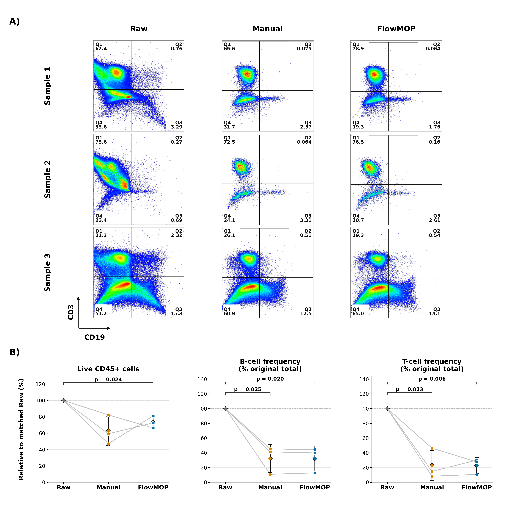
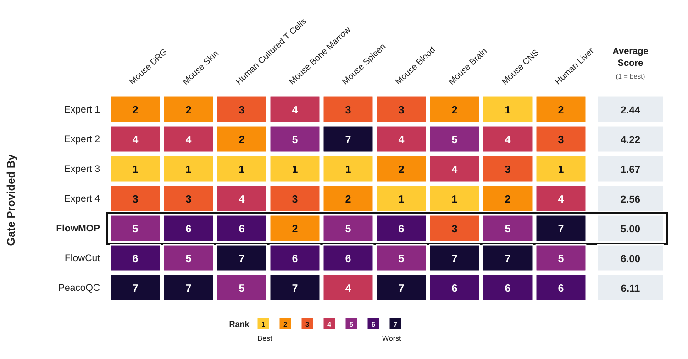
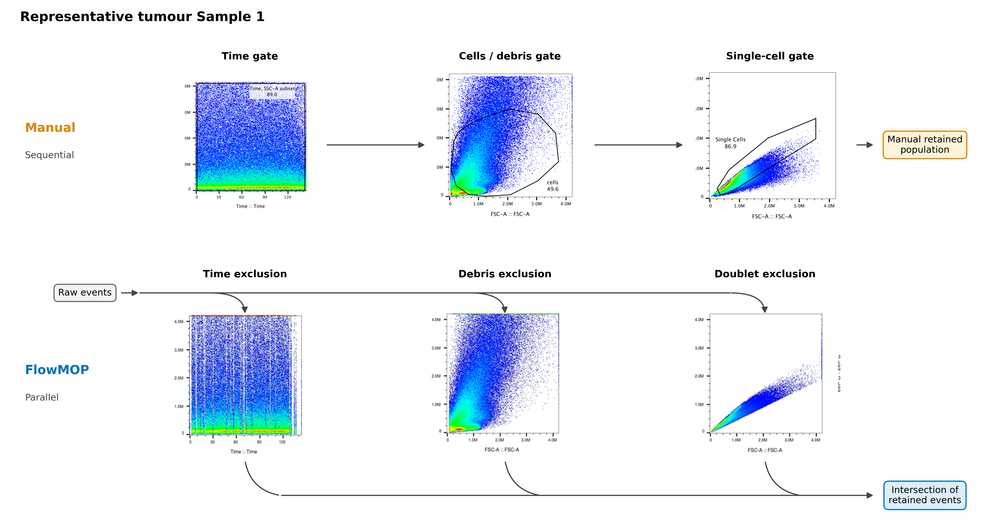

# FlowMOP: An Automated Flow Cytometry Time, Debris, and Doublet Removal Tool

Running Title: Automated Python-based Sample Cleanup

**Authors:**

Tony Xu [1], Nadia A. Roberts [1], Felix Marsh-Wakefield [2,3], Rebecca A. Jaeger [1], Sarah Croft [1], Abhimanu Pandey [1], Dalton Leibold [4], Angela L. Ferguson [2,3], Lily Rodgers [2,3], Umaimainthan Palendira [3], Geoffrey W. McCaughan [2,5,6], Ben Quah [7], Robin Vlieger* [8], Anne Brüstle* [1]

**Affiliations:**

1: Department of Immunology and Infectious Disease, John Curtin School of Medical Research, the Australian National University, Canberra, Australian Capital Territory, Australia 
2: Liver Injury & Cancer Program, Cancer Innovations Centre, Centenary Institute, The University of Sydney, Sydney, New South Wales, Australia
3: Human Immunology Laboratory, School of Medical Sciences, Faculty of Medicine and Health, The University of Sydney, Sydney NSW, Australia	
4: Division of Ecology and Evolution, Research School of Biology, the Australian National University, Canberra, Australian Capital Territory, Australia 
5: A.W. Morrow Gastroenterology and Liver Centre, Royal Prince Alfred Hospital, Sydney NSW, Australia
6: Sydney Medical School , Faculty of Medicine and Health, The University of Sydney, Sydney NSW, Australia
7: Division of Genome Sciences and Cancer, John Curtin School of Medical Research, the Australian National University, Canberra, Australian Capital Territory, Australia
8: School of Medicine and Psychology, Australian National University, Canberra, Australian Capital Territory, Australia

**Contact information for all authors:**

Tony Xu <Tony.Xu@anu.edu.au>; Nadia A. Roberts <Nadia.Roberts@anu.edu.au>; Felix Marsh-Wakefield <felix.marsh-wakefield@sydney.edu.au>; Rebecca A. Jaeger <Rebecca.Jaeger@anu.edu.au>; Sarah Croft <Sarah.Croft@anu.edu.au>; Abhimanu Pandey <Abhimanu.Pandey@anu.edu.au>; Dalton Leibold <Dalton.Leibold@anu.edu.au>; Angela L. Ferguson <a.ferguson@centenary.org.au>; Lily Rodgers <lrod8310@uni.sydney.edu.au>; Umaimainthan Palendira <umaimainthan.palendira@sydney.edu.au>; Geoffrey W. McCaughan <g.mccaughan@centenary.org.au>; Ben Quah <ben.quah@anu.edu.au>;  Robin Vlieger <Robin.Vlieger@anu.edu.au>; Anne Brüstle <Anne.Bruestle@anu.edu.au>

## Acknowledgements

We thank Givanna Putri for her very helpful feedback and suggestions throughout the manuscript’s preparation. This work was also supported by computational resources provided by the Australian Government through the National Computational Infrastructure (NCI) under the ANU Merit Allocation Scheme.

**Funding information:**

TX is supported by the Australian Government Research Training Program PhD Scholarship. There are no other relevant sources of funding.

## Abstract

Flow cytometry now generates high-parameter datasets whose scale and variability challenge manual preprocessing, leading to subjectivity and poor reproducibility. Here, we introduce FlowMOP, a Python-native framework that automates three major preprocessing steps—time-gating, debris removal, and doublet exclusion. FlowMOP was developed to combine these preprocessing steps in a single workflow, whereas FlowCut and PeacoQC primarily address time-dependent quality control and broader automatic gating frameworks are aimed at population identification rather than standardized preprocessing cleanup.

Methodologically, FlowMOP identifies temporal artifacts—acquisition-dependent deviations in event quality or fluorescence signal—via parameter-wise peak checks, bin-level fluorescence summaries across acquisition time, and robust outlier rejection. Debris is excluded by adaptive FSC-A thresholding derived from cross-parameter peak structure. Finally, doublets are removed using dynamic inflection detection on FSC-A/FSC-H and SSC-A/SSC-H ratio histograms. The implementation uses memory-conscious array operations; computational scaling was evaluated to 2 million events in a 36-channel file.

Against event-labelled synthetic technical controls, FlowMOP showed a favourable balance of sensitivity and specificity relative to comparator time-gating methods and effectively removed labelled debris- and doublet-enriched populations.

In a matched analysis of 36 human PBMC samples, FlowMOP and FlowCut retained the most events after time gating while preserving Live CD45+, B-, T-, and NKT-cell frequencies. Across the complete preprocessing pathway, FlowMOP reproduced expert-cleaned population counts and lineage frequencies in PBMC samples and did not differ from manual cleaning for any evaluated endpoint in human tumour-liver samples. Together with its synthetic benchmark and computational performance, these findings support FlowMOP as a fast, reproducible, fully automated preprocessing workflow for flow cytometry. FlowMOP can be accessed at https://github.com/1ordinateur/FlowMOP.

## Introduction

Modern flow-cytometry studies can contain increasing numbers of files, events, and measured parameters [2]. The large scale of these data makes repeated manual preprocessing time-consuming and often impractical, potentially amplifying variability between operators. Reproducible automated preprocessing is therefore valuable for large studies.

Manual preprocessing of flow cytometry data, whilst still not standardised, typically involves three gating components. I) Time gating: operators perform time-gating to remove events potentially acquired erroneously due to transient or persistent artifacts in the instrument or sample, including air bubbles, blockages, or laser malfunctions. II) Debris gating: operators remove debris, which is generated by both the sample preparation process and inherent in the sample itself. Debris events are generally identified by reference to measured events with low size (determined by FSC-A (Forward SCatter – Area)) and internal complexity (determined by SSC-A (Side SCatter – Area)) [1]. III) Doublet gating: Events classified as "doublets"—two or more cells erroneously detected as one—are removed as their fluorescence measurements lack reliability. This is often done with reference to the ratio of the signal duration, and signal intensity. Doublets feature a signal peak strength comparable to a single cell, but for twice the duration. Hence, analysts may filter these events out by comparing an event’s total FSC Area relative to its FSC height (peak signal intensity) or by comparing the FSC signal height against the FSC signal width [4]. These manual preprocessing steps are time-consuming, inherently subjective, and susceptible to inconsistency across operators.

The most conspicuous time artifacts often occur at the beginning or end of acquisition, but flow-rate surges interspersed throughout acquisition and associated signal-intensity variation have also been documented [10]. Here, we use “microblockage” operationally to denote a short, self-resolving mid-acquisition disturbance that produces a localized fluorescence shift; the term does not imply that a physical obstruction was directly observed. Temporary acquisition problems can be difficult to detect manually [5], and manual identification and removal of transient problems can be time-consuming and subjective [9]. Because the affected intervals may be short and interspersed with otherwise plausible events, they can be impractical to exclude reproducibly using multiple manual gates.

Several tools automate cytometry population identification, including the model-based flowClust method [13], the neural-network method GateNet [14], and the bivariate-segmentation framework UNITO [15]; automated gating approaches are reviewed elsewhere [16]. FlowMOP is a Python-based, training-free preprocessing workflow that combines automated time-gating, debris removal, and doublet exclusion in a single headless tool. FlowCut and PeacoQC provide the most direct comparison for its time-gating component.

The Python implementation specifically facilitates integration with contemporary machine-learning workflows, which predominantly utilize Python-based frameworks.

To date, cytometry preprocessing algorithms have been evaluated either by comparison to human-defined gold standards (as in FlowCut and PeacoQC) or through mathematical metrics (consider cyCombine’s approach to batch correction [11]). The synthetic datasets provide event-level labels for estimating sensitivity and specificity in preprocessing tasks where real ground truth is otherwise difficult to define.

Here, we introduce FlowMOP, an automated preprocessing tool for time-gating, debris removal, and doublet exclusion. We compare time-gating performance with PeacoQC and FlowCut, evaluate debris and doublet removal using synthetic ground-truth datasets and expert comparison, and benchmark computational scalability.

## Methods

For further details concerning datasets, see Supplementary Table 1A.

### Preparation protocols for synthetic samples

#### Synthetic Time Sample Preparation and Generation

#### Preparation of Human PBMC Samples for Synthetic Time Benchmarking Samples

PBMC samples were collected from healthy donors under ethics protocols ACT Health 2019.ETH.00081 and ANU HREC 2020/047. Blood was collected into ACD-A tubes and PBMCs isolated using Lymphoprep density gradient (Stemcell Technologies) and SepMate tubes (Stemcell Technologies) per manufacturer’s instructions prior to cryopreservation. Thawed PBMCs were stained with ViaDye Red (Cytek Biosciences). The staining cocktail contained antibodies to several highly abundant antigens at less-than-saturating concentrations, and either 0.5, 1 or 3 x 10^6 cells were stained, yielding samples with different levels of fluorophore signal intensity for these common antigens. Other antibodies within the panel were present at saturating concentrations to yield similar fluorescence intensity across different cell seeding densities. Samples were acquired on a Cytek Northern Lights 3-laser (V/B/R) spectral flow cytometer. The benchmarking uses real, existing datasets acquired with biology-specific antibody panels. Consequently, the antigen–fluorochrome combinations differ among datasets and are not variables under evaluation; they are not material to the preprocessing questions addressed here.

#### Generation of Synthetic Time Samples

Samples were synthetically combined across differing cell concentrations in three manners. Their construction is shown in Figure S1. One in a simple ‘Segmented’ fashion, where events from one or more samples were simply appended onto events from an existing sample. The second, ‘Bimix’ manner, where events from two differently stained samples were randomly synthetically combined in random proportions (e.g. 40:60, 75:25 etc), with one run containing a mixing bin size of 5000 events and the other of 2000 events. The final, ‘Trimix’ contained randomly combined events from three differently stained samples in mixing bin sizes of 5000, and 2000 events. Here, we use “microblockage” operationally to denote a short, self-resolving mid-acquisition disturbance that produces a localized fluorescence shift; the term does not imply that a physical obstruction was directly observed. Segmented samples model sustained changes, whereas Bimix and Trimix model the observable fluorescence consequence in this operational definition by introducing short source-defined fluorescence shifts during acquisition. They do not recreate or establish the physical mechanism itself. The Bimix and Trimix files can appear acceptable on visual inspection because the altered intervals are short and interspersed with otherwise plausible events; however, the retained source labels identify the intentionally perturbed events that should be excluded under the benchmark definition. This provides event-level ground truth for a class of artifact that is difficult to recognize and impractical to gate manually [5,9]. Flow-rate disturbances without corresponding fluorescence changes should not prompt event exclusion; these samples therefore model fluorescence changes across acquisition order without introducing flow-rate disturbances. Flow-rate effects were tested separately by altering Time either in alignment with source-linked fluorescence changes or independently of them.

#### Time-only acquisition-rate mechanism benchmark

To distinguish acquisition-rate sensitivity from source-linked fluorescence and composition structure, we performed a matched mechanism benchmark using source-labelled smallcut synthetic-combo FCS files. Thirty high-count inputs were selected: ten Bimix, ten Trimix, and ten Segment files. For each file, 500,000 acquisition-order-preserving events were used without changing fluorescence, scatter, source labels, or event order. Bimix and Trimix files used the first 500,000 events; Segment files used a contiguous 500,000-event window centered on the source transition so that both segment sources were represented.

Each input generated three matched variants: raw, source-time-warped, and random-time-warped. In the source-time-warped variant, local Time increments were multiplied according to source identity using acquisition-interval multipliers spanning 1.0x to 20.0x. In the random-time-warped variant, the same multiplier range was assigned to contiguous 25,000-event chunks independently of source identity. After warping, the total Time range was rescaled to match the raw input so that the benchmark tested local acquisition-rate structure rather than total acquisition duration. FlowMOP, FlowCut, and PeacoQC were run on each matched input. Performance was evaluated relative to the matched raw file using sensitivity and specificity.

#### MAD-smoothing ablation and default selection

To test spline smoothing directly, FlowMOP was rerun across all 173 primary synthetic time-gating inputs with all non-smoothing settings fixed. Nineteen short/long smoothing-factor pairs, including a no-smoothing control, were compared by equally weighting the six benchmark groups. The current default (`0.01,0.05`) was selected as the marginally highest-scoring smoothed setting on this balanced comparison (Table S4). Figure 2 was regenerated using this setting. All completed quantitative FlowMOP results retained in the main figures, including the biological-validation figures, use the current selected configuration for the relevant module.

#### Mice

For generation of synthetic samples for FlowMOP validation (debris and doublet removal), splenocytes from 13-16-week old C57Bl/6N or C57Bl/6J mice were used. All animal experimentation was performed under ethics protocol 2024/379 at the Australian Phenomics Facility at the Australian National University, Canberra.

#### Synthetic Debris Sample Preparation and Generation

Mouse spleens were mechanically dissociated prior to lysis of red blood cells (RBC) with RBC lysis buffer (MilliQ H2O containing 150 mM NH4Cl, 10 mM KHCO3 and 1 mM EDTA). Splenocytes were then incubated with Fc block (BD), then stained with an antibody panel to delineate several major immune cell subsets (CD19 APC, CD3 PE, CD8 PE-Cy7, CD11b BB515, CD4 BV605, Fixable Viability Dye efluor780). To generate ‘high debris’ samples, cells were resuspended in MilliQ water and incubated for 2 minutes, prior to addition of 10X PBS to restore osmolarity. ‘Low debris’ samples were kept in isotonic solution throughout. Samples were acquired using a BD LSRII cytometer.

For assessment of FlowMOP debris-gating performance, high-debris and low-debris samples were combined by sampling approximately equal event numbers from each source and concatenating them into matched synthetic mixtures while retaining source labels for ground-truth quantification.

#### Synthetic Doublet Sample Preparation and Generation

To generate samples with high proportions of doublets, C57BL/6 mouse spleens were injected with 1 mL digestion buffer comprising RPMI supplemented with 50 µg/mL collagenase P (Roche) and 10 µg/mL DNase I (Roche). Spleens were incubated for 20 minutes at room temperature (RT) in a further 1 mL of digestion buffer, mechanically dissociated, and incubated for a further 20 minutes at RT. Samples were passed through a 70-µm cell strainer with 10 mL FACS wash (PBS containing 2% heat-inactivated fetal bovine serum [FBS]), centrifuged (5 minutes, 500 × *g*, RT), and the supernatant discarded. Cell pellets were resuspended in 3 mL RBC lysis buffer and incubated for 3 minutes at RT, after which cells were washed twice with FACS wash and recovered by centrifugation.

For dye labelling, 5 × 10^6 cells were transferred to each fresh 15-mL tube and stained with either CellTrace Violet (CTV; Invitrogen) or carboxyfluorescein succinimidyl ester (CFSE; eBioscience). Cells were centrifuged (5 minutes, 500 × *g*, 4°C), the supernatant was removed, and pellets were resuspended in 1 mL complete IMDM (cIMDM; Gibco IMDM supplemented with 10% heat-inactivated FBS, 100 U/mL penicillin, 100 µg/mL streptomycin, 2 mM L-glutamine, and 55 µM 2-mercaptoethanol). Two microlitres of 5 mM CTV or 10 mM CFSE were added to the side of the corresponding tube; samples were rapidly inverted and mixed, then incubated for 10 minutes at 37°C. Labelling was quenched by adding 5 mL ice-cold cIMDM and incubating for a further 5 minutes at RT. Cells were centrifuged and resuspended in cIMDM, after which 2 × 10^6 CTV-labelled cells and 2 × 10^6 CFSE-labelled cells were combined in a single sample and incubated for 30 minutes at 37°C and 5% CO2. Samples were centrifuged, the supernatant was removed, and cells were stained for 20 minutes at RT with Fixable Viability Dye eFluor 780 (Invitrogen; 1:1,000 in PBS). Cells were washed with PBS, centrifuged, resuspended in FACS wash, and acquired on a BD LSRII flow cytometer.

### Non-synthetic samples

Human liver samples used in the non-synthetic validation datasets were collected under ethics approval from the Sydney Local Health District Ethics Review Committee (X19-0488 and 2019/ETH13790).

### Biological-validation analysis

Biological-validation endpoint counts and frequencies were calculated within sample for each cleaning comparison. Counts and frequencies were each normalized to their corresponding matched ungated (Raw) input, such that Raw equalled 1 for both metrics: for time, the ungated input retained the expert-defined singlet and debris masks but applied no time mask; for debris, it retained the expert-defined time and doublet masks but applied no debris mask; for doublet, it retained the expert-defined time and debris masks but applied no doublet mask; and for the combined Time + Debris + Doublet comparison, no time, debris, or doublet preprocessing mask was applied. Before Raw normalization, frequencies followed the expert-defined biological hierarchy: Live CD45+ cells were expressed as a percentage of Live cells, while B, T, and NKT cells were expressed as percentages of Live CD45+ cells. B cells were defined as Live CD45+ CD3−CD19+ events (Q1), T cells as Live CD45+ CD3+CD19− events (Q3), and NKT cells as Live CD45+ CD19−CD3+CD56+ events. Identical gate coordinates were used across workflow branches. Figure 5B (counts) and Figure 5C (frequencies) included every pairwise comparison among Raw, Expert Manual, FlowMOP, PeacoQC, and FlowCut within each endpoint and metric. Figure 6D (counts) and Figure 6E (frequencies) compared Expert Manual with Raw, FlowMOP with Raw, and FlowMOP with Expert Manual within each endpoint, metric, and cleaning group. Two-sided paired *t*-tests were used on the Raw-normalized values, with Holm adjustment across the ten tests within each endpoint and metric in Figures 5B–C and separately across the three tests within each endpoint, metric, and cleaning group in Figures 6D–E. One sample was excluded from NKT summaries and tests because no NKT cells were detected (n = 35); all other endpoints used n = 36.

### Tumour biological-validation analysis

Three human tumour-liver FCS files (LB202, LB236, and LB262) were analysed in their Raw state and after either manual or FlowMOP preprocessing. Manual preprocessing used sequential time, cells/debris, and single-cell gates. FlowMOP calculated time, debris, and doublet exclusions independently; the union of excluded events was removed, equivalently retaining the intersection of the three passed-event masks. The limit-of-detection mask was not included.

T and B cells were identified from CD3 and CD19 expression. T cells were defined as CD3+CD19− (Q1) and B cells as CD3−CD19+ (Q3). Three prespecified endpoints were calculated: the number of Live CD45+ cells and T- and B-cell frequencies as percentages of the original total event count. Each endpoint was normalized within sample to its matched Raw value (Raw = 100%). Raw, Manual, and FlowMOP values were compared using all three unadjusted, two-sided paired t-tests.

### Computational scalability benchmark

Computational scalability was evaluated using clone-based real-FCS scaling. A representative FCS file was subsampled/replicated to matched event counts of 10,000, 100,000, 300,000, 1,000,000, and 2,000,000 events while preserving the original 36-channel structure. FlowMOP, PeacoQC, and FlowCut were run on the same generated inputs for each size.

For fair timing of the shared time-gating task, FlowMOP was run using local non-distributed execution, with debris and doublet removal disabled and annotated output FCS writing disabled. PeacoQC and FlowCut were run with optional plotting, reporting, and output generation disabled where supported. Each condition was run once as a warm-up and then three measured times. Runtime and peak resident memory were recorded using `/usr/bin/time -v`; means and standard deviations were calculated across the three measured repeats.

### Coding Assistance

Parts of the code were generated with the aid of ChatGPT Codex and Claude Code. All code generated by LLMs were manually verified before implementation.

## RESULTS

Figure 1. Conceptual schematics depicting FlowMOP’s time-gating (A), debris-gating (B), and doublet-gating (C) methods; plotted fluorescence intensity and signal-strength axes are schematic and use arbitrary units. A) FlowMOP selects valid parameters using positive-peak detection, generates time-binned fluorescence summaries, applies two smoothing resolutions, and performs robust outlier rejection across acquisition order. B) FlowMOP applies the same valid-parameter check, derives a candidate FSC-A threshold from each eligible parameter’s positive events, and uses the median candidate as the final FSC-A gate. C) FlowMOP identifies doublets from inflection points in FSC-A/FSC-H and SSC-A/SSC-H ratio histograms, with a fixed-ratio fallback.

### Algorithmic design

An overview of FlowMOP’s architecture is contained in Fig. 1, detailing approaches for its preprocessing, time-gating, debris removal, and doublet removal methods. This cleaned data can be applied to downstream analysis.

FlowMOP accepts `.csv`, `.fcs`, and Parquet files. It reduces event-level measurements into time-bin and channel summaries, applies smoothing and robust outlier detection, and combines the resulting flags through parameter voting.

#### Precleaning

FlowMOP first checks the input file for events at the limit of detection, defined here as events at the maximum FSC-A value for that sample. If the number of events at this maximum exceeds a threshold (default 1%), FlowMOP removes these maximum-valued events. Otherwise, it retains all values. The 1% cutoff is a pragmatic safeguard intended to identify non-trivial accumulation at the acquisition maximum without responding to isolated maximum-valued events.

#### Time Gating

To time gate, FlowMOP builds upon the assumptions posited in PeacoQC and FlowCut regarding fluorescence fluctuations. That is, independent of flow rate variations, sections of acquired sample with aberrant positive fluorescence averages are the target portions to be removed. To achieve this, FlowMOP checks each parameter, excluding parameters with a unimodal distribution. ‘Unimodal distribution’ is presently defined as parameters with only one identifiable peak. Subsequently, for each fluorescence parameter that satisfies this criterion, FlowMOP excludes the first peak (selecting all subsequent peaks) and measures the average fluorescence value for each time bin. FlowMOP then can operate either in the ‘Positives’ mode, or ‘Geomean’ mode. In ‘Positives’ mode, all events before the first inflection point are discarded. All results shown presently operate in ‘Positives’ mode. In the ‘Geomean’ mode, all events are considered. Subsequently, on a per-parameter basis, the sample is transformed into bins grouped by time (the default being bin having minimum of 150 events, up to a maximum of 500 bins).

The median fluorescence of each bin’s cells is returned. Two spline smoothing values, one small and one larger (current default `0.01,0.05`), are applied to the returned time-bin series before median absolute deviation (MAD) filtering. The smoothing factor scales the spline fit used for the binned fluorescence summary. Bins falling outside the MAD threshold in either smoothing pass are flagged for removal. Time-bins across all parameters are then combined, with time bins rejected if they have been flagged in any parameter. For panels with more than 10 parameters, FlowMOP requires two or more parameters to flag a bin before rejection. This empirical safeguard reduces false-positive removal caused by isolated noisy channels in high-dimensional panels, although an aberration confined to one channel may consequently be retained (Figure 1A).

FlowMOP summarizes each time bin using the median fluorescence of the selected positive population. If Geomean mode is selected, FlowMOP instead uses the geometric mean of all events in the bin. The two smoothing resolutions target both shorter and more sustained deviations, while parameter voting limits removal driven by isolated noisy channels in higher-dimensional panels.

#### Debris Gating

FlowMOP’s debris module targets small, low-FSC debris. The final gate is applied on FSC-A, but its threshold is informed by FSC-A distributions across eligible fluorescence-positive populations rather than the overall FSC-A histogram alone. SSC-A may improve recognition of larger or internally complex debris, while pulse-width measurements may assist with aggregates. Accordingly, FlowMOP does not currently incorporate SSC-A or pulse-width measurements into its debris decision because broadly applicable thresholds for these features are difficult to establish across tissues, panels, instruments, and acquisition settings. FlowMOP’s debris exclusion conducts a similar unimodality check on each fluorescence parameter, and the first peak is then excluded as the Time-gating feature. Thereafter, FlowMOP detects the global FSC-A peak as a reference point. For every parameter’s positive events, FlowMOP checks first for an FSC-A peak similar to the reference peak (default 30% of the reference peak’s value). If there is such a peak, it checks if the second FSC-A peak is the global maximum FSC-A peak. If that parameter’s positive cell’s second FSC-A is the global maxima, FlowMOP returns the FSC-A threshold as the minima between those two FSC-A peaks. If the second FSC-A is not the maximum, it returns the global interpeak minimum between the reference peak and maximal peak. Conversely, if there is no reference peak present in that parameter’s positive population, it selects the left-boundary of that parameter’s first peak. The median FSC-A threshold across all parameters is taken as the final FSC-A gate to be applied to the sample (Figure 1B).

#### Doublet Gating

To doublet gate, FlowMOP dynamically excludes sample doublets. To do this, FlowMOP creates a histogram of the FSC-A/FSC-H ratio. If there are multiple peaks all with a ratio of 1 or more, then it chooses the inflection point between those peaks, and excludes all events larger than that value. If there are insufficient peaks, it simply returns all events that have an FSC-A/FSC-H ratio smaller than a threshold (default 5). The process is repeated for the 
SSC-A/SSC-H variable. Consequently, FlowMOP is able to distill the implicit ratiometric information that current density based methodologies may overlook. FlowMOP's doublet module assumes that FSC-A/FSC-H and SSC-A/SSC-H ratios remain informative and that acquisition voltages and scatter parameters have been set appropriately. If relevant scatter channels are saturated, edge-collapsed, or incorrectly configured at acquisition, the lost pulse-shape information cannot be recovered by FlowMOP or by other downstream preprocessing algorithms; such samples require acquisition review, manual intervention, or alternative pulse-shape features where available.

### Algorithmic Validation

#### Synthetic Sample Benchmarking

The ability of FlowMOP to successfully detect time, debris, and doublet-perturbed data was first tested against the respective task’s synthetic datasets, namely the synthetically combined staining time samples, the high-debris + low debris samples, and the CTV / CFSE doublet samples.

For time-gating samples, sensitivity and specificity were reported for each benchmarked method using source labels as the reference. Target source(s) were defined as the source(s) with the largest filename-encoded mixture proportion; tied largest proportions were treated as co-targets. Sensitivity was defined as retained target-source events divided by all retained events. Specificity was defined as removed non-target-source events divided by all removed events.

Figure 2. A) Representative flow cytometry plots showing CD3 fluorescence against time. The original synthetically generated sample is shown in column 1, with the resulting output following FlowMOP, PeacoQC, and FlowCut processing shown in the subsequent columns. The first row depicts a representative ‘segmentation’-based synthetic file. The second row shows a representative two-sample mixture with a 5000-event bin size. Frequency percentages shown are the percentage of cells left post-cleaning relative to the original synthetic sample (rounded to the nearest percentage point). B) Violin plots showing sensitivity and specificity, grouped by sample type (Segment, Bimix, and Trimix) and cleaning method (FlowMOP, PeacoQC, and FlowCut). Internal dashed lines indicate quartiles. The first and second rows represent mixing-bin sizes of 5000 events (n = 90: Segment, 33; Bimix, 33; Trimix, 24) and 2000 events (n = 83: Segment, 32; Bimix, 28; Trimix, 23), respectively. Brackets show significant Bonferroni-adjusted paired t-tests.

#### Synthetic Time Gating Benchmark

Several computational approaches address time-dependent quality control, including flowAI [10], PeacoQC [5], flowClean [6], and FlowCut [9]. FlowMOP combines a time-gating component with debris and doublet modules in one Python workflow. Here, its time-gating performance is evaluated against PeacoQC and FlowCut.

The Segment, Bimix, and Trimix samples were designed as complementary time-artifact stress tests with event-level source information for objective scoring (Fig. 2A). Sensitivity was defined as the proportion of retained events derived from the target source or sources, and specificity as the proportion of removed events derived from the non-target source or sources. Direct comparison with manual gating was not attempted because the short, interspersed intervals in the Bimix and Trimix samples are impractical to remove reproducibly by eye.

At the 5000-event bin size, FlowMOP had higher sensitivity than FlowCut in Segment (p < 0.001), Bimix (p < 0.001), and Trimix (p = 0.03) (Fig. 2B). PeacoQC also had higher sensitivity than FlowCut in Bimix (p = 0.03). FlowMOP had higher specificity than both PeacoQC and FlowCut in Segment (p = 0.03 and p = 0.009), Bimix (p < 0.001 and p = 0.001), and Trimix (p < 0.001 and p = 0.001), respectively.

At the 2000-event bin size, FlowMOP and PeacoQC had higher sensitivity than FlowCut in Segment (p < 0.001 and p = 0.007, respectively), while FlowMOP had higher specificity than FlowCut (p = 0.03). In Bimix, PeacoQC had lower sensitivity than FlowCut (p = 0.02) and lower specificity than both FlowMOP (p < 0.001) and FlowCut (p = 0.007). In Trimix, sensitivity did not differ significantly among methods, while PeacoQC had lower specificity than FlowMOP (p = 0.009) and FlowCut (p = 0.003). All comparisons were paired t-tests with Bonferroni correction, using each algorithm's fixed recommended or default settings.

To test the effect of flow-rate disturbances aligned with or independent of source-linked fluorescence changes, we altered only the Time channel while leaving fluorescence, scatter, source labels, and event order unchanged (Fig. S4). FlowMOP and PeacoQC were unchanged under both source-linked and random Time warping. In contrast, FlowCut's sensitivity and specificity shifted after Time-only perturbation. Across all inputs, random Time warping reduced FlowCut's specificity by 11.45 percentage points relative to matched raw inputs. In Segment inputs, source-linked Time warping reduced FlowCut's sensitivity by 7.84 percentage points and specificity by 15.25 percentage points. These results support the interpretation that FlowCut responds to local acquisition-density structure even when fluorescence values are unchanged, whereas FlowMOP and PeacoQC are unaffected by rate-only variation in these inputs.

Dual-resolution smoothing changed the balance between sensitivity and specificity (Table S4). The no-smoothing control had the highest equal-weight balanced mean (0.7551), but its sensitivity was 1.92 percentage points lower than that of `0.01,0.05`. Among smoothed settings, `0.01,0.05` had the highest balanced mean (0.7511), with specificity 2.70 percentage points lower than the no-smoothing control. We therefore selected `0.01,0.05` as the default and regenerated Figure 2 using this setting.

Representative plots for the 2000 bin Bimix method, and the 2000, and 5000 bin Trimix methods can be found in Supp. 1.

#### Computational scalability

Clone-based runtime and memory benchmarking showed that FlowMOP scaled favorably at larger event counts (Table 1). Values are mean ± SD across three measured repeats after one warm-up run. FlowMOP was fastest from 100,000 events onward and had the lowest peak RAM at all sizes except 100,000 events. At 1,000,000 events, FlowMOP completed in 10.69 ± 0.16 s, compared with 24.21 ± 0.23 s for PeacoQC and 30.34 ± 0.48 s for FlowCut, while using 658.0 ± 0.3 MB peak RAM compared with 1483.4 ± 86.8 MB and 1115.1 ± 0.3 MB. At 2,000,000 events, FlowMOP completed in 17.42 ± 0.88 s, compared with 43.18 ± 4.23 s and 60.61 ± 2.37 s, while using 839.5 ± 0.4 MB peak RAM compared with 2614.8 ± 0.1 MB and 1849.8 ± 0.3 MB.

**Table 1: Clone-based time-gating runtime and memory benchmark**

Mean runtime and peak RAM across three measured repeats are shown as mean ± SD. The best-performing runtime and RAM value for each event count is shown in bold.

| Events | FlowMOP time (s) | PeacoQC time (s) | FlowCut time (s) | FlowMOP RAM (MB) | PeacoQC RAM (MB) | FlowCut RAM (MB) |
| ---: | ---: | ---: | ---: | ---: | ---: | ---: |
| 10,000 | 2.67 ± 0.50 | 4.40 ± 0.57 | **1.72 ± 0.02** | **237.9 ± 0.2** | 446.6 ± 0.2 | 261.8 ± 0.3 |
| 100,000 | **4.34 ± 0.11** | 13.74 ± 1.34 | 4.78 ± 0.33 | 351.6 ± 0.1 | 606.6 ± 26.1 | **326.4 ± 0.1** |
| 300,000 | **8.42 ± 0.85** | 15.08 ± 0.84 | 10.91 ± 0.49 | **462.3 ± 0.4** | 948.5 ± 5.9 | 505.4 ± 0.4 |
| 1,000,000 | **10.69 ± 0.16** | 24.21 ± 0.23 | 30.34 ± 0.48 | **658.0 ± 0.3** | 1483.4 ± 86.8 | 1115.1 ± 0.3 |
| 2,000,000 | **17.42 ± 0.88** | 43.18 ± 4.23 | 60.61 ± 2.37 | **839.5 ± 0.4** | 2614.8 ± 0.1 | 1849.8 ± 0.3 |

#### Synthetic Debris Gating Benchmark

Figure 3. A) Representative flow cytometry plots showing FSC-A/SSC-A debris plots. The first plot represents a representative combined high + low debris sample, the second and third represent the high debris portion and the low debris portion of that sample respectively. The percentages below denote the proportion of the combined sample represented by the annotated plot. B) FSC-A/SSC-A flow plots of the Fig. 3A’s representative sample post-processing. Again, the first column shows the combined high + low debris sample, the second and third show the high debris and low debris samples separately respectively. The percentages in the first column denote the proportion of the sample remaining relative to the original combined sample. Percentages in the  high debris and low debris columns denote the post-filtering proportion that each comprises (rounded to the nearest percentage). C) Bar plot representing mean proportion percentage ± SD of low debris sample remaining post-processing for FlowMOP and four human experts. FlowMOP has significantly higher low debris sample proportion than Expert 4 (Bonferroni adjusted paired t-test, p = 0.04). D) Bar plots showing mean low debris sample proportion percentage ± SD following human expert gating using either a group or per-sample based strategy (Blue bars denote group-wise results, green sample-wise). No difference was found between the two methods (un-adjusted paired t-test, p > 0.05).

FlowMOP’s debris gating performance was tested by its ability to deplete the high-debris component in the combined high- and low-debris samples (Fig. 3A). FlowMOP reduced the high-debris source proportion from 50 ± 1.10% to 28.8 ± 0.1% (paired t-test, p < 0.001) (Fig. 3B). The final gate is applied on FSC-A, but its threshold is derived from candidate FSC-A distributions across eligible fluorescence-positive populations rather than from the overall FSC-A histogram alone. FlowMOP did not differ significantly from any human evaluator except Expert 4, for whom FlowMOP removed more labelled high-debris events (Bonferroni-adjusted paired t-test, p = 0.04) (Fig. 3C).

FlowMOP determines its debris gate independently for each sample, whereas manual debris gating is commonly performed groupwise by applying one gate across related samples. To evaluate whether this difference in strategy affected the comparison, human experts performed both groupwise and individual-sample gating. No difference was found between the two approaches for any expert (Fig. 3D, unadjusted paired t-test p > 0.05).

#### Synthetic Doublet Gating Benchmark

FlowMOP’s doublet removal performance was also examined through synthetic technical controls (Fig. 4A). Events positive for both CFSE and CTV provide an observable class of heterologous labelled doublets, subject to rare dye-transfer events; same-label CTV-CTV and CFSE-CFSE doublets are not identifiable from these labels alone. FlowMOP was then run on these samples, and the proportion of remaining CFSE/CTV double-positive cells was compared with the proportions remaining after human-expert gating (Fig. 4A).

Figure 4. A) Representative flow cytometry plots of synthetic doublet samples and gating. The first row shows all samples by CTV against CFSE, the second FSC-A/FSC-H, and the last by SSC-H/SSC-A. The columns show representative CTV-only stained, CFSE-only stained, mixed CTV-CFSE, human expert doublet-removed, and FlowMOP doublet removed samples. B) Bar graph showing the mean percentage ± SD of CTV-CFSE double positive events removed (relative to the original sample) following FlowMOP or human expert processing. C) Bar graphs showing mean frequency ± SD of remaining CTV-CFSE double positive events following human expert processing, comparing group and per-sample based gating strategies (Blue bars denote group-wise results, green sample-wise). Only Expert 3 had significantly different results (unadjusted paired t-test, p = 0.009, all others p > 0.05).

FlowMOP significantly decreased the frequency of CTV-CFSE double-positive events from 7.84 ± 1.21% to 0.27 ± 0.11% (paired t-test; p = 0.001). No statistically significant difference was detected between FlowMOP and any expert for this endpoint (Fig. 4B, paired t-test; unadjusted p > 0.05). FlowMOP also determines doublet gates independently for each sample, rather than applying a shared groupwise gate. Human experts therefore performed both groupwise and individual-sample doublet gating. No statistical difference was detected between these approaches except for Expert 3, who consistently removed fewer doublets with individual-sample gating (Fig. 4C, paired t-test; p = 0.009; all other unadjusted p > 0.05).

### Biological validation

Following the objective synthetic benchmarks, we evaluated FlowMOP using prespecified biological population endpoints in biological flow-cytometry datasets.

Time cleaning produced different event-retention outcomes while preserving the measured downstream population composition. Across the four count endpoints, Expert Manual retained mean values of 78.4–78.9% of the matched ungated input, FlowMOP retained 90.4–91.2%, FlowCut retained 90.6–90.9%, and PeacoQC retained 72.7–74.2%. All FlowMOP-versus-Expert Manual and FlowCut-versus-Expert Manual count comparisons were significant after Holm adjustment (p < 0.001; Fig. 5A,B). PeacoQC retained fewer Live CD45+, B, and T cells than Expert Manual (adjusted p = 0.031, 0.015, and 0.027, respectively), while the NKT-cell comparison was not significant (adjusted p = 0.078). No differences were detected among cleaning methods for the Raw-normalized Live CD45+, B-cell, T-cell, or NKT-cell frequencies (adjusted p ≥ 0.137; Fig. 5C).

Debris-gating behaviour was context dependent. In the representative debris-poor sample (Fig. 6A), the expert manual debris gate retained 258,765 of 267,889 matched ungated events (96.6%), whereas FlowMOP retained 113,679 (42.4%). Of the 145,091 events retained by the expert but rejected by FlowMOP, 86.5% were live and 83.6% were Live CD45+; T cells comprised 70.6% of all rejected events and 84.4% of their Live CD45+ compartment. These rejected events accounted for 52.1% of the T cells retained by the expert. Within the T-cell gate, the rejected lower-FSC population had modestly lower CD44 and higher CCR7 than the FlowMOP-retained population, while median CD3, CD45, CD4, and CD5 differed by only approximately 3–4%. This phenotype is compatible with smaller, less-activated or naïve-enriched lymphocytes, although the available panel does not permit a definitive naïve-cell assignment. Both the lower-FSC and FlowMOP-retained populations were present throughout acquisition, indicating that the lower-FSC population was not a transient time-dependent artefact. Debris cleaning produced lower FlowMOP counts than Expert Manual for all four populations (adjusted p ≤ 0.0017; Fig. 6A,D). On the Raw-normalized frequency scale, B-cell, T-cell, and NKT-cell frequencies did not differ (adjusted p ≥ 0.090), while Live CD45+ frequency was 0.018 lower with FlowMOP (adjusted p = 0.025; Fig. 6E).

FlowMOP also retained slightly fewer cells than Expert Manual after doublet cleaning: the mean FlowMOP-minus-expert differences were −0.019, −0.026, −0.007, and −0.015 on the Raw = 1 scale for Live CD45+, B-cell, T-cell, and NKT-cell recovery, respectively (adjusted p ≤ 0.0015; Fig. 6B,D). This corresponded to slightly greater event removal by the FlowMOP doublet gate. B-cell and NKT-cell frequencies did not differ after doublet cleaning (adjusted p ≥ 0.111), while Live CD45+ frequency was 0.006 lower (adjusted p = 0.029) and T-cell frequency was 0.013 higher (adjusted p < 0.001) with FlowMOP (Fig. 6E), indicating that the additional removal had limited effects on the measured population composition. After the combined Time + Debris + Doublet pipeline, no FlowMOP-versus-Expert Manual difference was detected for any aggregate count endpoint (adjusted p = 0.315, 0.100, 0.274, and 0.440; Fig. 6C,D) or for B-cell, T-cell, or NKT-cell frequency (adjusted p = 0.193, 0.550, and 1.000, respectively; Fig. 6E). Raw-normalized Live CD45+ frequency was 0.049 lower with FlowMOP (adjusted p = 0.035). Thus, notwithstanding the debris-gating outliers, the final combined output produced comparable aggregate counts and lineage frequencies, with a modest difference in Live CD45+ frequency.

Figure 5. Biological validation of time cleaning relative to matched ungated inputs. A) Representative time and downstream biological gates for Raw, Expert Manual, FlowMOP, PeacoQC, and FlowCut. B) Counts and C) frequencies for Live CD45+, B, T, and NKT cells, each normalized within sample to its corresponding matched Raw value (Raw = 1). Before normalization, Live CD45+ frequency was calculated relative to Live cells and B-, T-, and NKT-cell frequencies relative to Live CD45+ cells. Points represent matched samples, connecting lines show within-sample changes, diamonds show means, and error bars show SD. Raw comparisons are omitted from the brackets; every count comparison with Raw was significant, while frequency comparisons with Raw are provided in the Supplementary Data. Displayed brackets show significant method-versus-method two-sided paired *t*-tests after Holm adjustment, with adjusted values labelled “p” for brevity. One sample was excluded from NKT analyses because no NKT cells were detected (n = 35); all other analyses use n = 36.

Figure 6. Biological validation of debris, doublet, and combined cleanup relative to matched ungated inputs. A) Debris comparison for Ungated input, Expert Manual, and FlowMOP. B) Doublet comparison. C) Combined Time + Debris + Doublet comparison. Each representative row shows the cleaning decision projection and the corresponding Live CD45+, shared CD19 × CD3 B/T, and NKT gates; doublet rows show both FSC-H × FSC-W and SSC-H × SSC-W projections. D) Counts and E) frequencies for Live CD45+, B, T, and NKT cells, each normalized within sample to its corresponding matched Raw value (Raw = 1), in the Debris, Doublet, and Combined comparisons. Before normalization, Live CD45+ frequency was calculated relative to Live cells and B-, T-, and NKT-cell frequencies relative to Live CD45+ cells. Points represent matched samples, connecting lines show within-sample changes, diamonds show means, and error bars show SD. Raw comparisons are omitted from the brackets; every count comparison with Raw was significant, while frequency comparisons with Raw are provided in the Supplementary Data. Displayed brackets show significant method-versus-method two-sided paired *t*-tests after Holm adjustment, with adjusted values labelled “p” for brevity. One sample was excluded from NKT analyses because no NKT cells were detected (n = 35); all other analyses use n = 36.

### Tumour biological validation

Next, we wished to examine FlowMOP's performance in a more complex sample type, such as tumour samples. Consequently, we tested whether manual and FlowMOP preprocessing produced different downstream population measurements in three tumour samples (Fig. 7).

The Live CD45+ cell count was 62.9 ± 17.8% of Raw after manual preprocessing and 73.3 ± 7.3% after FlowMOP preprocessing. FlowMOP differed from Raw (p = 0.024), whereas Manual did not (p = 0.069), and Manual and FlowMOP did not differ (p = 0.545). B-cell frequency was 32.5 ± 18.8% of Raw after Manual and 32.2 ± 17.0% after FlowMOP; both differed from Raw (p = 0.025 and p = 0.020, respectively), but not from each other (p = 0.855). T-cell frequency was 23.0 ± 20.4% of Raw after Manual and 22.8 ± 10.6% after FlowMOP; both differed from Raw (p = 0.023 and p = 0.006, respectively), but not from each other (p = 0.985). Thus, although both preprocessing strategies changed absolute population recovery relative to Raw, no difference between Manual and FlowMOP was detected for any of the three prespecified endpoints.

Figure 7. Downstream tumour-population measurements after manual and FlowMOP preprocessing. A) CD3-versus-CD19 plots for tumour Samples 1, 2, and 3 in the Raw data and after Manual or FlowMOP preprocessing. T cells are CD3+CD19− (Q1), and B cells are CD3−CD19+ (Q3). B) Live CD45+ cell count, B-cell frequency, and T-cell frequency after normalization within sample to the matched Raw value (Raw = 100%). Small circles show individual samples, lines connect the matched samples across preprocessing methods, and diamonds and error bars show mean ± SD. All three unadjusted, two-sided paired t-tests were performed for each endpoint; brackets and P values are displayed only for significant comparisons (p < 0.05).

### Expert preference evaluation

Expert preference rankings were compared across nine biological datasets (Figs. S5-S7). For time gating, FlowMOP had the best mean rank among the automated methods and was preferred to FlowCut (BF = 5.39, P = 84.3%) and PeacoQC (BF = 12.10, P = 92.4%). Human gates generally ranked above FlowMOP. For debris and doublet removal, human gates were again generally preferred, but FlowMOP was competitive in several tissue-specific comparisons: it ranked first for debris removal in mouse blood, third for debris removal in human liver and mouse skin, and second for doublet removal in human liver. Full rankings and statistical comparisons are reported in the Supplementary Results and Tables S1B-E.

## Discussion

FlowMOP was evaluated for time, debris, and doublet gating using synthetic technical controls and biological datasets.

### Synthetic Benchmarking

#### Synthetic Sample Time Gating

In the synthetic time-gating analysis, the Segment time gate is perhaps the most common and consequential time-artifact, as a non-negligible sample portion is often required to be removed in real samples. This type of synthetic data expects gating most similar to current manual gating, where blocks of events are removed. The objective of these samples is to simulate where there is a long blockage or sudden shift in the acquired sample. Here, FlowMOP had higher sensitivity than FlowCut at both tested bin sizes. It also had higher specificity than both competitors at 5000 events and than FlowCut at 2000 events. The Time-only mechanism benchmark suggests that the FlowMOP versus FlowCut difference is not explained solely by implementation. When local acquisition-rate structure was altered either in alignment with source-linked fluorescence changes or independently of them, FlowMOP remained unchanged, whereas FlowCut's removal behavior shifted, especially in Segment inputs (Fig. S4). This supports the interpretation that FlowCut can be affected by acquisition-density changes even when fluorescence values are unchanged, while FlowMOP is more anchored to fluorescence-population summaries across acquisition order.

Transient acquisition disturbances are not confined to the beginning or end of a run: flow-rate surges interspersed throughout acquisition and associated signal-intensity variation have been documented [10]. PeacoQC notes that temporary acquisition problems can be difficult to detect manually [5], and FlowCut describes manual identification and removal of transient acquisition problems as time-consuming and subjective [9]. We use “microblockage” operationally for a short, self-resolving instance of this broader phenomenon that produces a localized fluorescence shift, without asserting that a physical obstruction was directly observed. The Bimix and Trimix samples were designed to represent this under-addressed case. Although these synthetic samples can appear acceptable on visual inspection, the source labels show that the short altered intervals contain events from an intentionally perturbed fluorescence source and therefore should be excluded under the benchmark definition. Visual subtlety is thus a central feature of the benchmark: it demonstrates why apparent normality by eye is not sufficient ground truth.

The size of the simulated microblockage was determined by the mixing-bin size, with the 2000-event samples representing shorter and more difficult disturbances than the 5000-event samples. FlowMOP provided the strongest overall performance profile across these conditions. At 5000 events, it had higher sensitivity than FlowCut and higher specificity than both competitors across Segment, Bimix, and Trimix. At 2000 events, FlowMOP had higher sensitivity and specificity than FlowCut in Segment and retained higher specificity than PeacoQC in Bimix and Trimix without a significant sensitivity disadvantage. Thus, FlowMOP's principal advantage was its consistent combination of high sensitivity with stronger specificity across sustained and short, interspersed time artifacts.

PeacoQC's documentation identifies acquisition-bin size as a trade-off between the accuracy of within-bin density estimation, the number of bins available for evaluating signal stability, and the number of events affected when a bin is removed [5]. The Bimix and Trimix benchmarks contain short, interspersed source-defined intervals. FlowMOP's stronger performance is therefore consistent with its temporal summarisation being better matched to these brief intervals.

The computational benchmark demonstrates that FlowMOP provides speed gains with lower peak RAM usage at larger event counts. This is most evident from 300,000 events onward, where FlowMOP had both the fastest mean runtime and lowest peak memory use. At 2,000,000 events, FlowMOP was approximately 2.5-fold faster than PeacoQC and 3.5-fold faster than FlowCut, while using approximately 32% of PeacoQC’s peak RAM and 45% of FlowCut’s peak RAM.

These measurements were obtained using local non-distributed execution and therefore demonstrate the performance of the tested implementations, not a distributed-computing speedup.

Among the three evaluated decision structures, only FlowMOP exposes an inherently channel-parallel within-sample computation. After shared acquisition bins are defined, each eligible fluorescence channel independently establishes its reference, produces a fixed-shape time-bin summary, and applies smoothing and MAD filtering; cross-channel coordination occurs only in the final parameter vote. PeacoQC instead performs data-dependent peak identification and reconciliation across bin-channel combinations, while FlowCut applies adjacent-segment, contiguous-region, file-wide, and conditional rerun decisions [5,9]. Their suboperations and separate files can be parallelised, but their complete within-sample decision pipelines cannot be expressed as the same independent channel-wise reduction without changing their decision rules. Porting either implementation to another language or scheduling framework would therefore not remove these structural dependencies. This structural distinction, together with FlowMOP’s earlier data reduction, fewer full-data passes, and smaller intermediate state, is consistent with its lower runtime and memory use in our benchmarks, although the benchmark does not independently establish causation.

It is of note that there is a large variation in algorithmic performance across the dataset. One source of this variation is that the 0.5 and 1.0 relative cell concentrations oftentimes exhibited marginal differences in fluorescence intensity (Supp. Fig. 3), especially relative to the 0.5 / 3.0 cell concentrations comparison. Consequently, the 0.5/1.0 discrimination tasks can be considered especially difficult benchmarks to overcome. However, this difficulty was intentionally placed, to ensure the present benchmarking dataset could also show progressive improvement of future time-gating algorithms.

Human gating was not included for the Bimix or Trimix synthetic datasets because the short mixed bins do not provide a practical manual ground-truth target. The retained source labels instead provide an event-level reference for comparing algorithmic performance. A dataset benchmark was therefore necessary to evaluate whether automated methods can detect these subtle but labelled artifacts reproducibly.

#### Synthetic Sample Debris and Doublet Gating

In the synthetic debris and doublet gating trials, FlowMOP removed the labelled technical artifact populations effectively (Fig. 3B, 4B). In the debris task, FlowMOP enriched the low-debris component by 9.67%, which represented approximately 19% more debris removed considering the original 50:50 debris / real sample mixture. FlowMOP’s debris performance can also be interpreted in relation to the two debris populations (Fig. 3A) present: one at <10,000 FSC-A units, and the second at ~20,000 FSC-A units. Human experts were instructed that this second debris population was debris, and to gate accordingly. FlowMOP was able to independently detect this second debris population and exclude it without external information.

Similarly, in the doublet removal, the synthetic samples, owing to the rather unique preparation, yielded triplets. FlowMOP was able to handle this unexpected population and successfully removed it.

FlowMOP's sample-specific debris and doublet gating also differs from the groupwise strategy commonly used in manual analysis, where a shared gate is applied across related samples. Estimating each gate independently allows FlowMOP to adapt to sample-specific distributions without assuming that scatter characteristics are identical across a group. In the synthetic controls, expert results did not differ between groupwise and individual-sample debris gating, and differed for doublet gating for only one expert. This indicates that the overall comparison between FlowMOP and expert gating was not primarily determined by the choice of groupwise or individual-sample gates.

The synthetic debris benchmark measures depletion of the source-labelled high-debris component from matched mixtures of high- and low-debris samples. Because both sources contain some debris, these labels represent relative debris enrichment rather than per-event debris classification. FlowMOP targets the small, low-FSC debris phenotype observed in these controls and successfully removed the two low-FSC debris populations shown in Figure 3A. SSC-A may improve recognition of larger or internally complex debris, while pulse-width measurements may assist with aggregates. Metadata-based margin removal may also identify events at acquisition limits, but is not implemented beyond FlowMOP's current FSC-A maximum-value precleaning check. FlowMOP does not currently incorporate these additional features because broadly applicable decision rules are difficult to establish across tissues, panels, instruments, and acquisition settings. Future extensions can evaluate configurable or sample-specific multivariate approaches in tumour digests with greater necrosis, aggregation, and scatter heterogeneity.

### Biological validation

The measured population frequencies changed little after time gating regardless of the cleaning method, although the numbers of retained cells differed significantly. FlowMOP and FlowCut retained approximately 12 percentage points more events than Expert Manual, whereas PeacoQC retained approximately 5 percentage points fewer. From the biological data alone, it is difficult to determine whether the lower retention by Expert Manual and PeacoQC represents more sensitive artifact removal or whether the higher retention by FlowMOP and FlowCut represents more specific preservation of valid events. Considered alongside the source-labelled synthetic results, which showed FlowMOP's strong combined sensitivity-specificity profile and PeacoQC's comparatively lower specificity, the findings support the latter interpretation for FlowMOP and suggest that PeacoQC may have a tendency towards over-removal. The higher retention by FlowMOP is also consistent with the comparatively blunt, block-based nature of manual time gating, which can remove valid events together with an affected interval.

Debris removal was particularly dependent on whether the input satisfied the algorithm's peak assumptions. When genuine, separable debris was present in the synthetic ground-truth benchmark, FlowMOP identified and removed it accurately. When little or no true debris was present, FlowMOP could mistake a lower-FSC biological population for the debris peak and erroneously remove it. In the observed failure case, the removed events were predominantly live CD45+ T cells; their lower CD44 and higher CCR7 expression is compatible with smaller or less-activated, potentially naïve-enriched lymphocytes. This explains the greater variability and divergence from expert debris gating and identifies the absence of a genuine debris population as an important limitation requiring inspection of the scatter distribution.

The doublet comparison was close in magnitude to expert gating, although small differences were detected in Raw-normalized counts and in Live CD45+ and T-cell frequencies. More importantly, when the complete Time + Debris + Doublet pathway was considered, FlowMOP did not differ from Expert Manual for any population count or for B-, T-, or NKT-cell frequency across the matched PBMC samples; the only remaining difference was a modest reduction in Raw-normalized Live CD45+ frequency. Thus, despite differences observed when individual modules were examined in isolation, the complete FlowMOP pathway produced biological outputs that were comparable to expert cleaning. Taken together with the objective synthetic benchmarks and computational performance measurements, these findings support FlowMOP as an acceptable tool for fully automated sample cleaning with overall output quality comparable to human preprocessing.

The tumour analysis provides an initial downstream biological assessment in a complex sample type (Fig. 7). Manual and FlowMOP preprocessing both reduced Live CD45+ recovery and B- and T-cell frequencies relative to Raw, and they did not differ for any of the three prespecified endpoints. At the level of the evaluated downstream populations, FlowMOP therefore behaved equivalently to manual preprocessing. This concordance supports the appropriateness of FlowMOP for automated cleaning of complex tumour samples and further demonstrates its ability to produce results comparable to human-expert preprocessing.

Across the nine-dataset expert evaluation, FlowMOP was preferred overall to FlowCut and PeacoQC for time gating. This agrees with the synthetic benchmarks, in which FlowMOP showed the strongest combined sensitivity-specificity profile, and indicates that this advantage was also reflected in expert preferences on biological datasets. Human gates were generally preferred for debris and doublet removal, although FlowMOP ranked competitively in several tissue-specific comparisons, including debris removal in mouse blood, human liver, and mouse skin and doublet removal in human liver. The variation between tissues is consistent with the greater dependence of debris and doublet gates on sample-specific scatter distributions. Taken together, these results indicate that FlowMOP-generated gates can be comparable in acceptability to human gating across many use cases.

### Other remarks

Automated Live/Dead classification of events was considered, however not implemented in the algorithm. There exist many varied protocols and methods for discriminating live/dead samples, along with great diversity in the determination of what constitutes a ‘dead’ event. Consequently, the difficulty of creating a universal live/dead discriminator is non-trivial. Finally, there may be potential significant biological insight in the ‘dead’ cells of a sample, whereby important information concerning a sample may be found in the dead events or their proportion.

The trade-off between sensitivity and specificity reflects competing biological risks rather than a purely statistical optimization. A more permissive gate may protect genuine or rare populations while allowing artifacts to remain; a more stringent gate may remove artifacts more completely while also deleting valid biological events. No balance is universally correct because the consequences of each error depend on the intended downstream analysis. Sensitivity and specificity should therefore be considered together and interpreted alongside their effects on population recovery and composition. In this context, FlowMOP's synthetic time-gating results are notable because its performance gains were not achieved simply by exchanging one error type for the other. FlowMOP had the strongest overall combined sensitivity-specificity profile across the tested conditions, including simultaneous improvements in both measures relative to FlowCut in the Segment benchmarks and higher specificity than PeacoQC in the Bimix and Trimix benchmarks without a detectable sensitivity disadvantage. Because FlowMOP's time-gating module operates on acquisition-time structure rather than population identity, rare populations are not expected to be systematically biased unless they are temporally confounded with an acquisition artifact.

The primary comparison used recommended or automatically selected settings, including fixed FlowMOP parameters, to reflect typical unsupervised use.

CTV-CFSE double-positive events provide an observable ground-truth doublet class, but same-label CTV-CTV and CFSE-CFSE doublets are not directly detectable in this validation design. FlowMOP requires appropriate acquisition voltage/gain settings; if relevant signals are poorly resolved or saturated, the lost information cannot be recovered and reliable cleaning cannot be guaranteed. FlowMOP currently expects users to identify the scatter channels used by the workflow; it has not been validated systematically across 405-nm, 488-nm, and polar 488-nm FSC/SSC configurations on instruments with multiple scatter measurements. Future versions could assess multiple scatter-channel pairs and select or combine the pair with the clearest debris/doublet separation.

## Conclusion

FlowMOP provides time-gating, conservative low-FSC debris removal, and scatter-ratio doublet removal in a single Python implementation. This facilitates integration with Python-based workflows and provides fast, memory-conscious preprocessing for large cytometry files.

Within the tested synthetic scenarios, event-level source labels enabled objective evaluation of the targeted artifact classes. FlowMOP had higher sensitivity than FlowCut for Segment anomalies at both bin sizes and higher specificity than both competitors across the 5000-event Segment, Bimix, and Trimix benchmarks. For debris and doublet removal, FlowMOP removed the labelled technical artifact populations effectively in the synthetic ground-truth datasets, including unexpected triplet events.

An expert evaluation across nine human and mouse datasets preferred FlowMOP to PeacoQC and FlowCut for time gating, while its debris and doublet gates were competitive with human gates in several tissue-specific comparisons (Figs. S5-S7), supporting the broader practical suitability of FlowMOP across diverse biological samples. Together, the debris analyses show that FlowMOP's performance is conditional on the structure of the input distribution. When a genuine, separable debris population was present in the ground-truth debris benchmark, FlowMOP removed it effectively. In biological samples containing little true debris, however, debris removal was less consistent with manual gating. In the observed failure case, FlowMOP's peak-based procedure interpreted a lower-FSC lymphocyte mode as debris and removed predominantly live CD45+ T cells. This violates the method's working assumption that the lower-scatter peak represents technical debris and explains the divergent behaviour from the manual gate. Accordingly, absence of a genuine debris component is an important limitation rather than evidence that no validation is required. In three tumour samples, Manual and FlowMOP preprocessing did not differ for Live CD45+ cell count, B-cell frequency, or T-cell frequency. The open-source Python implementation supports reproducible preprocessing across cytometry datasets of increasing scale.

## Data and Code Availability

FlowMOP can be accessed via https://github.com/1ordinateur/FlowMOP. The code associated with the creation of this paper can be accessed at https://github.com/1ordinateur/FlowMOP_paper. The FCS Files used for this paper can be accessed at http://doi.org/10.5281/zenodo.17896445.

## Supplementary data

Figure S1: Construction of Segment, Bimix, and Trimix synthetic time samples. No flow-rate disturbance was introduced.

Figure S2: Representative flow cytometry CD3 / Time plots for Bimix 2000 bin, Trimix 5000 bin, and Trimix 2000 bin synthetic datasets, with original data inputs, and following cleaning by FlowMOP, FlowCut, and PeacoQC. Percentages below each figure represent the retained proportion of cells relative to the original representative synthetic sample.

**Table S1A: Dataset Compositions**

| Dataset Name | Synthetic Time-Gating Dataset | Synthetic Debris-Gating Dataset | Synthetic Doublet-Gating Dataset | Human Liver |
| --- | --- | --- | --- | --- |
| Samples (given per benchmarker) | 6, 2 each at 0.5, 1, 3 cell concentrations, 3 datasets | 4, combined into 3 benchmarking samples | 4, combined into 3 benchmarking samples | 3 |
| Tissue Type | Peripheral blood mononuclear cells | Spleen | Spleen | Liver tissue |
| Organism | Human | Mouse | Mouse | Human |
| Collection Location | Canberra, ACT, Australia | Canberra, ACT, Australia | Canberra, ACT, Australia | Sydney, NSW, Australia |

| Mouse Dorsal Root Ganglion | Mouse Skin | Mouse Small Intestine | Mouse Colon | Mouse Brain |
| --- | --- | --- | --- | --- |
| 3 | 3 | 3 | 3 | 4 |
| Dorsal root ganglia | Skin | Distal small intestine | Colon | Brain |
| Mouse | Mouse | Mouse | Mouse | Mouse |
| Canberra, ACT, Australia | Canberra, ACT, Australia | Canberra, ACT, Australia | Canberra, ACT, Australia | Canberra, ACT, Australia |

| Mouse Central Nervous System | Mouse Spleen | Mouse Blood | Mouse Bone Marrow | Human Cultured T cells |
| --- | --- | --- | --- | --- |
| 3 | 7 | 5 | 3 | 5 |
| Spinal cord and brain | Spleen | Peripherally collected blood | Femur derived bone marrow | Peripherally collected, cultured, and restimulated T cells |
| Mouse | Mouse | Mouse | Mouse | Human |
| Canberra, ACT, Australia | Canberra, ACT, Australia | Canberra, ACT, Australia | Canberra, ACT, Australia | Canberra, ACT, Australia |

**Table S1B: Expert / Algorithm IDs**

| Expert / Algorithm | ID |
| --- | --- |
| Expert 1 | 1 |
| Expert 2 | 2 |
| Expert 3 | 3 |
| Expert 4 | 4 |
| FlowMOP | 5 |
| FlowCut | 6 |
| PeacoQC | 7 |

**Table S1C: Time gating rankings (1 = best)**

| Rankings | Mouse DRG | Mouse Skin | Human Cultured T Cells | Mouse Bone Marrow |
| --- | --- | --- | --- | --- |
| 1 | 3 | 3 | 3 | 3 |
| 2 | 1 | 1 | 2 | 5 |
| 3 | 4 | 4 | 1 | 4 |
| 4 | 2 | 2 | 4 | 1 |
| 5 | 5 | 6 | 7 | 2 |
| 6 | 6 | 5 | 5 | 6 |
| 7 | 7 | 7 | 6 | 7 |
| Mouse Spleen | Mouse Blood | Mouse Brain | Mouse Central Nervous System | Human Liver |
| 3 | 4 | 4 | 1 | 3 |
| 4 | 3 | 1 | 4 | 1 |
| 1 | 1 | 5 | 3 | 2 |
| 7 | 2 | 3 | 2 | 4 |
| 5 | 6 | 2 | 5 | 6 |
| 6 | 5 | 7 | 7 | 7 |
| 2 | 7 | 6 | 6 | 5 |

**Table S1D: Debris gating rankings (1 = best)**

| Rankings | Mouse DRG | Mouse Skin | Human Cultured T cells | Mouse Bone Marrow |
| --- | --- | --- | --- | --- |
| 1 | 3 | 2 | 4 | 3 |
| 2 | 2 | 3 | 2 | 2 |
| 3 | 1 | 5 | 3 | 1 |
| 4 | 4 | 4 | 1 | 4 |
| 5 | 5 | 1 | 5 | 5 |
| Mouse Spleen | Mouse Blood | Mouse Brain | Mouse Central Nervous System | Human Liver |
| 3 | 5 | 3 | 3 | 2 |
| 2 | 3 | 2 | 2 | 1 |
| 1 | 2 | 4 | 4 | 5 |
| 4 | 4 | 1 | 5 | 3 |
| 5 | 1 | 5 | 1 |  |

**Table S1E: Doublet gating rankings (1 = best)**

| Rankings | Mouse DRG | Mouse Skin | Human Cultured T cells | Mouse Bone Marrow |
| --- | --- | --- | --- | --- |
| 1 | 2 | 2 | 1 | 4 |
| 2 | 3 | 3 | 4 | 2 |
| 3 | 1 | 1 | 3 | 1 |
| 4 | 5 | 5 | 2 | 5 |
| 5 | 4 | 4 | 5 |  |
| Mouse Spleen | Mouse Blood | Mouse Brain | Mouse Central Nervous System | Human Liver |
| 3 | 3 | 3 | 4 | 3 |
| 4 | 2 | 1 | 3 | 5 |
| 1 | 1 | 4 | 1 | 2 |
| 5 | 5 | 5 | 2 | 4 |
| 2 | 4 | 2 | 5 | 1 |

**Table S2: Jeffreys’ Scale**

| Bayes Factor | Hypothesis descriptor |
| --- | --- |
| <1 | Null hypothesis supported |
| 1-3 | Anecdotal / Weak evidence |
| 3-10 | Moderate / Substantial evidence |
| 10-30 | Very strong evidence |
| >30 | Decisive evidence |

**Table S4: Full-dataset FlowMOP MAD-smoothing analysis**

| Short, long smoothing factors | Sensitivity | Specificity | Balanced mean |
| --- | ---: | ---: | ---: |
| `0,0` (no-smoothing control) | 0.8021 | **0.7081** | **0.75506** |
| **`0.01,0.05` (current default)** | 0.8212 | 0.6811 | **0.75114** |
| `0.02,0.05` | 0.8228 | 0.6794 | 0.75108 |
| `0.01,0.02` | 0.8112 | 0.6885 | 0.74986 |
| `0.02,0.09` | **0.8276** | 0.6709 | 0.74923 |
| `0.01,0.09` | 0.8257 | 0.6707 | 0.74823 |
| `0.05,0.09` | 0.8188 | 0.6676 | 0.74317 |
| `0.02,0.20` | 0.8248 | 0.6479 | 0.73632 |
| `0.05,0.20` | 0.8197 | 0.6520 | 0.73586 |
| `0.01,0.20` | 0.8231 | 0.6477 | 0.73540 |
| `0.10,0.20` | 0.8138 | 0.6415 | 0.72769 |
| `0.05,0.34` | 0.8194 | 0.6344 | 0.72686 |
| `0.02,0.34` | 0.8199 | 0.6286 | 0.72424 |
| `0.10,0.34` | 0.8134 | 0.6250 | 0.71921 |
| `0.10,0.50` | 0.8139 | 0.6229 | 0.71842 |
| `0.10,0.90` (former default) | 0.8139 | 0.6226 | 0.71827 |
| `0.10,1.00` | 0.8139 | 0.6226 | 0.71827 |
| `0.20,0.90` | 0.8007 | 0.6142 | 0.70747 |
| `0.40,0.90` | 0.7812 | 0.6140 | 0.69756 |

Values are equally weighted macro-averages across the six Figure 2 benchmark groups (173 primary inputs; six tied-composition inputs excluded). The balanced mean is the arithmetic mean of sensitivity and specificity. Bold indicates the highest value overall and the highest balanced mean among smoothed settings.

Figure S3:

Fluorescence variation as a function of cell concentration.

Figure S4:

Time-only acquisition-rate perturbations reveal FlowCut sensitivity to local Time density. Points show raw-matched changes in sensitivity and specificity, with large points and intervals showing the mean and 95% confidence interval. Negative values indicate reduced performance relative to the raw control. Columns show all inputs together and the Segment, Bimix, and Trimix subsets separately. FlowMOP and PeacoQC remain unchanged under both source-linked and random Time warping. In contrast, FlowCut's sensitivity and specificity shift after Time-only perturbation, with the clearest specificity loss in random Time-warped inputs and the strongest source-linked sensitivity loss in Segment inputs, where acquisition-rate structure aligns with source composition.

### Supplementary expert preference evaluation

#### Supplementary methods

The expert-ranking analysis was used to summarize relative preferences among gates generated by FlowMOP, comparator algorithms, and human operators; it was not treated as an absolute measure of gating adequacy.

Rankings were modelled using a Plackett–Luce model with latent method abilities; identifiability was enforced by fixing a reference ability to zero. Independent Normal priors were placed on non-reference abilities. Posterior inference was performed with an affine-invariant ensemble Markov Chain Monte Carlo sampler (emcee; 32 walkers, 5,000 iterations; 1,000 burn-in), and posterior medians with 95% credible intervals were reported. Directional hypotheses (superiority/inferiority) were evaluated by computing P = Pr(H1 | data) and converting to a Bayes factor BF₁₀ = p/(1 – p) under equal prior odds, interpreted using Jeffreys’ scale and reported as BF, P (Bayes factor, posterior probability of the alternative hypothesis) (Table S2).

For each Plackett–Luce fit, the ensemble sampler’s mean acceptance fraction and an integrated-autocorrelation-time-based effective sample size were monitored (both as implemented in emcee) to assess MCMC convergence. Across all analyses, mean acceptance fractions ranged from 0.520 to 0.60, and effective sample sizes ranged from 128,003 to 134,042.

Posterior predictive checks compared observed pairwise win counts with those implied by posterior draws under a Bradley–Terry formulation, using a chi-square-type discrepancy averaged over method pairs. The maximum average χ² per comparison was 0.56, indicating good agreement between the model and the observed rankings.

Computations were implemented in Python with numerically stable log-likelihoods.

#### Supplementary results

FlowMOP outputs were compared with expert-provided gates using a forced-ranking preference task across nine biological datasets. These rankings measure relative expert preference and should not be interpreted as an absolute measure of gating adequacy. The resulting time, debris, and doublet gates were ranked by an expert familiar with that sample type. FlowCut and PeacoQC were also included in the time-gating comparison. Rank 1 indicates greatest preference.

Figure S5. Expert preference rankings for time gates provided by four human experts, FlowMOP (black border), FlowCut, and PeacoQC across nine datasets. Rows indicate the gate provider, and the final column shows the mean rank across datasets. Rank 1 indicates greatest preference; therefore, a lower average score indicates greater preference. Abbreviations: DRG, dorsal root ganglion; CNS, central nervous system.

In the biological datasets, FlowMOP had the lowest mean rank among the algorithmic time-gating approaches (Fig. S5). In the mouse brain and mouse bone marrow tasks, it ranked third and second, respectively (Fig. S5). On a Bayesian analysis, FlowMOP was observed to be substantially preferred to FlowCut (BF = 5.39, P = 84.3%) and strongly preferred to PeacoQC (BF = 12.10, P = 92.4%). FlowMOP was ranked inferiorly to all human experts with strong to decisive evidence (Expert 2 BF = 10.55, P = 91.3%, all others BF > 100, P = 100%).

Figure S6. Expert preference rankings for debris gates provided by four human experts and FlowMOP (black border) across nine datasets. Rows indicate the gate provider, and the final column shows the mean rank across available datasets. Rank 1 indicates greatest preference; therefore, a lower average score indicates greater preference. N/A denotes an unavailable gate.

Figure S7. Expert preference rankings for doublet gates provided by four human experts and FlowMOP (black border) across nine datasets. Rows indicate the gate provider, and the final column shows the mean rank across available datasets. Rank 1 indicates greatest preference; therefore, a lower average score indicates greater preference. N/A denotes an unavailable gate.

FlowMOP had the highest mean rank when compared with the human experts for debris and doublet removal (Figs. S6, S7). On a Bayesian analysis, substantial to strong evidence was observed for FlowMOP being inferior to Expert 1 (BF = 5.87, P = 85.5%), Expert 4 (BF = 12.85, P = 92.8%), and Experts 2 and 3 (BF > 100, P = 100%) in debris removal. In doublet removal, FlowMOP was weakly inferiorly ranked to Expert 4 (BF = 3.14, P = 75.8%), substantially inferiorly ranked to Expert 1 (BF = 5.67, P = 85.0%), strongly inferiorly ranked to Expert 2 (BF = 14.38, P = 93.5%), and decisively inferiorly ranked to Expert 3 (BF > 100, P = 100%).

FlowMOP’s relative expert preference varied across datasets. For debris, it ranked first in the mouse blood task and third in the human liver and mouse skin datasets. In the doublet task, FlowMOP ranked second in the human liver task. Full tabular rankings are provided in Tables S1B-E.

Figure S8. Representative preprocessing strategies for tumour Sample 1. Manual preprocessing applies time, cells/debris, and single-cell gates sequentially from left to right. FlowMOP calculates time, debris, and doublet exclusions independently in parallel. The intersection of events retained by the time, debris, and doublet gates forms the final FlowMOP population.

## References

[1]	Aysun Adan, Günel Alizada, Yağmur Kiraz, Yusuf Baran, and Ayten Nalbant. 2017. Flow cytometry: basic principles and applications. Critical Reviews in Biotechnology 37, 2 (February 2017), 163–176. https://doi.org/10.3109/07388551.2015.1128876

[2]	Thomas Myles Ashhurst, Felix Marsh-Wakefield, Givanna Haryono Putri, Alanna Gabrielle Spiteri, Diana Shinko, Mark Norman Read, Adrian Lloyd Smith, and Nicholas Jonathan Cole King. 2022. Integration, exploration, and analysis of high-dimensional single-cell cytometry data using Spectre. Cytometry Part A 101, 3 (2022), 237–253. https://doi.org/10.1002/cyto.a.24350

[3]	Noah Castelo, Maarten W. Bos, and Donald R. Lehmann. 2019. Task-Dependent Algorithm Aversion. Journal of Marketing Research 56, 5 (October 2019), 809–825. https://doi.org/10.1177/0022243719851788

[4]	Antonio Cosma. 2020. The Nightmare of a Single Cell: Being a Doublet. Cytometry A 97, 8 (August 2020), 768–771. https://doi.org/10.1002/cyto.a.23929

[5]	Annelies Emmaneel, Katrien Quintelier, Dorine Sichien, Paulina Rybakowska, Concepción Marañón, Marta E. Alarcón-Riquelme, Gert Van Isterdael, Sofie Van Gassen, and Yvan Saeys. 2022. PeacoQC: Peak-based selection of high quality cytometry data. Cytometry Part A 101, 4 (2022), 325–338. https://doi.org/10.1002/cyto.a.24501

[6]	Kipper Fletez-Brant, Josef Špidlen, Ryan R. Brinkman, Mario Roederer, and Pratip K. Chattopadhyay. 2016. flowClean: Automated identification and removal of fluorescence anomalies in flow cytometry data. Cytometry Part A 89, 5 (2016), 461–471. https://doi.org/10.1002/cyto.a.22837

[7]	Zicheng Hu, Alice Tang, Jaiveer Singh, Sanchita Bhattacharya, and Atul J. Butte. 2020. A robust and interpretable end-to-end deep learning model for cytometry data. Proceedings of the National Academy of Sciences 117, 35 (September 2020), 21373–21380. https://doi.org/10.1073/pnas.2003026117

[8]	Nanditha Mallesh. 2023. Automated analysis of flow cytometry using deep learning for the detection of B-cell neoplasms. Thesis. Universitäts- und Landesbibliothek Bonn. Retrieved August 7, 2023 from https://bonndoc.ulb.uni-bonn.de/xmlui/handle/20.500.11811/10949

[9]	Justin Meskas, Daniel Yokosawa, Sherrie Wang, Gabriela C. Segat, and Ryan Remy Brinkman. 2023. FlowCut: An R package for automated removal of outlier events and flagging of files based on time versus fluorescence analysis. Cytometry Part A 103, 1 (2023), 71–81. https://doi.org/10.1002/cyto.a.24670

[10]	Gianni Monaco, Hao Chen, Michael Poidinger, Jinmiao Chen, João Pedro de Magalhães, and Anis Larbi. 2016. flowAI: automatic and interactive anomaly discerning tools for flow cytometry data. Bioinformatics 32, 16 (August 2016), 2473–2480. https://doi.org/10.1093/bioinformatics/btw191

[11]	Christina Bligaard Pedersen, Søren Helweg Dam, Mike Bogetofte Barnkob, Michael D. Leipold, Noelia Purroy, Laura Z. Rassenti, Thomas J. Kipps, Jennifer Nguyen, James Arthur Lederer, Satyen Harish Gohil, Catherine J. Wu, and Lars Rønn Olsen. 2022. cyCombine allows for robust integration of single-cell cytometry datasets within and across technologies. Nat Commun 13, 1 (March 2022), 1698. https://doi.org/10.1038/s41467-022-29383-5

[12]	Lisa Weijler, Florian Kowarsch, Michael Reiter, Pedro Hermosilla, Margarita Maurer-Granofszky, and Michael Dworzak. 2024. FATE: Feature-Agnostic Transformer-Based Encoder for Learning Generalized Embedding Spaces in Flow Cytometry Data. 2024. 7956–7964. Retrieved May 3, 2024 from https://openaccess.thecvf.com/content/WACV2024/html/Weijler_FATE_Feature-Agnostic_Transformer-Based_Encoder_for_Learning_Generalized_Embedding_Spaces_in_WACV_2024_paper.html

[13]	Kenneth Lo, Ryan Remy Brinkman, and Raphael Gottardo. 2008. Automated gating of flow cytometry data via robust model-based clustering. Cytometry Part A 73A, 4 (April 2008), 321–332. https://doi.org/10.1002/cyto.a.20531

[14]	Lukas Fisch, Michael Heming, Andreas Schulte-Mecklenbeck, Catharina C. Gross, Stefan Zumdick, Carlotta Barkhau, Daniel Emden, Jan Ernsting, Ramona Leenings, Kelvin Sarink, Nils R. Winter, Udo Dannlowski, Heinz Wiendl, Gerd Meyer zu Hörste, and Tim Hahn. 2024. GateNet: A novel neural network architecture for automated flow cytometry gating. Computers in Biology and Medicine 179 (September 2024), 108820. https://doi.org/10.1016/j.compbiomed.2024.108820

[15]	Jiong Chen, Matei Ionita, Yanbo Feng, Yinfeng Lu, Patryk Orzechowski, Sumita Garai, Kenneth Hassinger, Jingxuan Bao, Junhao Wen, Duy Duong-Tran, Joost Wagenaar, Michelle L. McKeague, Mark M. Painter, Divij Mathew, Ajinkya Pattekar, Nuala J. Meyer, E. John Wherry, Allison R. Greenplate, and Li Shen. 2025. Automated cytometric gating with human-level performance using bivariate segmentation. Nature Communications 16, 1 (February 2025), 1576. https://doi.org/10.1038/s41467-025-56622-2

[16]	Chris P. Verschoor, Alina Lelic, Jonathan L. Bramson, and Dawn M. E. Bowdish. 2015. An introduction to automated flow cytometry gating tools and their implementation. Frontiers in Immunology 6 (July 2015), 380. https://doi.org/10.3389/fimmu.2015.00380
