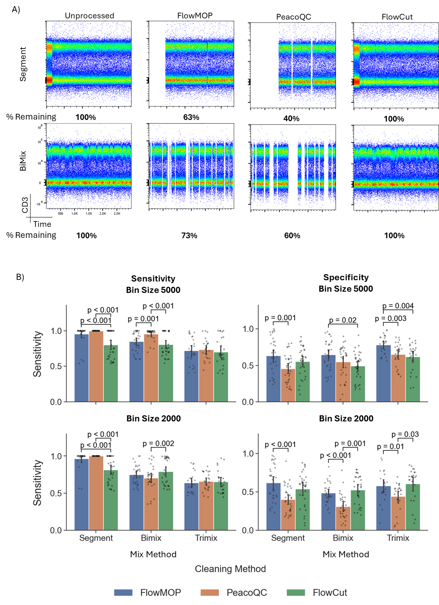
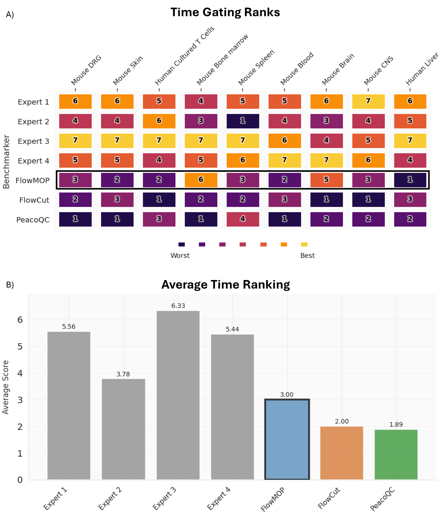
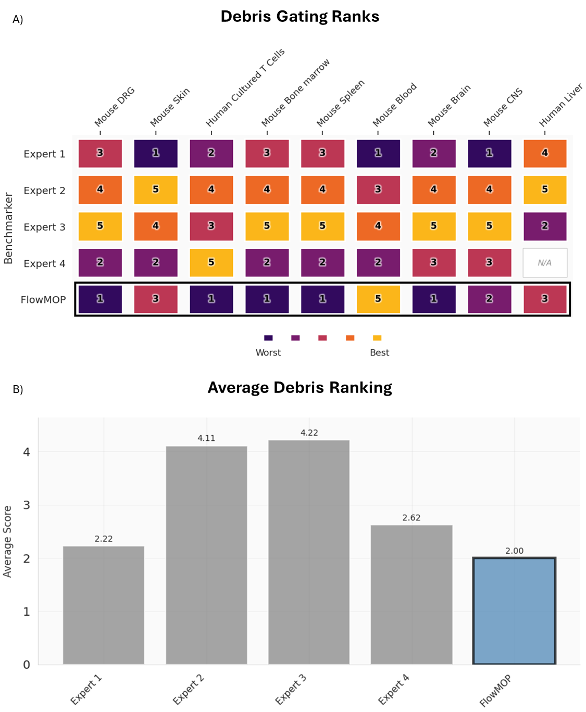
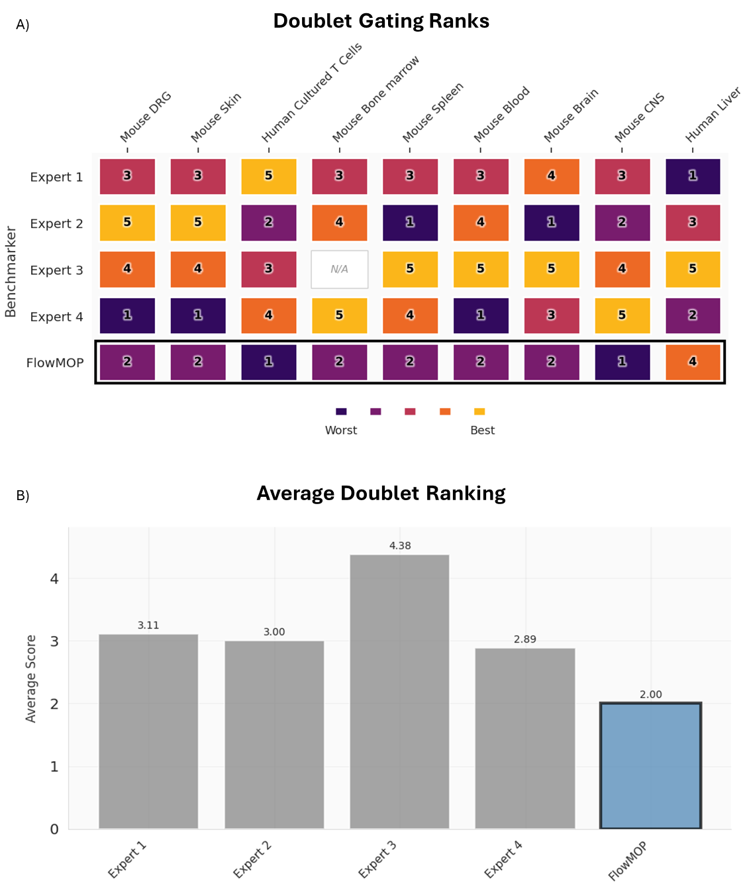
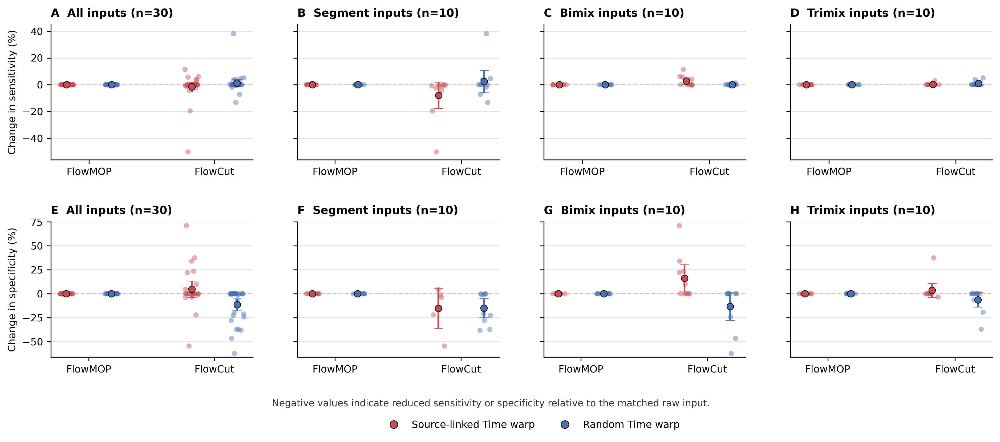

# FlowMOP: An Automated Flow Cytometry Time, Debris, and Doublet Removal Tool

Running Title: Automated Python-based Sample Cleanup

**Authors:**

Tony Xu [1], Nadia A. Roberts [1], Felix Marsh-Wakefield [2,3], Rebecca A. Jaeger [1], Sarah Croft [1], Abhimanu Pandey [1], Dalton Leibold [4], Angela L. Ferguson [2,3], Lily Rodgers [2,3], Umaimainthan Palendira [3], Geoffrey W. McCaughan [2,5,6], Ben Quah [7], Robin Vlieger* [8], Anne Brüstle* [1]

**Affiliations:**

1: Department of Immunology and Infectious Disease, John Curtin School of Medical Research, the Australian National University, Canberra, Australian Capital Territory, Australia 
2: Liver Injury & Cancer Program, Cancer Innovations Centre, Centenary Institute, The University of Sydney, Sydney, New South Wales, Australia
3: Human Immunology Laboratory, School of Medical Sciences, Faculty of Medicine and Health, The University of Sydney, Sydney NSW, Australia	
4: Division of Ecology and Evolution, Research School of Biology, the Australian National University, Canberra, Australian Capital Territory, Australia 
5: A.W. Morrow Gastroenterology and Liver Centre, Royal Prince Alfred Hospital, Sydney NSW, Australia
6: Sydney Medical School , Faculty of Medicine and Health, The University of Sydney, Sydney NSW, Australia
7: Division of Genome Sciences and Cancer, John Curtin School of Medical Research, the Australian National University, Canberra, Australian Capital Territory, Australia
8: School of Medicine and Psychology, Australian National University, Canberra, Australian Capital Territory, Australia

**Contact information for all authors:**

Tony Xu <Tony.Xu@anu.edu.au>; Nadia A. Roberts <Nadia.Roberts@anu.edu.au>; Felix Marsh-Wakefield <felix.marsh-wakefield@sydney.edu.au>; Rebecca A. Jaeger <Rebecca.Jaeger@anu.edu.au>; Sarah Croft <Sarah.Croft@anu.edu.au>; Abhimanu Pandey <Abhimanu.Pandey@anu.edu.au>; Dalton Leibold <Dalton.Leibold@anu.edu.au>; Angela L. Ferguson <a.ferguson@centenary.org.au>; Lily Rodgers <lrod8310@uni.sydney.edu.au>; Umaimainthan Palendira <umaimainthan.palendira@sydney.edu.au>; Geoffrey W. McCaughan <g.mccaughan@centenary.org.au>; Ben Quah <ben.quah@anu.edu.au>;  Robin Vlieger <Robin.Vlieger@anu.edu.au>; Anne Brüstle <Anne.Bruestle@anu.edu.au>

## Acknowledgements

We thank Givanna Putri for her very helpful feedback and suggestions throughout the manuscript’s preparation. This work was also supported by computational resources provided by the Australian Government through the National Computational Infrastructure (NCI) under the ANU Merit Allocation Scheme.

**Funding information:**

TX is supported by the Australian Government Research Training Program PhD Scholarship. There are no other relevant sources of funding.

## Abstract

Flow cytometry now generates high-parameter datasets whose scale and variability challenge manual preprocessing, leading to subjectivity and poor reproducibility. Temporal artifacts are acquisition-time-dependent deviations in event quality or fluorescence signal caused by blockages, bubbles, flow instability, or instrument instability. This study introduces FlowMOP, a Python-native framework that automates three major preprocessing steps—time-gating, debris removal, and doublet exclusion. FlowMOP was developed to combine these preprocessing steps in a single workflow, whereas FlowCut and PeacoQC primarily address time-dependent quality control and broader automatic gating frameworks are aimed at population identification rather than standardized preprocessing cleanup.

Methodologically, temporal artifacts are identified via parameter-wise peak checks, bin-level fluorescence summaries across acquisition time, and robust outlier rejection. Debris is excluded by adaptive FSC-A thresholding derived from cross-parameter peak structure. Finally, doublets are removed using dynamic inflection detection on FSC-A/FSC-H and SSC-A/SSC-H ratio histograms. All operations are chunked and memory-efficient, enabling consistent processing on extremely large files.

Validation used synthetic datasets with event-level ground truth for acquisition-time artifacts, debris enrichment, and doublet enrichment, together with expert comparison on biological datasets. In the synthetic benchmarking, FlowMOP demonstrated higher sensitivity than FlowCut and greater specificity than PeacoQC for segment-type temporal artifacts, and removed labelled debris and doublet populations effectively in technical-control datasets. Subjective rankings often favored manual gates, and Bayesian analyses were used to summarize relative expert preference rather than objective ground-truth gating quality. FlowMOP provides a comprehensive, scalable, and reproducible preprocessing solution that standardizes cytometry data cleanup and strengthens downstream quantitative analyses. FlowMOP can be accessed at https://github.com/1ordinateur/FlowMOP.

## Introduction

The field of flow cytometry faces increasing complexity challenges. Modern acquisition hardware, exemplified by spectral cytometry, coupled with sophisticated analysis software utilizing deep-learning approaches, has resulted in datasets of increasingly large size and dimensionality [2]. This evolution necessitates correspondingly sophisticated preprocessing methodologies to enable satisfactory performance in both scale and quality of sample cleaning. Traditionally, preprocessing has been conducted manually, creating significant challenges where datasets exceed human analytical capacity and where reproducibility and objectivity are increasingly prioritized.

Manual preprocessing of flow cytometry data, whilst still not standardised, typically involves three gating components. I) Time gating: operators perform time-gating to remove events potentially acquired erroneously due to transient or persistent artifacts in the instrument or sample, including air bubbles, blockages, or laser malfunctions. II) Debris gating: operators remove debris, which is generated by both the sample preparation process and inherent in the sample itself. Debris events are generally identified by reference to measured events with low size (determined by FSC-A (Forward SCatter – Area)) and internal complexity (determined by SSC-A (Side SCatter – Area)) [1]. III) Doublet gating: Events classified as "doublets"—two or more cells erroneously detected as one—are removed as their fluorescence measurements lack reliability. This is often done with reference to the ratio of the signal duration, and signal intensity. Doublets feature a signal peak strength comparable to a single cell, but for twice the duration. Hence, analysts may filter these events out by comparing an event’s total FSC Area relative to its FSC height (peak signal intensity) or by comparing the FSC signal height against the FSC signal width [4]. These manual preprocessing steps are time-consuming, inherently subjective, and susceptible to inconsistency across operators.

This paper introduces FlowMOP, a Python-based preprocessing workflow that combines automated time-gating, debris removal, and doublet exclusion in a single headless tool. In contrast, FlowCut and PeacoQC primarily address time-dependent quality control, while broader automatic gating approaches such as GateNet and UNITO are aimed at population identification rather than standardized preprocessing cleanup. Unlike broader automated gating frameworks that require user-defined training examples or manually annotated gates, FlowMOP is designed to operate without task-specific training or manual gate annotation.

The Python implementation specifically facilitates integration with contemporary machine-learning workflows, which predominantly utilize Python-based frameworks. FlowMOP also supports efficient large-file preprocessing through vectorised numerical operations and memory-conscious summary calculations.

To date, cytometry preprocessing algorithms have been evaluated either by comparison to human-defined gold standards (as in FlowCut and PeacoQC) or through mathematical metrics (consider cyCombine’s approach to batch correction [11]). The synthetic datasets used here are not intended to suggest that simulation-based validation is unique; rather, they provide event-level labels for estimating sensitivity and specificity in preprocessing tasks where real ground truth is otherwise difficult to define.

Here, we introduce FlowMOP, an automated preprocessing tool for time-gating, debris removal, and doublet exclusion. We compare time-gating performance with PeacoQC and FlowCut, evaluate debris and doublet removal using synthetic ground-truth datasets and expert comparison, assess downstream biological impact, and benchmark computational scalability.

## Methods

For further details concerning datasets, see Supplementary Table 1A.

### Preparation protocols for synthetic samples

#### Synthetic Time Sample Preparation and Generation

#### Preparation of Human PBMC Samples for Synthetic Time Benchmarking Samples

PBMC samples were collected from healthy donors under ethics protocols ACT Health 2019.ETH.00081 and ANU HREC 2020/047. Blood was collected into ACD-A tubes and PBMCs isolated using Lymphoprep density gradient (Stemcell Technologies) and SepMate tubes (Stemcell Technologies) per manufacturer’s instructions prior to cryopreservation. Thawed PBMCs were stained with ViaDye Red (Cytek Biosciences). The staining cocktail contained antibodies to several highly abundant antigens at less-than-saturating concentrations, and either 0.5, 1 or 3 x 10^6 cells were stained, yielding samples with different levels of fluorophore signal intensity for these common antigens. Other antibodies within the panel were present at saturating concentrations to yield similar fluorescence intensity across different cell seeding densities. Samples were acquired on a Cytek Northern Lights 3-laser (V/B/R) spectral flow cytometer.

#### Generation of Synthetic Time Samples

The Segment, Bimix, and Trimix samples were designed as complementary time-artifact stress tests. Source FCS files were sampled to the proportions encoded in the output filename and an event-level source label (`SampleIDInt`) was retained for scoring but excluded from algorithm input. Segment samples model sustained acquisition shifts by sequentially appending sampled source blocks. Bimix and Trimix samples model subtler mid-acquisition changes in event origin or fluorescence distribution by sampling two or three differently stained source files, splitting events into 5000- or 2000-event mixing bins, shuffling those bins, and regenerating the Time channel across the mixed acquisition order. While major blockages often produce segmental deviations, short self-resolving micro-blockages can generate smaller transient changes; the Bimix and Trimix simulations were designed to test detection of these less obvious distributional perturbations under controlled ground-truth conditions.

#### Time-only acquisition-rate mechanism benchmark

To distinguish acquisition-rate sensitivity from source-linked fluorescence and composition structure, we performed a matched mechanism benchmark using source-labelled smallcut synthetic-combo FCS files. Thirty high-count inputs were selected: ten Bimix, ten Trimix, and ten Segment files. For each file, 500,000 acquisition-order-preserving events were used without changing fluorescence, scatter, source labels, or event order. Bimix and Trimix files used the first 500,000 events; Segment files used a contiguous 500,000-event window centered on the source transition so that both segment sources were represented.

Each input generated three matched variants: raw, source-time-warped, and random-time-warped. In the source-time-warped variant, local Time increments were multiplied according to `SampleIDInt` using acquisition-interval multipliers spanning 1.0x to 20.0x. In the random-time-warped variant, the same multiplier range was assigned to contiguous 25,000-event chunks independently of source identity. After warping, the total Time range was rescaled to match the raw input so that the benchmark tested local acquisition-rate structure rather than total acquisition duration. Performance was evaluated relative to the matched raw file using source-label sensitivity and specificity.

#### Mice

For generation of synthetic samples for FlowMOP validation (debris and doublet removal), splenocytes from 13-16-week old C57Bl/6N or C57Bl/6J mice were used. All animal experimentation was performed under ethics protocol 2024/379 at the Australian Phenomics Facility at the Australian National University, Canberra.

#### Synthetic Debris Sample Preparation and Generation

Mouse spleens were mechanically dissociated prior to lysis of red blood cells (RBC) with RBC lysis buffer (MilliQ H2O containing 150 mM NH4Cl, 10 mM KHCO3 and 1 mM EDTA). Splenocytes were then incubated with Fc block (BD), then stained with an antibody panel to delineate several major immune cell subsets (CD19 APC, CD3 PE, CD8 PE-Cy7, CD11b BB515, CD4 BV605, Fixable Viability Dye efluor780). To generate ‘high debris’ samples, cells were resuspended in MilliQ water and incubated for 2 minutes, prior to addition of 10X PBS to restore osmolarity. ‘Low debris’ samples were kept in isotonic solution throughout. Samples were acquired using a BD LSRII cytometer.

For assessment of FlowMOP debris-gating performance, high-debris and low-debris samples were combined by sampling approximately equal event numbers from each source and concatenating them into matched synthetic mixtures while retaining source labels for ground-truth quantification.

#### Synthetic Doublet Sample Preparation and Generation

To generate samples with high proportions of doublets, mouse spleens were digested through injection with digestion buffer comprising RPMI (Gibco) supplemented with collagenase P (Roche) and DNAse I (Roche). After incubation and mechanical dissociation, red blood cells (RBCs) were lysed with RBC lysis buffer. Cells were then divided and stained with either CellTrace Violet (CTV) (Invitrogen) or Carboxyfluorescein succinimidyl ester (CFSE) (eBioscience). Following this, cells were recombined and incubated for 30 minutes at 37oC 5% CO2 to encourage further doublet formation, then stained with Fixable Viability Dye eFluor780 (Invitrogen). Samples were acquired on a BD LSRII cytometer.

### Non-synthetic samples

Human liver samples used in the non-synthetic validation datasets were collected under ethics approval from the Sydney Local Health District Ethics Review Committee (X19-0488 and 2019/ETH13790).

### Bayesian Modelling

Rankings were modelled using a Plackett–Luce model with latent method abilities; identifiability was enforced by fixing a reference ability to zero. Independent Normal priors were placed on non‑reference abilities. Posterior inference was performed with an affine‑invariant ensemble Markov Chain Monte Carlo sampler (emcee; 32 walkers, 5,000 iterations; 1,000 burn‑in), and posterior medians with 95% credible intervals were reported. Directional hypotheses (superiority/inferiority) were evaluated by computing P = Pr(H1 | data) and converting to a Bayes factor BF₁₀ = p/(1 – p) under equal prior odds, interpreted using Jeffreys’ scale and reported as BF, P (Bayes factor, Posterior probability of alternative hypothesis) (see Supp. Table 2).

For each Plackett–Luce fit, the ensemble sampler’s mean acceptance fraction and an integrated‑autocorrelation‑time–based effective sample size was monitored (both as implemented in emcee) to assess MCMC convergence. Across all analyses, mean acceptance fractions ranged from 0.520 – 0.60, effective sample sizes ranging from 134042 to 128003.

Posterior predictive checks were carried out by comparing observed pairwise win counts with those implied by posterior draws under a Bradley–Terry formulation, using a chi‑square‑type discrepancy averaged over method pairs. The resulting average χ² per comparison with a maximum of 0.56, indicating good agreement between the model and the observed rankings.

Computations were implemented in Python with numerically stable log‑likelihoods.

### Computational scalability benchmark

Computational scalability was evaluated using clone-based real-FCS scaling. A representative FCS file was subsampled/replicated to matched event counts of 10,000, 100,000, 300,000, 1,000,000, and 2,000,000 events while preserving the original 36-channel structure. FlowMOP, PeacoQC, and FlowCut were run on the same generated inputs for each size.

For fair timing of the shared time-gating task, FlowMOP was run with debris and doublet removal disabled, and annotated output FCS writing disabled. PeacoQC and FlowCut were run with optional plotting, reporting, and output generation disabled where supported. Each condition was run once as a warm-up and then three measured times. Runtime and peak resident memory were recorded using `/usr/bin/time -v`; means and standard deviations were calculated across the three measured repeats.

### Coding Assistance

Parts of the code were generated with the aid of ChatGPT Codex and Claude Code. All code generated by LLMs were manually verified before implementation.

## RESULTS

Figure 1. Schematics depicting the methodology behind FlowMOP’s time-gating (A), debris-gating (B), and doublet gating methodologies (C). A) Depicts FlowMOP’s time-gating algorithm which selects valid parameters using positive-peak detection. Using these parameters, FlowMOP generates time-binned fluorescence medians, by selecting that time bin’s median positive peak value, or overall geometric mean. These summaries are smoothed and compared across acquisition order using robust outlier rejection.  B) Depicts FlowMOP’s debris-removal logic. It undertakes the same valid-parameters check as in A), and then selects the appropriate threshold based on that parameter’s fluorescence peaks. The median threshold is selected as the FSC-A gate. C) Depicts FlowMOP’s doublet-gating strategy. Doublets are either removed by the FSC-A/H, and/or SSC-A/H histogram inflection points, or by a fixed ratio.

### Algorithmic design

An overview of FlowMOP’s architecture is contained in Fig. 1, detailing approaches for its preprocessing, time-gating, debris removal, and doublet removal methods. This cleaned data can be applied to downstream analysis. FlowMOP ingests flow cytometry data stored in common cytometry and tabular formats, including .csv, .fcs, and parquet files. The algorithm reduces event-level measurements into compact bin- and channel-level summaries before applying robust outlier detection and voting steps, limiting memory use while supporting reproducible processing from single samples to cohort-level analyses.

This design keeps the main gating operations array-based and deterministic, reducing intermediate data storage during preprocessing.

#### Precleaning

FlowMOP first checks the input file for events at the limit of detection, defined as the maximum fluorescence value for that sample. If the number of events that equal this maximum fluorescence exceeds a threshold (default 5%), then FlowMOP automatically removes these events. Otherwise, it retains all the values.

#### Time Gating

To time gate, FlowMOP builds upon the assumptions posited in PeacoQC and FlowCut regarding fluorescence fluctuations. That is, independent of flow rate variations, sections of acquired sample with aberrant positive fluorescence averages are the target portions to be removed. To achieve this, FlowMOP checks each parameter, excluding parameters with a unimodal distribution. ‘Unimodal distribution’ is presently defined as parameters with only one identifiable peak. Subsequently, for each fluorescence parameter that satisfies this criterion, FlowMOP excludes the first peak (selecting all subsequent peaks) and measures the average fluorescence value for each time bin. FlowMOP then can operate either in the ‘Positives’ mode, or ‘Geomean’ mode. In ‘Positives’ mode, all events before the first inflection point are discarded. All results shown presently operate in ‘Positives’ mode. In the ‘Geomean’ mode, all events are considered. Subsequently, on a per-parameter basis, the sample is transformed into bins grouped by time (the default being bin having minimum of 150 events, up to a maximum of 500 bins).

The median fluorescence of each bin’s cells is returned. Two spline smoothing values, one small and one larger, are applied to the returned time-bin series before median absolute deviation (MAD) filtering. The smoothing factor scales the spline fit used for the binned fluorescence summary. Bins falling outside the MAD threshold in either smoothing pass are flagged for removal. Time-bins across all parameters are then combined, with time bins rejected if they have been flagged in any parameter. For panels with more than 10 parameters, FlowMOP requires two or more parameters to flag a bin before rejection. This empirical safeguard reduces false-positive removal caused by isolated noisy channels in high-dimensional panels (Figure 1A).

Most substantially, FlowMOP differs from the existing methods by choosing to measure how each time bin’s positive events differ, rather than re-calculating per time bin the ‘positive’ peak like in PeacoQC. Conversely, it also does not eschew positive peak detection completely (unless in Geomean mode) unlike FlowCut. Finally, FlowMOP combines robust outlier detection with parameter voting to detect short spikes, sustained signal shifts, gradual drift, transient microblockages, and mixed-source acquisition irregularities while reducing excessive removal in higher-dimensional sample sets.

#### Debris Gating

To debris gate, FlowMOP applies a conservative FSC-A-based threshold intended primarily to remove low-FSC debris. FSC-A was selected because low-forward-scatter material is a comparatively universal debris signal across sample types, whereas SSC-A patterns are more tissue- and instrument-dependent. This module is not intended to classify all possible debris morphologies. FlowMOP’s debris exclusion conducts a similar unimodality check on each fluorescence parameter, and the first peak is then excluded as the Time-gating feature. Thereafter, FlowMOP detects the global FSC-A peak as a reference point. For every parameter’s positive events, FlowMOP checks first for an FSC-A peak similar to the reference peak (default 30% of the reference peak’s value). If there is such a peak, it checks if the second FSC-A peak is the global maximum FSC-A peak. If that parameter’s positive cell’s second FSC-A is the global maxima, FlowMOP returns the FSC-A threshold as the minima between those two FSC-A peaks. If the second FSC-A is not the maximum, it returns the global interpeak minimum between the reference peak and maximal peak. Conversely, if there is no reference peak present in that parameter’s positive population, it selects the left-boundary of that parameter’s first peak. The median FSC-A threshold across all parameters is taken as the final FSC-A gate to be applied to the sample (Figure 1B).

#### Doublet Gating

To doublet gate, FlowMOP dynamically excludes sample doublets. To do this, FlowMOP creates a histogram of the FSC-A/FSC-H ratio. If there are multiple peaks all with a ratio of 1 or more, then it chooses the inflection point between those peaks, and excludes all events larger than that value. If there are insufficient peaks, it simply returns all events that have an FSC-A/FSC-H ratio smaller than a threshold (default 5). The process is repeated for the 
SSC-A/SSC-H variable. Consequently, FlowMOP is able to distill the implicit ratiometric information that current density based methodologies may overlook. FlowMOP's doublet module assumes that FSC-A/FSC-H and SSC-A/SSC-H ratios remain informative and that acquisition voltages and scatter parameters have been set appropriately. If relevant scatter channels are saturated, edge-collapsed, or incorrectly configured at acquisition, the lost pulse-shape information cannot be recovered by FlowMOP or by other downstream preprocessing algorithms; such samples require acquisition review, manual intervention, or alternative pulse-shape features where available.

### Algorithmic Validation

#### Synthetic Sample Benchmarking

The ability of FlowMOP to successfully detect time, debris, and doublet-perturbed data was first tested against the respective task’s synthetic datasets, namely the synthetically combined staining time samples, the high-debris + low debris samples, and the CTV / CFSE doublet samples.

For time gating samples, sensitivity and specificity were reported for each of the benchmarked methods using source labels as ground truth. Target source(s) were defined as the source(s) with the largest filename-encoded mixture proportion; tied largest proportions were treated as co-targets. Sensitivity was defined as retained target-source events divided by all retained events. Specificity was defined as removed non-target-source events divided by all removed events.

Figure 2. A) Representative flow cytometry plots to showing CD3 fluorescence against time. The original synthetically generated sample is shown in column 1, with the resulting output following FlowMOP, PeacoQC, and FlowCut processing shown in the subsequent columns. The first row depicts a representative ‘segmentation’ based synthetic file. The second row shows a representative two-sample mixture, 5000-event bin sample. Frequency percentages shown are the percentage of cells left post-cleaning relative to the original synthetic sample (rounded to the nearest percentage point). B) Bar plots showing algorithmic performance, grouped by sample type (Segmented, Bimix, and Trimix), and algorithm (FlowMOP, PeacoQC, and FlowCut). The first column depicts algorithmic performance sensitivity ± SD, with points representing individual samples. The second column depicts specificity ± SD. The first and second rows representing a 5000 and 2000 event mixing bin size respectively (n=87, 92). All comparisons were performed using a Bonferroni-adjusted paired t-test.

#### Synthetic Time Gating Benchmark

Several computational approaches have been proposed to address specific preprocessing challenges, primarily focusing on time-gating. Notable examples include flowAI [10], PeacoQC [5], flowClean [6], and FlowCut [9]. These algorithms are differentiated from FlowMOP by their focus on time-gating and R implementation. FlowMOP also uniquely offers debris cleaning capabilities and doublet removal (with the exception of PeacoQC). Here, FlowMOP’s time gating performance is evaluated against PeacoQC and FlowCut, the two most recent and best rated methods.

The Segment, Bimix, and Trimix samples were designed as complementary time-artifact stress tests, while allowing for an objective performance metric as each event’s origin is known (Fig. 2A). For samples with two or more equally weighted samples, algorithms were benchmarked on their ability to retain both considering that neither could be considered ‘superior’ in quality. Algorithmic performance against humans was considered not appropriate given the inability for humans to accurately remove multiple <1000 event bins from a sample in the mixed category. Results are reported with sensitivity and specificity.

In the Segmented method, FlowMOP and PeacoQC had significantly higher sensitivity than FlowCut (p < 0.001) (Fig. 2B). FlowMOP also had higher specificity than PeacoQC (p < 0.001). In the Bimix method, for the 5000-bin size, PeacoQC showed higher sensitivity than both FlowMOP and FlowCut (p < 0.001). FlowMOP demonstrated significantly higher specificity than FlowCut (p = 0.02). In 2000-bin size, PeacoQC showed inferior sensitivity to FlowCut (p = 0.002), and far worse specificity compared to both FlowMOP and FlowCut (p < 0.001). In the Trimix method, for the 5000 bin samples, FlowMOP exhibited higher specificity than both other methods (p = 0.004 PeacoQC, p = 0.003 FlowCut). Similarly, in the 2000 bin samples, PeacoQC was inferior in specificity to both FlowMOP and FlowCut (p = 0.01, p = 0.03). This pattern is consistent with PeacoQC being susceptible to bin-level noise when local peak estimates are unstable.

To test whether FlowCut's lower performance in Segment inputs reflected sensitivity to acquisition-rate structure itself, we altered only the Time channel while leaving fluorescence, scatter, source labels, and event order unchanged (Fig. S3). FlowMOP was unchanged under both source-linked and random Time warping. In contrast, FlowCut's sensitivity and specificity shifted after Time-only perturbation. Across all inputs, random Time warping reduced FlowCut specificity by 11.45 percentage points relative to matched raw inputs. In Segment inputs, source-linked Time warping reduced FlowCut sensitivity by 7.84 percentage points and specificity by 15.25 percentage points. These results support the interpretation that FlowCut responds to local acquisition-density structure even when fluorescence values are unchanged, whereas FlowMOP is less affected by rate-only variation.

Representative plots for the 2000 bin Bimix method, and the 2000, and 5000 bin Trimix methods can be found in Supp. 1.

#### Computational scalability

Clone-based runtime and memory benchmarking showed that FlowMOP scaled favorably at larger event counts (Table 1). Values are mean ± SD across three measured repeats after one warm-up run. FlowMOP was fastest from 100,000 events onward and had the lowest peak RAM at all sizes except 100,000 events. At 1,000,000 events, FlowMOP completed in 10.69 ± 0.16 s, compared with 24.21 ± 0.23 s for PeacoQC and 30.34 ± 0.48 s for FlowCut, while using 658.0 ± 0.3 MB peak RAM compared with 1483.4 ± 86.8 MB and 1115.1 ± 0.3 MB. At 2,000,000 events, FlowMOP completed in 17.42 ± 0.88 s, compared with 43.18 ± 4.23 s and 60.61 ± 2.37 s, while using 839.5 ± 0.4 MB peak RAM compared with 2614.8 ± 0.1 MB and 1849.8 ± 0.3 MB.

**Table 1: Clone-based time-gating runtime and memory benchmark**

Mean runtime and peak RAM across three measured repeats are shown as mean ± SD. The best-performing runtime and RAM value for each event count is shown in bold.

| Events | FlowMOP time (s) | PeacoQC time (s) | FlowCut time (s) | FlowMOP RAM (MB) | PeacoQC RAM (MB) | FlowCut RAM (MB) |
| ---: | ---: | ---: | ---: | ---: | ---: | ---: |
| 10,000 | 2.67 ± 0.50 | 4.40 ± 0.57 | **1.72 ± 0.02** | **237.9 ± 0.2** | 446.6 ± 0.2 | 261.8 ± 0.3 |
| 100,000 | **4.34 ± 0.11** | 13.74 ± 1.34 | 4.78 ± 0.33 | 351.6 ± 0.1 | 606.6 ± 26.1 | **326.4 ± 0.1** |
| 300,000 | **8.42 ± 0.85** | 15.08 ± 0.84 | 10.91 ± 0.49 | **462.3 ± 0.4** | 948.5 ± 5.9 | 505.4 ± 0.4 |
| 1,000,000 | **10.69 ± 0.16** | 24.21 ± 0.23 | 30.34 ± 0.48 | **658.0 ± 0.3** | 1483.4 ± 86.8 | 1115.1 ± 0.3 |
| 2,000,000 | **17.42 ± 0.88** | 43.18 ± 4.23 | 60.61 ± 2.37 | **839.5 ± 0.4** | 2614.8 ± 0.1 | 1849.8 ± 0.3 |

#### Synthetic Debris Gating Benchmark

Figure 3. A) Representative flow cytometry plots showing FSC-A/SSC-A debris plots. The first plot represents a representative combined high + low debris sample, the second and third represent the high debris portion and the low debris portion of that sample respectively. The percentages below denote the proportion of the combined sample represented by the annotated plot. B) FSC-A/SSC-A flow plots of the Fig. 3A’s representative sample post-processing. Again, the first column shows the combined high + low debris sample, the second and third show the high debris and low debris samples separately respectively. The percentages in the first column denote the proportion of the sample remaining relative to the original combined sample. Percentages in the  high debris and low debris columns denote the post-filtering proportion that each comprises (rounded to the nearest percentage). C) Bar plot representing mean proportion percentage ± SD of low debris sample remaining post-processing for FlowMOP and four human experts. FlowMOP has significantly higher low debris sample proportion than Expert 4 (Bonferroni adjusted paired t-test, p = 0.04). D) Bar plots showing mean low debris sample proportion percentage ± SD following human expert gating using either a group or per-sample based strategy (Blue bars denote group-wise results, green sample-wise). No difference was found between the two methods (un-adjusted paired t-test, p > 0.05).

FlowMOP’s debris gating performance was tested by its ability to deplete the high debris component in the combined high + low debris samples (Fig. 3A). FlowMOP was able to consistently reduce the proportion of high debris sample in the high + low debris sample from 50 ± 1.10% content to 28.8 ± 0.1% (paired t-test, p < 0.001), even whilst only using the FSC-A parameter to define the debris population (Fig. 3B). FlowMOP did not differ in performance to any human evaluators save for Expert 4 where FlowMOP performed better (Bonferroni adjusted paired t-test, p = 0.04) (Fig. 3C).

FlowMOP by default conducts debris removal on a per-sample basis. For comparison with the standard per-group gating methodology, human experts were also requested to apply per-sample and per-group gating strategies for comparison. No difference was found between per-sample and group-based gating for any expert (Fig. 3D, unadjusted paired t-Test p > 0.05).

#### Synthetic Doublet Gating Benchmark

FlowMOP’s doublet removal performance was also examined through synthetic technical controls (Fig. 4A). Events that were positive for both CFSE and CTV could then be confidently labelled as doublets, as no actual double positive events can be present (save for very rare dye-transfer events). FlowMOP was then run on these samples, and the proportion of remaining CFSE/CTV double positive cells was compared against that of human experts (Fig. 4A).

Figure 4. A) Representative flow cytometry plots of synthetic doublet samples and gating. The first row shows all samples by CTV against CFSE, the second FSC-A/FSC-H, and the last by SSC-H/SSC-A. The columns show representative CTV-only stained, CFSE-only stained, mixed CTV-CFSE, human expert doublet-removed, and FlowMOP doublet removed samples. B) Bar graph showing the mean percentage ± SD of CTV-CFSE double positive events removed (relative to the original sample) following FlowMOP or human expert processing. C) Bar graphs showing mean frequency ± SD of remaining CTV-CFSE double positive events following human expert processing, comparing group and per-sample based gating strategies (Blue bars denote group-wise results, green sample-wise). Only Expert 3 had significantly different results (un-adjusted paired t-test, p = 0.001, all others p > 0.05).

FlowMOP was able to significantly decrease the number of CTV-CFSE double-expressing events from an initial frequency of 7.84 ± 1.21% to 0.27 ± 0.11% (paired t-test; p = 0.001), successfully performing at the same standard as all experts (Fig. 4B, paired t-test; unadjusted p > 0.05). Again, to ensure that FlowMOP’s sample-wise doublet gating was not systemically biasing the results, human experts were asked to also perform sample wise and groupwise doublet gating. No statistical difference was detected between the sample-wise and groupwise methods, save for Expert 3 (Fig. 4C, paired t-test unadjusted p values). Expert 3 consistently removed fewer doublets in the sample-wise method than in the group method (Fig. 4C, paired t-test; p = 0.009).

### Human Subjective Rankings

To examine FlowMOP’s utility in real-world samples, its performance was evaluated across different flow cytometry files. FlowMOP’s outputs in these samples were compared with expert-provided gates using a forced-ranking preference task. These rankings measure relative expert preference and should not be interpreted as an absolute measure of gating adequacy. The resulting time, debris, and doublet gates were ranked by that sample type’s expert. In the time-gating task, FlowCut and PeacoQC were also included for comparison. Rankings were provided by a relevant expert in that sample type. Lower rankings indicate lower preference.

Figure 5. A) Table showing expert preference rankings for gates provided by each cleanup method or human operator for human experts 1-4, FlowMOP (our method, black border), FlowCut, and PeacoQC (Abbreviations: DRG – Dorsal Root Ganglion, CNS – Central Nervous System). Methods were ranked 1-7 for 9 different datasets by an expert in that respective data type. Lower ranking is worse.  B) Average ranking score across all 9 methods.

In the biological datasets, FlowMOP ranked the best amongst the algorithmic time gating approaches in the time gate (Fig. 5A, 5B). In the mouse brain and mouse bone marrow tasks, it was ranked sixth and fifth respectively (Fig. 5B). On a Bayesian analysis, FlowMOP was observed to be substantially preferred to FlowCut (BF = 5.39, P = 84.3%) and strongly preferred to PeacoQC (BF = 12.10, P = 92.4%). FlowMOP was ranked inferiorly to all human experts with strong to decisive evidence (Expert 2 BF = 10.55, P = 91.3%, all others BF > 100, P = 100%).

Figure 6. A) Table showing ranking preferences for human experts 1-4, and FlowMOP, when ranked 1-5 for 9 different datasets by an expert in debris removal. N/A denotes where samples for that human expert are not available. Lower ranking is worse. B) Bar graphs showing the average ranking score for each method across all datasets.

Figure 7. A) Table showing ranking preferences for human experts 1-4, and FlowMOP, when ranked 1-5 for 9 different datasets by an expert in doublet removal. NA denotes where samples for that human expert are not available. Lower ranking is worse. B) Bar graphs showing the average ranking score for each method across all datasets. Ranking score is determined by the inverse rank, out of five.

FlowMOP scored the poorest overall when ranked against the human experts in debris, and in doublets (Fig. 6B, 7B). On a Bayesian analysis, substantial to strong evidence was observed for FlowMOP being inferior to Expert 1 (BF = 5.87, P = 85.5%), Expert 4 (BF = 12.85, P = 92.8%), and Experts 2,3 (BF > 100, P = 100%) in debris removal. In doublet removal, FlowMOP was weakly inferiorly ranked to Expert 4 (BF = 3.14, P = 75.8%), substantially inferiorly ranked to Expert 1 (BF = 5.67, P = 85.0%), strongly inferiorly ranked to Expert 2 (BF = 14.38, P = 93.5%), and decisively inferiorly ranked to Expert 3 (BF > 100, P = 100%).

FlowMOP’s relative expert preference varied across datasets. For debris, it rated first in the mouse blood task, and third in human liver and mouse skin datasets. In the doublets task, FlowMOP scored second in the human liver task again. For full tabular rankings, see supplementary data Tables 1B-E.

## Discussion

FlowMOP demonstrates an ability to conduct time, debris, and doublet gating in a wide variety of sample types, including in difficult synthetic datasets.

### Synthetic Benchmarking

#### Synthetic Sample Time Gating

In the synthetic time-gating analysis, the Segment time gate is perhaps the most common and consequential time-artifact, as a non-negligible sample portion is often required to be removed in real samples. This type of synthetic data expects gating most similar to current manual gating, where blocks of events are removed. The objective of these samples is to simulate where there is a long blockage or sudden shift in the acquired sample. Here, FlowMOP demonstrated overall a greater sensitivity than FlowCut, and with better specificity than PeacoQC. The Time-only mechanism benchmark suggests that the FlowMOP versus FlowCut difference is not explained solely by implementation. When only local acquisition-rate structure was altered, FlowMOP remained unchanged, whereas FlowCut's removal behavior shifted, especially in Segment inputs (Fig. S3). This supports the interpretation that FlowCut can be affected by acquisition-density changes even when fluorescence values are unchanged, while FlowMOP is more anchored to fluorescence-population summaries across acquisition order.

The Bimix synthetic samples seek to emulate transient microblockages that self-resolve quickly. The size of the simulated microblockage is determined by the ‘bin size’, where the larger bin sizes emulate larger blockages. As expected, algorithm sensitivity and specificity reduced in the smaller bin sized samples. This degradation was particularly marked for PeacoQC’s sensitivity. Therefore, despite PeacoQC demonstrating higher sensitivity in the larger bin size to both algorithms, in the smaller bin-size runs PeacoQC proved to be inferior. FlowMOP at large Bimix bin sizes more specifically removed events than FlowCut. The benefits of this approach can also be seen in the Trimix results, where FlowMOP demonstrated higher specificity compared to both other algorithms in the large bin size, and to PeacoQC in the smaller Trimix samples.

The PeacoQC results are consistent with sensitivity to bin-level noise in local peak estimation. PeacoQC detects acquisition instability by identifying density peaks per channel and assessing their stability across acquisition bins. In mixed-source Bimix and Trimix files, each acquisition bin is a finite draw from multiple fluorescence distributions, which can make local peak estimates less stable. PeacoQC may therefore flag bins because their local peak structure is noisy, rather than because the removed events correspond cleanly to the source-labelled contaminating population. FlowMOP is less sensitive to this failure mode because it does not redefine peak quality independently within each bin; instead, it uses globally anchored positive-population thresholds and compares time-bin fluorescence summaries against the sample-level distribution. Together with the Time-only benchmark, these results suggest that FlowMOP's advantage arises from separating fluorescence-population deviation from acquisition-rate variation and local peak-estimation noise.

The computational benchmark demonstrates that FlowMOP provides speed gains with lower peak RAM usage at larger event counts. This is most evident from 300,000 events onward, where FlowMOP had both the fastest mean runtime and lowest peak memory use. At 2,000,000 events, FlowMOP was approximately 2.5-fold faster than PeacoQC and 3.5-fold faster than FlowCut, while using approximately 32% of PeacoQC’s peak RAM and 45% of FlowCut’s peak RAM.

It is of note that there is a large variation in algorithmic performance across the dataset. One source of this variation is that the 0.5 and 1.0 relative cell concentrations oftentimes exhibited marginal differences in fluorescence intensity (Supp. Fig. 2), especially relative to the 0.5 / 3.0 cell concentrations comparison. Consequently, the 0.5/1.0 discrimination tasks can be considered especially difficult benchmarks to overcome. However, this difficulty was intentionally placed, to ensure the present benchmarking dataset could also show progressive improvement of future time-gating algorithms.

Finally, it is germane to note that human expert gating on the synthetic dataset was considered but deemed inappropriate. This is due to humans being, for all practical purposes, incapable of gating the Bimix or Trimix in a manner that would yield a meaningful contaminated sample reduction. Given the above approaches provide an objective ground-truth target, the addition of human benchmarkers would not provide a further interpretable indication of algorithmic performance.

#### Synthetic Sample Debris and Doublet Gating

In the synthetic debris and doublet gating trials, FlowMOP removed the labelled technical artifact populations effectively (Fig. 3B, 4B). In the debris task, FlowMOP enriched the low-debris component by 9.67%, which represented approximately 19% more debris removed considering the original 50:50 debris / real sample mixture. FlowMOP’s debris performance can also be interpreted in relation to the two debris populations (Fig. 3A) present: one at <10,000 FSC-A units, and the second at ~20,000 FSC-A units. Human experts were instructed that this second debris population was debris, and to gate accordingly. FlowMOP was able to independently detect this second debris population and exclude it without external information.

Similarly, in the doublet removal, the synthetic samples, owing to the rather unique preparation, yielded triplets. FlowMOP was able to handle this unexpected population and successfully removed it.

When interpreting the synthetic debris and doublet samples, it is prudent to note that it is the relative enrichment of the non-lysed sample which provides the ground-truth label. This is because the standard-lysed samples actually contain debris too, albeit in a smaller proportion than the lysed sample. Similarly, some debris components may be quite large. Consequently, the resulting proportion of debris, at least when defined solely with an FSC-A / SSC-A gate must contain some contamination. FlowMOP's debris module deliberately targets the most generalizable debris phenotype: small, low-FSC events with undesirable staining characteristics. We do not assume that all debris can be identified from FSC-A alone. Larger aggregates or tissue-specific contaminants may resemble intact large cells, granulocytes, hepatocytes, or other biologically plausible populations in FSC/SSC space, and distinguishing these events generally requires domain knowledge or sample-specific gating. Future techniques may look to define debris on a per-event methodology based on that event’s entire fluorescence profile, rather than a traditional ‘gate’ that sets universal thresholds. Tumor digests and other high-debris tissues remain important future validation contexts because necrotic debris, aggregates, and heterogeneous scatter profiles may challenge a conservative FSC-A-centered debris strategy.

### Biological datasets: Human Ranking Data

For completeness, nine datasets were selected for human evaluation and ranking. These datasets were chosen to be a representative sample of human and mouse-based flow cytometry research, whilst also including samples that were intentionally difficult to gate. FlowMOP was preferred the least relative to the other human experts, however this is not unexpected.

There are several limitations of subjective human rankings for the evaluation of algorithm performance. The bias against algorithmic methodologies when compared to manual approaches is well documented, particularly where objective ground truths are difficult to ascertain such as in flow cleaning [3]. Due to FlowMOP’s unique approaches to gating (consider the difference in style in debris gating (Fig. 4A), or micro-time gates present (Fig. 2A)), FlowMOP samples were readily apparent to benchmarkers. Furthermore, reproducibility and the ‘correctness’ of evaluations was a recurrent problem. Benchmarkers would, more than on one occasion, rate themselves poorly in the rankings and deem their own gates as unacceptable. Together, these findings should condition any conclusion drawn from the rankings, especially in light of the synthetic sample benchmark results which include an objective ground truth.

The subjective human rankings suggest that FlowMOP's acceptability varies by dataset and task. Because forced rankings do not distinguish marginal preference from analytical inadequacy, and because human evaluation itself has inherent inter-operator limitations, we interpret these data as exploratory expert preference. Practical performance is therefore assessed alongside synthetic ground-truth tests and quantitative downstream analyses in real samples, including regression-based estimates of how preprocessing choice affects downstream population frequencies. The practical relevance of preprocessing differences depends on whether they alter downstream biological conclusions. We therefore interpret event-removal differences alongside downstream population analyses in real samples rather than treating higher or lower event removal, or closer agreement with a single human gate, as inherently superior.

### Other remarks

Automated Live/Dead classification of events was considered, however not implemented in the algorithm. There exist many varied protocols and methods for discriminating live/dead samples, along with great diversity in the determination of what constitutes a ‘dead’ event. Consequently, the difficulty of creating a universal live/dead discriminator is non-trivial. Finally, there may be potential significant biological insight in the ‘dead’ cells of a sample, whereby important information concerning a sample may be found in the dead events or their proportion.

The biological cost of preprocessing errors is difficult to measure directly, and neither under-cleaning nor over-cleaning is preferable. Under-cleaning may allow acquisition-time artifacts with abnormal staining patterns to confound downstream results, including by creating, inflating, or obscuring apparent rare populations. Conversely, over-cleaning could remove rare or transient biological populations. Because FlowMOP's time-gating module operates on acquisition-time structure rather than population identity, rare populations are not expected to be systematically biased unless they are temporally confounded with an acquisition artifact.

All algorithms were compared using recommended or default settings, including fixed FlowMOP parameters, to reflect typical unsupervised use. We did not perform extensive parameter tuning for FlowCut or PeacoQC because the original method descriptions do not provide dataset-specific guidance for how such tuning should be performed. We therefore treat full cross-method parameter optimization as outside the scope of this validation.

CTV-CFSE double-positive events provide an observable ground-truth doublet class, but same-label CTV-CTV and CFSE-CFSE doublets are not directly detectable in this validation design. Future versions could also extend FlowMOP to evaluate multiple scatter-channel pairs and select or combine the pair with the clearest debris/doublet separation.

## Conclusion

FlowMOP addresses existing gaps in automated flow cytometry preprocessing by providing comprehensive time-gating, debris removal, and doublet removal capabilities in a Python implementation. This facilitates integration with modern machine learning workflows while providing fast, memory-conscious preprocessing for large cytometry files.

Validation using synthetic datasets with objective ground truth demonstrated robust performance across diverse scenarios. FlowMOP showed higher specificity than PeacoQC and better sensitivity than FlowCut for segment-type anomalies, while maintaining consistent performance across varying bin sizes. For debris and doublet removal, FlowMOP removed the labelled technical artifact populations effectively in the synthetic ground-truth datasets, including unexpected triplet events.

Although human rankings on biological datasets favoured manual gating, synthetic benchmarking results provide stronger evidence of algorithmic capabilities, particularly given observed inconsistencies in human evaluations and the synthetic dataset’s ground-truthing. The open-source Python implementation enables reproducible and scalable analysis essential for increasingly complex cytometry datasets.

## Data and Code Availability

FlowMOP can be accessed via https://github.com/1ordinateur/FlowMOP. The code associated with the creation of this paper can be accessed at https://github.com/1ordinateur/FlowMOP_paper. The FCS Files used for this paper can be accessed at http://doi.org/10.5281/zenodo.17896445.

## Supplementary data

Figure S1: Representative flow cytometry CD3 / Time plots for Bimix 2000 bin, Trimix 5000 bin, and Trimix 2000 bin synthetic datasets, with original data inputs, and following cleaning by FlowMOP, FlowCut, and PeacoQC.  Percentages below each figure represent the retained proportion of cells relative to the original representative synthetic sample.

**Table S1A: Dataset Compositions**

| Dataset Name | Synthetic Time-Gating Dataset | Synthetic Debris-Gating Dataset | Synthetic Doublet-Gating Dataset | Human Liver |
| --- | --- | --- | --- | --- |
| Samples (given per benchmarker) | 6, 2 each at 0.5, 1, 3 cell concentrations, 3 datasets | 4, combined into 3 benchmarking samples | 4, combined into 3 benchmarking samples | 3 |
| Tissue Type | Peripheral blood mononuclear cells | Spleen | Spleen | Liver tissue |
| Organism | Human | Mouse | Mouse | Human |
| Collection Location | Canberra, ACT, Australia | Canberra, ACT, Australia | Canberra, ACT, Australia | Sydney, NSW, Australia |

| Mouse Dorsal Root Ganglion | Mouse Skin | Mouse Small Intestine | Mouse Colon | Mouse Brain |
| --- | --- | --- | --- | --- |
| 3 | 3 | 3 | 3 | 4 |
| Dorsal root ganglia | Skin | Distal small intestine | Colon | Brain |
| Mouse | Mouse | Mouse | Mouse | Mouse |
| Canberra, ACT, Australia | Canberra, ACT, Australia | Canberra, ACT, Australia | Canberra, ACT, Australia | Canberra, ACT, Australia |

| Mouse Central Nervous System | Mouse Spleen | Mouse Blood | Mouse Bone Marrow | Human Cultured T cells |
| --- | --- | --- | --- | --- |
| 3 | 7 | 5 | 3 | 5 |
| Spinal cord and brain | Spleen | Peripherally collected blood | Femur derived bone marrow | Peripherally collected, cultured, and restimulated T cells |
| Mouse | Mouse | Mouse | Mouse | Human |
| Canberra, ACT, Australia | Canberra, ACT, Australia | Canberra, ACT, Australia | Canberra, ACT, Australia | Canberra, ACT, Australia |

**Table S1B: Expert / Algorithm IDs**

| Expert / Algorithm | ID |
| --- | --- |
| Expert 1 | 1 |
| Expert 2 | 2 |
| Expert 3 | 3 |
| Expert 4 | 4 |
| FlowMOP | 5 |
| FlowCut | 6 |
| PeacoQC | 7 |

**Table S1C: Time gating rankings**

| Rankings | Mouse DRG | Mouse Skin | Human Cultured T Cells | Mouse Bone Marrow |
| --- | --- | --- | --- | --- |
| 1 | 3 | 3 | 3 | 3 |
| 2 | 1 | 1 | 2 | 5 |
| 3 | 4 | 4 | 1 | 4 |
| 4 | 2 | 2 | 4 | 1 |
| 5 | 5 | 6 | 7 | 2 |
| 6 | 6 | 5 | 5 | 6 |
| 7 | 7 | 7 | 6 | 7 |
| Mouse Spleen | Mouse Blood | Mouse Brain | Mouse Central Nervous System | Human Liver |
| 3 | 4 | 4 | 1 | 3 |
| 4 | 3 | 1 | 4 | 1 |
| 1 | 1 | 5 | 3 | 2 |
| 7 | 2 | 3 | 2 | 4 |
| 5 | 6 | 2 | 5 | 6 |
| 6 | 5 | 7 | 7 | 7 |
| 2 | 7 | 6 | 6 | 5 |

**Table S1D: Debris gating rankings**

| Rankings | Mouse DRG | Mouse Skin | Human Cultured T cells | Mouse Bone Marrow |
| --- | --- | --- | --- | --- |
| 1 | 3 | 2 | 4 | 3 |
| 2 | 2 | 3 | 2 | 2 |
| 3 | 1 | 5 | 3 | 1 |
| 4 | 4 | 4 | 1 | 4 |
| 5 | 5 | 1 | 5 | 5 |
| Mouse Spleen | Mouse Blood | Mouse Brain | Mouse Central Nervous System | Human Liver |
| 3 | 5 | 3 | 3 | 2 |
| 2 | 3 | 2 | 2 | 1 |
| 1 | 2 | 4 | 4 | 5 |
| 4 | 4 | 1 | 5 | 3 |
| 5 | 1 | 5 | 1 |  |

**Table S1E: Doublet gating rankings**

| Rankings | Mouse DRG | Mouse Skin | Human Cultured T cells | Mouse Bone Marrow |
| --- | --- | --- | --- | --- |
| 1 | 2 | 2 | 1 | 4 |
| 2 | 3 | 3 | 4 | 2 |
| 3 | 1 | 1 | 3 | 1 |
| 4 | 5 | 5 | 2 | 5 |
| 5 | 4 | 4 | 5 |  |
| Mouse Spleen | Mouse Blood | Mouse Brain | Mouse Central Nervous System | Human Liver |
| 3 | 3 | 3 | 4 | 3 |
| 4 | 2 | 1 | 3 | 5 |
| 1 | 1 | 4 | 1 | 2 |
| 5 | 5 | 5 | 2 | 4 |
| 2 | 4 | 2 | 5 | 1 |

**Table S2: Jeffreys’ Scale**

| Bayes Factor | Hypothesis descriptor |
| --- | --- |
| <1 | Null hypothesis supported |
| 1-3 | Anecdotal / Weak evidence |
| 3-10 | Moderate / Substantial evidence |
| 10-30 | Very strong evidence |
| >30 | Decisive evidence |

Figure S2:

Fluorescence variation as a function of cell concentration.

Figure S3:

Time-only acquisition-rate perturbations reveal FlowCut sensitivity to local Time density. Points show raw-matched changes in sensitivity and specificity, with large points and intervals showing the mean and 95% confidence interval. Negative values indicate reduced sensitivity or specificity relative to the raw control. Columns show all inputs together and the Segment, Bimix, and Trimix subsets separately. FlowMOP remains unchanged under both source-linked and random Time warping. In contrast, FlowCut's sensitivity and specificity shift after Time-only perturbation, with the clearest specificity loss in random Time-warped inputs and the strongest source-linked sensitivity loss in Segment inputs, where acquisition-rate structure aligns with source composition.

## References

[1]	Aysun Adan, Günel Alizada, Yağmur Kiraz, Yusuf Baran, and Ayten Nalbant. 2017. Flow cytometry: basic principles and applications. Critical Reviews in Biotechnology 37, 2 (February 2017), 163–176. https://doi.org/10.3109/07388551.2015.1128876

[2]	Thomas Myles Ashhurst, Felix Marsh-Wakefield, Givanna Haryono Putri, Alanna Gabrielle Spiteri, Diana Shinko, Mark Norman Read, Adrian Lloyd Smith, and Nicholas Jonathan Cole King. 2022. Integration, exploration, and analysis of high-dimensional single-cell cytometry data using Spectre. Cytometry Part A 101, 3 (2022), 237–253. https://doi.org/10.1002/cyto.a.24350

[3]	Noah Castelo, Maarten W. Bos, and Donald R. Lehmann. 2019. Task-Dependent Algorithm Aversion. Journal of Marketing Research 56, 5 (October 2019), 809–825. https://doi.org/10.1177/0022243719851788

[4]	Antonio Cosma. 2020. The Nightmare of a Single Cell: Being a Doublet. Cytometry A 97, 8 (August 2020), 768–771. https://doi.org/10.1002/cyto.a.23929

[5]	Annelies Emmaneel, Katrien Quintelier, Dorine Sichien, Paulina Rybakowska, Concepción Marañón, Marta E. Alarcón-Riquelme, Gert Van Isterdael, Sofie Van Gassen, and Yvan Saeys. 2022. PeacoQC: Peak-based selection of high quality cytometry data. Cytometry Part A 101, 4 (2022), 325–338. https://doi.org/10.1002/cyto.a.24501

[6]	Kipper Fletez-Brant, Josef Špidlen, Ryan R. Brinkman, Mario Roederer, and Pratip K. Chattopadhyay. 2016. flowClean: Automated identification and removal of fluorescence anomalies in flow cytometry data. Cytometry Part A 89, 5 (2016), 461–471. https://doi.org/10.1002/cyto.a.22837

[7]	Zicheng Hu, Alice Tang, Jaiveer Singh, Sanchita Bhattacharya, and Atul J. Butte. 2020. A robust and interpretable end-to-end deep learning model for cytometry data. Proceedings of the National Academy of Sciences 117, 35 (September 2020), 21373–21380. https://doi.org/10.1073/pnas.2003026117

[8]	Nanditha Mallesh. 2023. Automated analysis of flow cytometry using deep learning for the detection of B-cell neoplasms. Thesis. Universitäts- und Landesbibliothek Bonn. Retrieved August 7, 2023 from https://bonndoc.ulb.uni-bonn.de/xmlui/handle/20.500.11811/10949

[9]	Justin Meskas, Daniel Yokosawa, Sherrie Wang, Gabriela C. Segat, and Ryan Remy Brinkman. 2023. FlowCut: An R package for automated removal of outlier events and flagging of files based on time versus fluorescence analysis. Cytometry Part A 103, 1 (2023), 71–81. https://doi.org/10.1002/cyto.a.24670

[10]	Gianni Monaco, Hao Chen, Michael Poidinger, Jinmiao Chen, João Pedro de Magalhães, and Anis Larbi. 2016. flowAI: automatic and interactive anomaly discerning tools for flow cytometry data. Bioinformatics 32, 16 (August 2016), 2473–2480. https://doi.org/10.1093/bioinformatics/btw191

[11]	Christina Bligaard Pedersen, Søren Helweg Dam, Mike Bogetofte Barnkob, Michael D. Leipold, Noelia Purroy, Laura Z. Rassenti, Thomas J. Kipps, Jennifer Nguyen, James Arthur Lederer, Satyen Harish Gohil, Catherine J. Wu, and Lars Rønn Olsen. 2022. cyCombine allows for robust integration of single-cell cytometry datasets within and across technologies. Nat Commun 13, 1 (March 2022), 1698. https://doi.org/10.1038/s41467-022-29383-5

[12]	Lisa Weijler, Florian Kowarsch, Michael Reiter, Pedro Hermosilla, Margarita Maurer-Granofszky, and Michael Dworzak. 2024. FATE: Feature-Agnostic Transformer-Based Encoder for Learning Generalized Embedding Spaces in Flow Cytometry Data. 2024. 7956–7964. Retrieved May 3, 2024 from https://openaccess.thecvf.com/content/WACV2024/html/Weijler_FATE_Feature-Agnostic_Transformer-Based_Encoder_for_Learning_Generalized_Embedding_Spaces_in_WACV_2024_paper.html
