# FlowMOP: An Automated Flow Cytometry Time, Debris, and Doublet Removal Tool

Running Title: Automated Python-based Sample Cleanup

**Authors:**

Tony Xu [1], Nadia A. Roberts [1], Felix Marsh-Wakefield [2,3], Rebecca A. Jaeger [1], Sarah Croft [1], Abhimanu Pandey [1], Dalton Leibold [4], Angela L. Ferguson [2,3], Lily Rodgers [2,3], Umaimainthan Palendira [3], Geoffrey W. McCaughan [2,5,6], Ben Quah [7], Robin Vlieger* [8], Anne Brüstle* [1]

**Affiliations:**

1: Department of Immunology and Infectious Disease, John Curtin School of Medical Research, the Australian National University, Canberra, Australian Capital Territory, Australia 
2: Liver Injury & Cancer Program, Cancer Innovations Centre, Centenary Institute, The University of Sydney, Sydney, New South Wales, Australia
3: Human Immunology Laboratory, School of Medical Sciences, Faculty of Medicine and Health, The University of Sydney, Sydney NSW, Australia	
4: Division of Ecology and Evolution, Research School of Biology, the Australian National University, Canberra, Australian Capital Territory, Australia 
5: A.W. Morrow Gastroenterology and Liver Centre, Royal Prince Alfred Hospital, Sydney NSW, Australia
6: Sydney Medical School , Faculty of Medicine and Health, The University of Sydney, Sydney NSW, Australia
7: Division of Genome Sciences and Cancer, John Curtin School of Medical Research, the Australian National University, Canberra, Australian Capital Territory, Australia
8: School of Medicine and Psychology, Australian National University, Canberra, Australian Capital Territory, Australia

**Contact information for all authors:**

Tony Xu <Tony.Xu@anu.edu.au>; Nadia A. Roberts <Nadia.Roberts@anu.edu.au>; Felix Marsh-Wakefield <felix.marsh-wakefield@sydney.edu.au>; Rebecca A. Jaeger <Rebecca.Jaeger@anu.edu.au>; Sarah Croft <Sarah.Croft@anu.edu.au>; Abhimanu Pandey <Abhimanu.Pandey@anu.edu.au>; Dalton Leibold <Dalton.Leibold@anu.edu.au>; Angela L. Ferguson <a.ferguson@centenary.org.au>; Lily Rodgers <lrod8310@uni.sydney.edu.au>; Umaimainthan Palendira <umaimainthan.palendira@sydney.edu.au>; Geoffrey W. McCaughan <g.mccaughan@centenary.org.au>; Ben Quah <ben.quah@anu.edu.au>;  Robin Vlieger <Robin.Vlieger@anu.edu.au>; Anne Brüstle <Anne.Bruestle@anu.edu.au>

## Acknowledgements

We thank Givanna Putri for her very helpful feedback and suggestions throughout the manuscript’s preparation. This work was also supported by computational resources provided by the Australian Government through the National Computational Infrastructure (NCI) under the ANU Merit Allocation Scheme.

**Funding information:**

TX is supported by the Australian Government Research Training Program PhD Scholarship. There are no other relevant sources of funding.

## Abstract

Flow cytometry now generates high-parameter datasets whose scale and variability challenge manual preprocessing, leading to subjectivity and poor reproducibility. Temporal artifacts are acquisition-time-dependent deviations in event quality or fluorescence signal caused by blockages, bubbles, flow instability, or instrument instability. This study introduces FlowMOP, a Python-native framework that automates three major preprocessing steps—time-gating, debris removal, and doublet exclusion. FlowMOP was developed to combine these preprocessing steps in a single workflow, whereas FlowCut and PeacoQC primarily address time-dependent quality control and broader automatic gating frameworks are aimed at population identification rather than standardized preprocessing cleanup.

Methodologically, temporal artifacts are identified via parameter-wise peak checks, bin-level fluorescence summaries across acquisition time, and robust outlier rejection. Debris is excluded by adaptive FSC-A thresholding derived from cross-parameter peak structure. Finally, doublets are removed using dynamic inflection detection on FSC-A/FSC-H and SSC-A/SSC-H ratio histograms. The implementation uses memory-conscious array operations; computational scaling was evaluated to 2 million events in a 36-channel file.

Validation used synthetic datasets with event-level ground truth for acquisition-time artifacts, debris enrichment, and doublet enrichment, together with expert comparison on biological datasets. In the synthetic benchmarking, FlowMOP demonstrated higher retained-target purity than FlowCut and greater removed-non-target purity than PeacoQC for segment-type temporal artifacts, and removed labelled debris and doublet populations effectively in technical-control datasets. Subjective rankings often favored manual gates, and Bayesian analyses were used to summarize relative expert preference rather than objective ground-truth gating quality. Within the tested settings, FlowMOP provides a reproducible workflow for standardizing time, debris, and doublet preprocessing. FlowMOP can be accessed at https://github.com/1ordinateur/FlowMOP.

## Introduction

Modern flow-cytometry studies can contain increasing numbers of files, events, and measured parameters [2]. The large scale of these data makes repeated manual preprocessing time-consuming and often impractical, potentially amplifying variability between operators. Reproducible automated preprocessing is therefore valuable for large studies.

Manual preprocessing of flow cytometry data, whilst still not standardised, typically involves three gating components. I) Time gating: operators perform time-gating to remove events potentially acquired erroneously due to transient or persistent artifacts in the instrument or sample, including air bubbles, blockages, or laser malfunctions. II) Debris gating: operators remove debris, which is generated by both the sample preparation process and inherent in the sample itself. Debris events are generally identified by reference to measured events with low size (determined by FSC-A (Forward SCatter – Area)) and internal complexity (determined by SSC-A (Side SCatter – Area)) [1]. III) Doublet gating: Events classified as "doublets"—two or more cells erroneously detected as one—are removed as their fluorescence measurements lack reliability. This is often done with reference to the ratio of the signal duration, and signal intensity. Doublets feature a signal peak strength comparable to a single cell, but for twice the duration. Hence, analysts may filter these events out by comparing an event’s total FSC Area relative to its FSC height (peak signal intensity) or by comparing the FSC signal height against the FSC signal width [4]. These manual preprocessing steps are time-consuming, inherently subjective, and susceptible to inconsistency across operators.

The most conspicuous time artifacts often occur at the beginning or end of acquisition, but flow-rate surges interspersed throughout acquisition and associated signal-intensity variation have also been documented [10]. Here, we use “microblockage” operationally to denote a short, self-resolving mid-acquisition disturbance that produces a localized fluorescence shift; the term does not imply that a physical obstruction was directly observed. Temporary acquisition problems can be difficult to detect manually [5], and manual identification and removal of transient problems can be time-consuming and subjective [9]. Because the affected intervals may be short and interspersed with otherwise plausible events, they can be impractical to exclude reproducibly using multiple manual gates.

Several tools automate cytometry population identification, including the model-based flowClust method [13], the neural-network method GateNet [14], and the bivariate-segmentation framework UNITO [15]; automated gating approaches are reviewed elsewhere [16]. FlowMOP is a Python-based, training-free preprocessing workflow that combines automated time-gating, debris removal, and doublet exclusion in a single headless tool. FlowCut and PeacoQC provide the most direct comparison for its time-gating component.

The Python implementation specifically facilitates integration with contemporary machine-learning workflows, which predominantly utilize Python-based frameworks.

To date, cytometry preprocessing algorithms have been evaluated either by comparison to human-defined gold standards (as in FlowCut and PeacoQC) or through mathematical metrics (consider cyCombine’s approach to batch correction [11]). The synthetic datasets provide event-level labels for estimating retained-target purity and removed-non-target purity in preprocessing tasks where real ground truth is otherwise difficult to define.

Here, we introduce FlowMOP, an automated preprocessing tool for time-gating, debris removal, and doublet exclusion. We compare time-gating performance with PeacoQC and FlowCut, evaluate debris and doublet removal using synthetic ground-truth datasets and expert comparison, and benchmark computational scalability.

## Methods

For further details concerning datasets, see Supplementary Table 1A.

### Preparation protocols for synthetic samples

#### Synthetic Time Sample Preparation and Generation

#### Preparation of Human PBMC Samples for Synthetic Time Benchmarking Samples

PBMC samples were collected from healthy donors under ethics protocols ACT Health 2019.ETH.00081 and ANU HREC 2020/047. Blood was collected into ACD-A tubes and PBMCs isolated using Lymphoprep density gradient (Stemcell Technologies) and SepMate tubes (Stemcell Technologies) per manufacturer’s instructions prior to cryopreservation. Thawed PBMCs were stained with ViaDye Red (Cytek Biosciences). The staining cocktail contained antibodies to several highly abundant antigens at less-than-saturating concentrations, and either 0.5, 1 or 3 x 10^6 cells were stained, yielding samples with different levels of fluorophore signal intensity for these common antigens. Other antibodies within the panel were present at saturating concentrations to yield similar fluorescence intensity across different cell seeding densities. Samples were acquired on a Cytek Northern Lights 3-laser (V/B/R) spectral flow cytometer.

#### Generation of Synthetic Time Samples

Samples were synthetically combined across differing cell concentrations in three manners. Their construction is shown in Figure S1. One in a simple ‘Segmented’ fashion, where events from one or more samples were simply appended onto events from an existing sample. The second, ‘Bimix’ manner, where events from two differently stained samples were randomly synthetically combined in random proportions (e.g. 40:60, 75:25 etc), with one run containing a mixing bin size of 5000 events and the other of 2000 events. The final, ‘Trimix’ contained randomly combined events from three differently stained samples in mixing bin sizes of 5000, and 2000 events. Here, we use “microblockage” operationally to denote a short, self-resolving mid-acquisition disturbance that produces a localized fluorescence shift; the term does not imply that a physical obstruction was directly observed. Segmented samples model sustained changes, whereas Bimix and Trimix model the observable fluorescence consequence in this operational definition by introducing short source-defined fluorescence shifts during acquisition. They do not recreate or establish the physical mechanism itself. The Bimix and Trimix files can appear acceptable on visual inspection because the altered intervals are short and interspersed with otherwise plausible events; however, the retained source labels identify the intentionally perturbed events that should be excluded under the benchmark definition. This provides event-level ground truth for a class of artifact that is difficult to recognize and impractical to gate manually [5,9]. Flow-rate disturbances without corresponding fluorescence changes should not prompt event exclusion; these samples therefore model fluorescence changes across acquisition order without introducing flow-rate disturbances. Flow-rate effects were tested separately by altering Time either in alignment with source-linked fluorescence changes or independently of them. The event-level source label (`SampleIDInt`) was retained for scoring but excluded from algorithm input.

#### Time-only acquisition-rate mechanism benchmark

To distinguish acquisition-rate sensitivity from source-linked fluorescence and composition structure, we performed a matched mechanism benchmark using source-labelled smallcut synthetic-combo FCS files. Thirty high-count inputs were selected: ten Bimix, ten Trimix, and ten Segment files. For each file, 500,000 acquisition-order-preserving events were used without changing fluorescence, scatter, source labels, or event order. Bimix and Trimix files used the first 500,000 events; Segment files used a contiguous 500,000-event window centered on the source transition so that both segment sources were represented.

Each input generated three matched variants: raw, source-time-warped, and random-time-warped. In the source-time-warped variant, local Time increments were multiplied according to `SampleIDInt` using acquisition-interval multipliers spanning 1.0x to 20.0x. In the random-time-warped variant, the same multiplier range was assigned to contiguous 25,000-event chunks independently of source identity. After warping, the total Time range was rescaled to match the raw input so that the benchmark tested local acquisition-rate structure rather than total acquisition duration. Performance was evaluated relative to the matched raw file using retained-target purity and removed-non-target purity.

#### MAD-smoothing ablation and default selection

To test spline smoothing directly, FlowMOP was rerun on all 92 largecut synthetic time-gating files with all non-smoothing settings fixed. Nine short/long smoothing-factor pairs were evaluated against a no-smoothing control. The primary comparison in Figure 2 used the then-default pair (`0.1,0.9`); this separate ablation was not used to rerun the primary comparison (Table S4).

#### Mice

For generation of synthetic samples for FlowMOP validation (debris and doublet removal), splenocytes from 13-16-week old C57Bl/6N or C57Bl/6J mice were used. All animal experimentation was performed under ethics protocol 2024/379 at the Australian Phenomics Facility at the Australian National University, Canberra.

#### Synthetic Debris Sample Preparation and Generation

Mouse spleens were mechanically dissociated prior to lysis of red blood cells (RBC) with RBC lysis buffer (MilliQ H2O containing 150 mM NH4Cl, 10 mM KHCO3 and 1 mM EDTA). Splenocytes were then incubated with Fc block (BD), then stained with an antibody panel to delineate several major immune cell subsets (CD19 APC, CD3 PE, CD8 PE-Cy7, CD11b BB515, CD4 BV605, Fixable Viability Dye efluor780). To generate ‘high debris’ samples, cells were resuspended in MilliQ water and incubated for 2 minutes, prior to addition of 10X PBS to restore osmolarity. ‘Low debris’ samples were kept in isotonic solution throughout. Samples were acquired using a BD LSRII cytometer.

For assessment of FlowMOP debris-gating performance, high-debris and low-debris samples were combined by sampling approximately equal event numbers from each source and concatenating them into matched synthetic mixtures while retaining source labels for ground-truth quantification.

#### Synthetic Doublet Sample Preparation and Generation

To generate samples with high proportions of doublets, mouse spleens were digested through injection with digestion buffer comprising RPMI (Gibco) supplemented with collagenase P (Roche) and DNAse I (Roche). After incubation and mechanical dissociation, red blood cells (RBCs) were lysed with RBC lysis buffer. Cells were then divided and stained with either CellTrace Violet (CTV) (Invitrogen) or Carboxyfluorescein succinimidyl ester (CFSE) (eBioscience). Following this, cells were recombined and incubated for 30 minutes at 37oC 5% CO2 to encourage further doublet formation, then stained with Fixable Viability Dye eFluor780 (Invitrogen). Samples were acquired on a BD LSRII cytometer.

### Non-synthetic samples

Human liver samples used in the non-synthetic validation datasets were collected under ethics approval from the Sydney Local Health District Ethics Review Committee (X19-0488 and 2019/ETH13790).

### Tumour-liver acquisition-instability and biological-concordance analysis

Three tumour and three non-tumour human liver FCS files were used for an additional biological validation. For the acquisition-instability analysis, the three tumour files were divided into common acquisition-order bins, and the time masks produced by manual gating, FlowMOP, FlowCut, and PeacoQC were projected onto those bins. Bin-level deviations were evaluated using fluorescence channels only; Time, FSC, and SSC measurements were excluded. Method-overlap and method-specific residual bins were then examined using robustly scaled fluorescence summaries and positive-population deviations.

For the downstream analysis, the FlowMOP output was defined as the intersection of its independently calculated time, debris, and doublet masks; the limit-of-detection mask was excluded. The corresponding manual population was reconstructed from the final time, cells, and single-cell gates in the FlowJo workspace. Zombie-low events were defined operationally as Zombie UV-A values below 12,000 raw units, with the same threshold applied to every sample. This threshold-based analysis was used as an orthogonal biological-concordance check and not as a universal live/dead classifier.

To separate selective Zombie-high exclusion from the overall extent of event removal, selectivity was defined within each sample as the Zombie-high removal rate divided by the Zombie-low removal rate. The primary comparison was the paired FlowMOP/manual selectivity fold-change. Because selectivity is multiplicative and the sample size was small, FlowMOP and manual values were compared using an exact two-sided Wilcoxon signed-rank test applied to the log-transformed paired ratios. Constituent time, debris, and doublet masks were evaluated separately as secondary mechanistic analyses. No equivalence or non-inferiority margin was prespecified; consequently, a non-significant paired comparison was interpreted as no detected difference rather than proof of equivalence.

### Statistical Analysis of Expert Preference Rankings

The expert-ranking analysis was used to summarize relative preferences among gates generated by FlowMOP, comparator algorithms, and human operators; it was not treated as an absolute measure of gating adequacy.

Rankings were modelled using a Plackett–Luce model with latent method abilities; identifiability was enforced by fixing a reference ability to zero. Independent Normal priors were placed on non‑reference abilities. Posterior inference was performed with an affine‑invariant ensemble Markov Chain Monte Carlo sampler (emcee; 32 walkers, 5,000 iterations; 1,000 burn‑in), and posterior medians with 95% credible intervals were reported. Directional hypotheses (superiority/inferiority) were evaluated by computing P = Pr(H1 | data) and converting to a Bayes factor BF₁₀ = p/(1 – p) under equal prior odds, interpreted using Jeffreys’ scale and reported as BF, P (Bayes factor, Posterior probability of alternative hypothesis) (see Supp. Table 2).

For each Plackett–Luce fit, the ensemble sampler’s mean acceptance fraction and an integrated‑autocorrelation‑time–based effective sample size was monitored (both as implemented in emcee) to assess MCMC convergence. Across all analyses, mean acceptance fractions ranged from 0.520 – 0.60, effective sample sizes ranging from 134042 to 128003.

Posterior predictive checks were carried out by comparing observed pairwise win counts with those implied by posterior draws under a Bradley–Terry formulation, using a chi‑square‑type discrepancy averaged over method pairs. The resulting average χ² per comparison with a maximum of 0.56, indicating good agreement between the model and the observed rankings.

Computations were implemented in Python with numerically stable log‑likelihoods.

### Computational scalability benchmark

Computational scalability was evaluated using clone-based real-FCS scaling. A representative FCS file was subsampled/replicated to matched event counts of 10,000, 100,000, 300,000, 1,000,000, and 2,000,000 events while preserving the original 36-channel structure. FlowMOP, PeacoQC, and FlowCut were run on the same generated inputs for each size.

For fair timing of the shared time-gating task, FlowMOP was run using local non-distributed execution, with debris and doublet removal disabled and annotated output FCS writing disabled. PeacoQC and FlowCut were run with optional plotting, reporting, and output generation disabled where supported. Each condition was run once as a warm-up and then three measured times. Runtime and peak resident memory were recorded using `/usr/bin/time -v`; means and standard deviations were calculated across the three measured repeats.

### Coding Assistance

Parts of the code were generated with the aid of ChatGPT Codex and Claude Code. All code generated by LLMs were manually verified before implementation.

## RESULTS

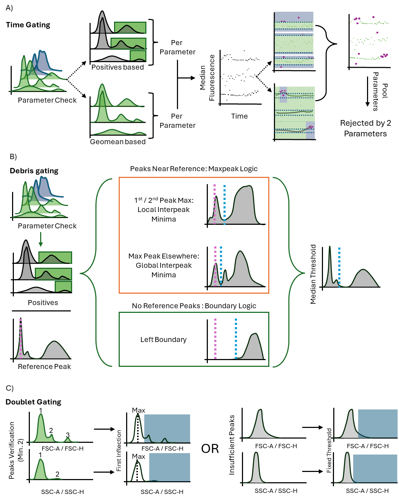

Figure 1. Conceptual schematics depicting FlowMOP’s time-gating (A), debris-gating (B), and doublet-gating (C) methods; plotted fluorescence intensity and signal-strength axes are schematic and use arbitrary units. A) FlowMOP selects valid parameters using positive-peak detection, generates time-binned fluorescence summaries, applies two smoothing resolutions, and performs robust outlier rejection across acquisition order. B) FlowMOP applies the same valid-parameter check, derives a candidate FSC-A threshold from each eligible parameter’s positive events, and uses the median candidate as the final FSC-A gate. C) FlowMOP identifies doublets from inflection points in FSC-A/FSC-H and SSC-A/SSC-H ratio histograms, with a fixed-ratio fallback.

### Algorithmic design

An overview of FlowMOP’s architecture is contained in Fig. 1, detailing approaches for its preprocessing, time-gating, debris removal, and doublet removal methods. This cleaned data can be applied to downstream analysis.

FlowMOP accepts `.csv`, `.fcs`, and Parquet files. It reduces event-level measurements into time-bin and channel summaries, applies smoothing and robust outlier detection, and combines the resulting flags through parameter voting.

#### Precleaning

FlowMOP first checks the input file for events at the limit of detection, defined here as events at the maximum FSC-A value for that sample. If the number of events at this maximum exceeds a threshold (default 1%), FlowMOP removes these maximum-valued events. Otherwise, it retains all values. The 1% cutoff is a pragmatic safeguard intended to identify non-trivial accumulation at the acquisition maximum without responding to isolated maximum-valued events.

#### Time Gating

To time gate, FlowMOP builds upon the assumptions posited in PeacoQC and FlowCut regarding fluorescence fluctuations. That is, independent of flow rate variations, sections of acquired sample with aberrant positive fluorescence averages are the target portions to be removed. To achieve this, FlowMOP checks each parameter, excluding parameters with a unimodal distribution. ‘Unimodal distribution’ is presently defined as parameters with only one identifiable peak. Subsequently, for each fluorescence parameter that satisfies this criterion, FlowMOP excludes the first peak (selecting all subsequent peaks) and measures the average fluorescence value for each time bin. FlowMOP then can operate either in the ‘Positives’ mode, or ‘Geomean’ mode. In ‘Positives’ mode, all events before the first inflection point are discarded. All results shown presently operate in ‘Positives’ mode. In the ‘Geomean’ mode, all events are considered. Subsequently, on a per-parameter basis, the sample is transformed into bins grouped by time (the default being bin having minimum of 150 events, up to a maximum of 500 bins).

The median fluorescence of each bin’s cells is returned. Two spline smoothing values, one small and one larger (current default `0.01,0.05`), are applied to the returned time-bin series before median absolute deviation (MAD) filtering. The smoothing factor scales the spline fit used for the binned fluorescence summary. Bins falling outside the MAD threshold in either smoothing pass are flagged for removal. Time-bins across all parameters are then combined, with time bins rejected if they have been flagged in any parameter. For panels with more than 10 parameters, FlowMOP requires two or more parameters to flag a bin before rejection. This empirical safeguard reduces false-positive removal caused by isolated noisy channels in high-dimensional panels, although an aberration confined to one channel may consequently be retained (Figure 1A).

FlowMOP summarizes each time bin using the median fluorescence of the selected positive population. If Geomean mode is selected, FlowMOP instead uses the geometric mean of all events in the bin. The two smoothing resolutions target both shorter and more sustained deviations, while parameter voting limits removal driven by isolated noisy channels in higher-dimensional panels.

#### Debris Gating

FlowMOP’s debris module targets small, low-FSC debris. The final gate is applied on FSC-A, but its threshold is informed by FSC-A distributions across eligible fluorescence-positive populations rather than the overall FSC-A histogram alone. SSC-A may improve recognition of larger or internally complex debris, while pulse-width measurements may assist with aggregates. Accordingly, FlowMOP does not currently incorporate SSC-A or pulse-width measurements into its debris decision because broadly applicable thresholds for these features are difficult to establish across tissues, panels, instruments, and acquisition settings. FlowMOP’s debris exclusion conducts a similar unimodality check on each fluorescence parameter, and the first peak is then excluded as the Time-gating feature. Thereafter, FlowMOP detects the global FSC-A peak as a reference point. For every parameter’s positive events, FlowMOP checks first for an FSC-A peak similar to the reference peak (default 30% of the reference peak’s value). If there is such a peak, it checks if the second FSC-A peak is the global maximum FSC-A peak. If that parameter’s positive cell’s second FSC-A is the global maxima, FlowMOP returns the FSC-A threshold as the minima between those two FSC-A peaks. If the second FSC-A is not the maximum, it returns the global interpeak minimum between the reference peak and maximal peak. Conversely, if there is no reference peak present in that parameter’s positive population, it selects the left-boundary of that parameter’s first peak. The median FSC-A threshold across all parameters is taken as the final FSC-A gate to be applied to the sample (Figure 1B).

#### Doublet Gating

To doublet gate, FlowMOP dynamically excludes sample doublets. To do this, FlowMOP creates a histogram of the FSC-A/FSC-H ratio. If there are multiple peaks all with a ratio of 1 or more, then it chooses the inflection point between those peaks, and excludes all events larger than that value. If there are insufficient peaks, it simply returns all events that have an FSC-A/FSC-H ratio smaller than a threshold (default 5). The process is repeated for the 
SSC-A/SSC-H variable. Consequently, FlowMOP is able to distill the implicit ratiometric information that current density based methodologies may overlook. FlowMOP's doublet module assumes that FSC-A/FSC-H and SSC-A/SSC-H ratios remain informative and that acquisition voltages and scatter parameters have been set appropriately. If relevant scatter channels are saturated, edge-collapsed, or incorrectly configured at acquisition, the lost pulse-shape information cannot be recovered by FlowMOP or by other downstream preprocessing algorithms; such samples require acquisition review, manual intervention, or alternative pulse-shape features where available.

### Algorithmic Validation

#### Synthetic Sample Benchmarking

The ability of FlowMOP to successfully detect time, debris, and doublet-perturbed data was first tested against the respective task’s synthetic datasets, namely the synthetically combined staining time samples, the high-debris + low debris samples, and the CTV / CFSE doublet samples.

For time-gating samples, retained-target purity and removed-non-target purity were reported for each benchmarked method using source labels as the reference. Target source(s) were defined as the source(s) with the largest filename-encoded mixture proportion; tied largest proportions were treated as co-targets. Retained-target purity was defined as retained target-source events divided by all retained events. Removed-non-target purity was defined as removed non-target-source events divided by all removed events.

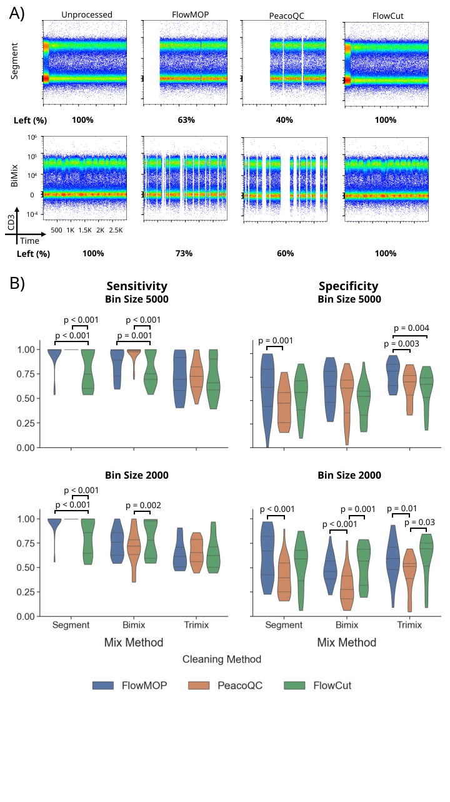

Figure 2. A) Representative flow cytometry plots showing CD3 fluorescence against time. The original synthetically generated sample is shown in column 1, with the resulting output following FlowMOP, PeacoQC, and FlowCut processing shown in the subsequent columns. The first row depicts a representative ‘segmentation’-based synthetic file. The second row shows a representative two-sample mixture with a 5000-event bin size. Frequency percentages shown are the percentage of cells left post-cleaning relative to the original synthetic sample (rounded to the nearest percentage point). B) Bar plots showing algorithmic performance, grouped by sample type (Segmented, Bimix, and Trimix) and algorithm (FlowMOP, PeacoQC, and FlowCut). The first column depicts retained-target purity ± SD, with points representing individual samples. The second column depicts removed-non-target purity ± SD. The first and second rows represent mixing-bin sizes of 5000 and 2000 events, respectively (n=87, 92). All comparisons were performed using a Bonferroni-adjusted paired t-test.

#### Synthetic Time Gating Benchmark

Several computational approaches address time-dependent quality control, including flowAI [10], PeacoQC [5], flowClean [6], and FlowCut [9]. FlowMOP combines a time-gating component with debris and doublet modules in one Python workflow. Here, its time-gating performance is evaluated against PeacoQC and FlowCut.

The Segment, Bimix, and Trimix samples were designed as complementary time-artifact stress tests, while allowing for objective performance metrics because each event’s origin is known (Fig. 2A). For samples with two or more equally weighted samples, algorithms were benchmarked on their ability to retain both considering that neither could be considered ‘superior’ in quality. Algorithmic performance against humans was considered not appropriate given the inability for humans to accurately remove multiple <1000-event bins from a sample in the mixed category. Results are reported as retained-target purity and removed-non-target purity.

In the Segmented method, FlowMOP and PeacoQC had significantly higher retained-target purity than FlowCut (p < 0.001) (Fig. 2B). FlowMOP also had higher removed-non-target purity than PeacoQC (p < 0.001). In the Bimix method, for the 5000-bin size, PeacoQC showed higher retained-target purity than both FlowMOP and FlowCut (p < 0.001). FlowMOP demonstrated significantly higher removed-non-target purity than FlowCut (p = 0.02). In the 2000-bin size, PeacoQC showed lower retained-target purity than FlowCut (p = 0.002) and lower removed-non-target purity than both FlowMOP and FlowCut (p < 0.001). In the Trimix method, for the 5000-bin samples, FlowMOP exhibited higher removed-non-target purity than both other methods (p = 0.004 PeacoQC, p = 0.003 FlowCut). Similarly, in the 2000-bin samples, PeacoQC had lower removed-non-target purity than both FlowMOP and FlowCut (p = 0.01, p = 0.03). This pattern is consistent with PeacoQC being susceptible to bin-level noise when local peak estimates are unstable.

To test the effect of flow-rate disturbances aligned with or independent of source-linked fluorescence changes, we altered only the Time channel while leaving fluorescence, scatter, source labels, and event order unchanged (Fig. S4). FlowMOP was unchanged under both source-linked and random Time warping. In contrast, FlowCut's retained-target and removed-non-target purity shifted after Time-only perturbation. Across all inputs, random Time warping reduced FlowCut's removed-non-target purity by 11.45 percentage points relative to matched raw inputs. In Segment inputs, source-linked Time warping reduced FlowCut's retained-target purity by 7.84 percentage points and removed-non-target purity by 15.25 percentage points. These results support the interpretation that FlowCut responds to local acquisition-density structure even when fluorescence values are unchanged, whereas FlowMOP is less affected by rate-only variation.

Dual-resolution smoothing increased retained-target purity, with a corresponding removed-non-target purity trade-off (Table S4). Relative to no smoothing, the current dual-resolution default (`0.01,0.05`) increased mean retained-target purity by 3.1%, while mean removed-non-target purity decreased by 3.6%. Across the tested dual settings, `0.02,0.09` produced the highest retained-target purity (0.9122), whereas the no-smoothing control produced the highest removed-non-target purity (0.6400).

Representative plots for the 2000 bin Bimix method, and the 2000, and 5000 bin Trimix methods can be found in Supp. 1.

#### Computational scalability

Clone-based runtime and memory benchmarking showed that FlowMOP scaled favorably at larger event counts (Table 1). Values are mean ± SD across three measured repeats after one warm-up run. FlowMOP was fastest from 100,000 events onward and had the lowest peak RAM at all sizes except 100,000 events. At 1,000,000 events, FlowMOP completed in 10.69 ± 0.16 s, compared with 24.21 ± 0.23 s for PeacoQC and 30.34 ± 0.48 s for FlowCut, while using 658.0 ± 0.3 MB peak RAM compared with 1483.4 ± 86.8 MB and 1115.1 ± 0.3 MB. At 2,000,000 events, FlowMOP completed in 17.42 ± 0.88 s, compared with 43.18 ± 4.23 s and 60.61 ± 2.37 s, while using 839.5 ± 0.4 MB peak RAM compared with 2614.8 ± 0.1 MB and 1849.8 ± 0.3 MB.

**Table 1: Clone-based time-gating runtime and memory benchmark**

Mean runtime and peak RAM across three measured repeats are shown as mean ± SD. The best-performing runtime and RAM value for each event count is shown in bold.

| Events | FlowMOP time (s) | PeacoQC time (s) | FlowCut time (s) | FlowMOP RAM (MB) | PeacoQC RAM (MB) | FlowCut RAM (MB) |
| ---: | ---: | ---: | ---: | ---: | ---: | ---: |
| 10,000 | 2.67 ± 0.50 | 4.40 ± 0.57 | **1.72 ± 0.02** | **237.9 ± 0.2** | 446.6 ± 0.2 | 261.8 ± 0.3 |
| 100,000 | **4.34 ± 0.11** | 13.74 ± 1.34 | 4.78 ± 0.33 | 351.6 ± 0.1 | 606.6 ± 26.1 | **326.4 ± 0.1** |
| 300,000 | **8.42 ± 0.85** | 15.08 ± 0.84 | 10.91 ± 0.49 | **462.3 ± 0.4** | 948.5 ± 5.9 | 505.4 ± 0.4 |
| 1,000,000 | **10.69 ± 0.16** | 24.21 ± 0.23 | 30.34 ± 0.48 | **658.0 ± 0.3** | 1483.4 ± 86.8 | 1115.1 ± 0.3 |
| 2,000,000 | **17.42 ± 0.88** | 43.18 ± 4.23 | 60.61 ± 2.37 | **839.5 ± 0.4** | 2614.8 ± 0.1 | 1849.8 ± 0.3 |

#### Synthetic Debris Gating Benchmark

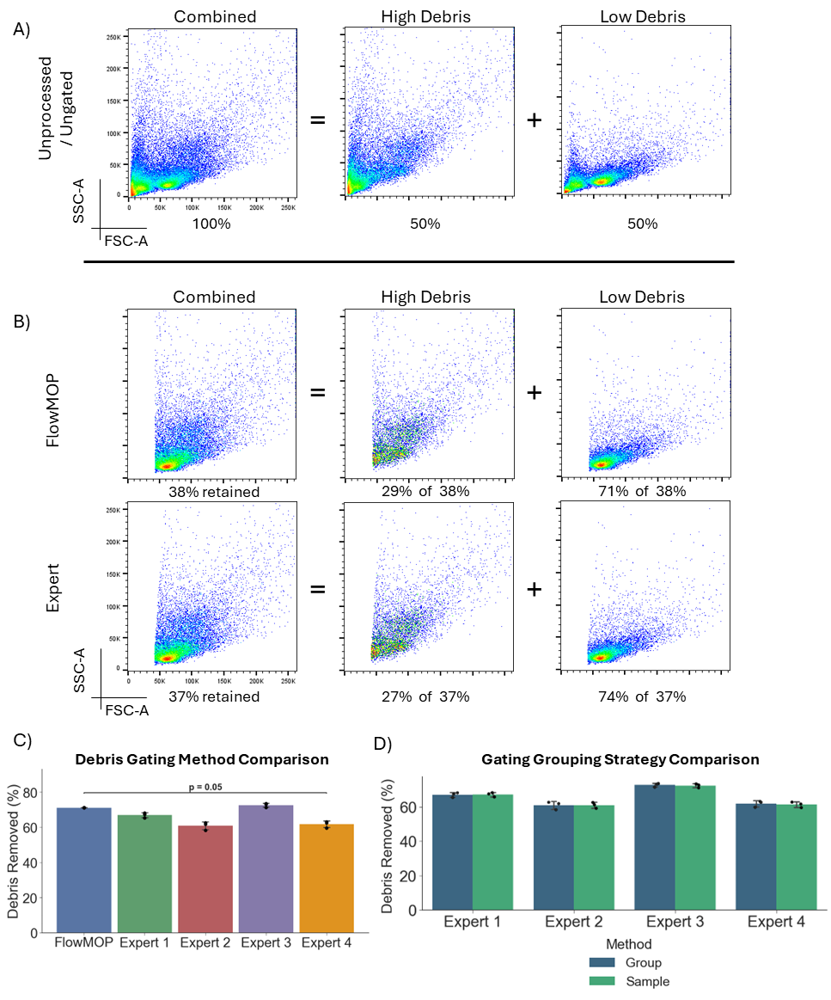

Figure 3. A) Representative flow cytometry plots showing FSC-A/SSC-A debris plots. The first plot represents a representative combined high + low debris sample, the second and third represent the high debris portion and the low debris portion of that sample respectively. The percentages below denote the proportion of the combined sample represented by the annotated plot. B) FSC-A/SSC-A flow plots of the Fig. 3A’s representative sample post-processing. Again, the first column shows the combined high + low debris sample, the second and third show the high debris and low debris samples separately respectively. The percentages in the first column denote the proportion of the sample remaining relative to the original combined sample. Percentages in the  high debris and low debris columns denote the post-filtering proportion that each comprises (rounded to the nearest percentage). C) Bar plot representing mean proportion percentage ± SD of low debris sample remaining post-processing for FlowMOP and four human experts. FlowMOP has significantly higher low debris sample proportion than Expert 4 (Bonferroni adjusted paired t-test, p = 0.04). D) Bar plots showing mean low debris sample proportion percentage ± SD following human expert gating using either a group or per-sample based strategy (Blue bars denote group-wise results, green sample-wise). No difference was found between the two methods (un-adjusted paired t-test, p > 0.05).

FlowMOP’s debris gating performance was tested by its ability to deplete the high-debris component in the combined high- and low-debris samples (Fig. 3A). FlowMOP reduced the high-debris source proportion from 50 ± 1.10% to 28.8 ± 0.1% (paired t-test, p < 0.001) (Fig. 3B). The final gate is applied on FSC-A, but its threshold is derived from candidate FSC-A distributions across eligible fluorescence-positive populations rather than from the overall FSC-A histogram alone. FlowMOP did not differ significantly from any human evaluator except Expert 4, for whom FlowMOP removed more labelled high-debris events (Bonferroni-adjusted paired t-test, p = 0.04) (Fig. 3C).

FlowMOP by default conducts debris removal on a per-sample basis. For comparison with the standard per-group gating methodology, human experts were also requested to apply per-sample and per-group gating strategies for comparison. No difference was found between per-sample and group-based gating for any expert (Fig. 3D, unadjusted paired t-Test p > 0.05).

#### Synthetic Doublet Gating Benchmark

FlowMOP’s doublet removal performance was also examined through synthetic technical controls (Fig. 4A). Events positive for both CFSE and CTV provide an observable class of heterologous labelled doublets, subject to rare dye-transfer events; same-label CTV-CTV and CFSE-CFSE doublets are not identifiable from these labels alone. FlowMOP was then run on these samples, and the proportion of remaining CFSE/CTV double-positive cells was compared with the proportions remaining after human-expert gating (Fig. 4A).

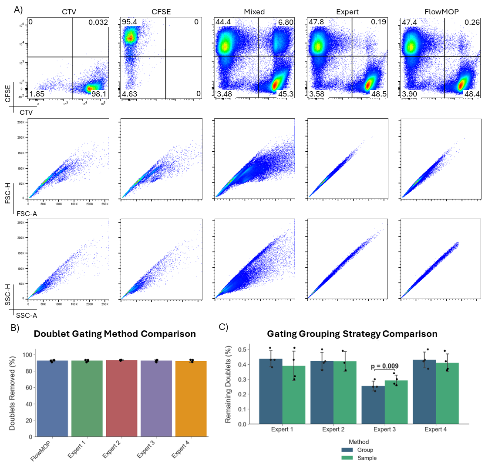

Figure 4. A) Representative flow cytometry plots of synthetic doublet samples and gating. The first row shows all samples by CTV against CFSE, the second FSC-A/FSC-H, and the last by SSC-H/SSC-A. The columns show representative CTV-only stained, CFSE-only stained, mixed CTV-CFSE, human expert doublet-removed, and FlowMOP doublet removed samples. B) Bar graph showing the mean percentage ± SD of CTV-CFSE double positive events removed (relative to the original sample) following FlowMOP or human expert processing. C) Bar graphs showing mean frequency ± SD of remaining CTV-CFSE double positive events following human expert processing, comparing group and per-sample based gating strategies (Blue bars denote group-wise results, green sample-wise). Only Expert 3 had significantly different results (un-adjusted paired t-test, p = 0.001, all others p > 0.05).

FlowMOP significantly decreased the frequency of CTV-CFSE double-positive events from 7.84 ± 1.21% to 0.27 ± 0.11% (paired t-test; p = 0.001). No statistically significant difference was detected between FlowMOP and any expert for this endpoint (Fig. 4B, paired t-test; unadjusted p > 0.05). To assess whether sample-wise gating systematically affected the comparison, human experts also performed sample-wise and groupwise doublet gating. No statistical difference was detected between these approaches except for Expert 3 (Fig. 4C, paired t-test; unadjusted p values). Expert 3 consistently removed fewer doublets with the sample-wise method than with the group method (Fig. 4C, paired t-test; p = 0.009).

### Expert Preference Evaluation

To examine FlowMOP’s utility in real-world samples, its performance was evaluated across different flow cytometry files. FlowMOP’s outputs in these samples were compared with expert-provided gates using a forced-ranking preference task. These rankings measure relative expert preference and should not be interpreted as an absolute measure of gating adequacy. The resulting time, debris, and doublet gates were ranked by that sample type’s expert. In the time-gating task, FlowCut and PeacoQC were also included for comparison. Rankings were provided by a relevant expert in that sample type. Rank 1 indicates the greatest preference.

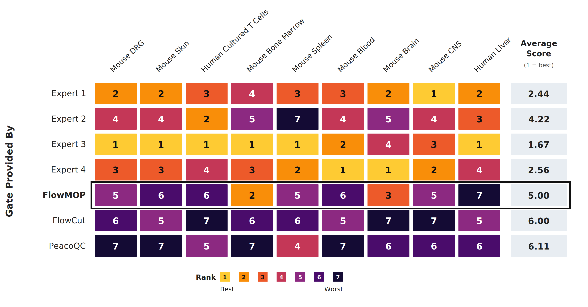

Figure 5. Expert preference rankings for time gates provided by four human experts, FlowMOP (black border), FlowCut, and PeacoQC across nine datasets. Rows indicate the gate provider, and the final column shows the mean rank across datasets. Rank 1 indicates greatest preference; therefore, a lower average score indicates greater preference. Abbreviations: DRG, dorsal root ganglion; CNS, central nervous system.

In the biological datasets, FlowMOP had the lowest mean rank among the algorithmic time-gating approaches (Fig. 5). In the mouse brain and mouse bone marrow tasks, it ranked third and second, respectively (Fig. 5). On a Bayesian analysis, FlowMOP was observed to be substantially preferred to FlowCut (BF = 5.39, P = 84.3%) and strongly preferred to PeacoQC (BF = 12.10, P = 92.4%). FlowMOP was ranked inferiorly to all human experts with strong to decisive evidence (Expert 2 BF = 10.55, P = 91.3%, all others BF > 100, P = 100%).

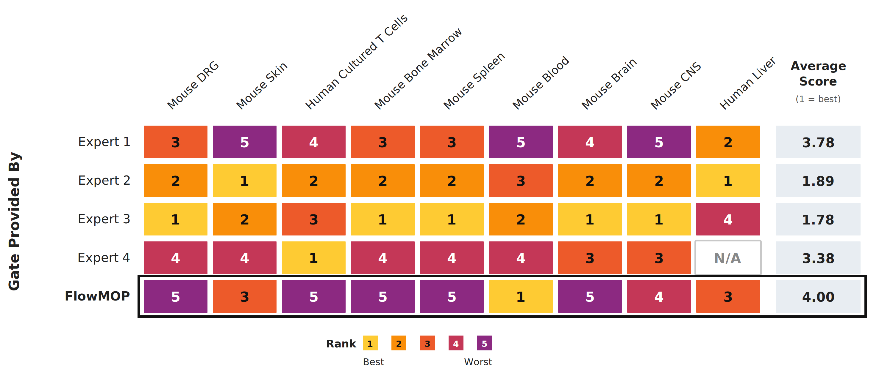

Figure 6. Expert preference rankings for debris gates provided by four human experts and FlowMOP (black border) across nine datasets. Rows indicate the gate provider, and the final column shows the mean rank across available datasets. Rank 1 indicates greatest preference; therefore, a lower average score indicates greater preference. N/A denotes an unavailable gate.

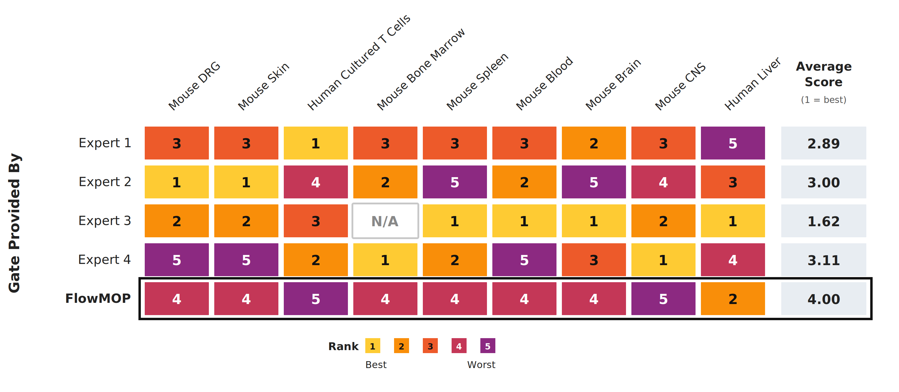

Figure 7. Expert preference rankings for doublet gates provided by four human experts and FlowMOP (black border) across nine datasets. Rows indicate the gate provider, and the final column shows the mean rank across available datasets. Rank 1 indicates greatest preference; therefore, a lower average score indicates greater preference. N/A denotes an unavailable gate.

FlowMOP had the highest mean rank when compared with the human experts for debris and doublet removal (Figs. 6, 7). On a Bayesian analysis, substantial to strong evidence was observed for FlowMOP being inferior to Expert 1 (BF = 5.87, P = 85.5%), Expert 4 (BF = 12.85, P = 92.8%), and Experts 2,3 (BF > 100, P = 100%) in debris removal. In doublet removal, FlowMOP was weakly inferiorly ranked to Expert 4 (BF = 3.14, P = 75.8%), substantially inferiorly ranked to Expert 1 (BF = 5.67, P = 85.0%), strongly inferiorly ranked to Expert 2 (BF = 14.38, P = 93.5%), and decisively inferiorly ranked to Expert 3 (BF > 100, P = 100%).

FlowMOP’s relative expert preference varied across datasets. For debris, it rated first in the mouse blood task, and third in human liver and mouse skin datasets. In the doublets task, FlowMOP scored second in the human liver task again. For full tabular rankings, see supplementary data Tables 1B-E.

### Tumour-liver acquisition instability and downstream biological concordance

In the three tumour-liver files, FlowMOP identified the principal acquisition intervals with strong multichannel fluorescence instability, including the major disturbances identified by manual gating, FlowCut, or PeacoQC. FlowMOP also identified additional intervals with shifts in positive-population fluorescence, whereas residual intervals detected only by comparator methods generally showed weaker fluorescence divergence. The substantial overlap between retained and removed events at the individual-event level indicates that the time gate detected acquisition-dependent shifts in population summaries rather than a discrete aberrant cell phenotype.

These findings also demonstrate that acquisition instability was not confined to conspicuous beginning- or end-of-run departures: the biological files contained mid-acquisition intervals with coordinated fluorescence shifts, including subtle intervals that would be difficult to define reproducibly by visual gating alone.

Across the three tumour and three non-tumour liver samples, the combined FlowMOP time, debris, and doublet masks retained 61.1% ± 10.0% of events, compared with 51.3% ± 17.8% after reconstructed manual gating (Tables S3A-B). FlowMOP had greater permissiveness-adjusted Zombie-high removal selectivity than manual gating in four of six samples. The median paired FlowMOP/manual selectivity fold-change was 1.68 (range 0.82-2.70), but the difference was not statistically significant (exact two-sided Wilcoxon signed-rank test on log ratios, p = 0.156). Thus, this analysis detected neither systematic superiority nor inferiority relative to manual gating; it was not designed to establish statistical equivalence.

Decomposition of the FlowMOP workflow showed distinct contributions from its three masks. The time mask was approximately composition-neutral (median Zombie-high/Zombie-low removal ratio 1.04), and debris removal was heterogeneous across samples. The doublet mask preferentially excluded Zombie-high events in all six samples (median ratio 7.38; secondary exact two-sided paired test, p = 0.031), making it the principal source of Zombie-high enrichment in the combined output. The doublet inflection procedure used its prespecified MAD fallback in these files, so this association provides biological concordance for the resulting mask but does not establish that every removed event was an invalid doublet.

## Discussion

FlowMOP was evaluated for time, debris, and doublet gating using synthetic technical controls and biological datasets.

### Synthetic Benchmarking

#### Synthetic Sample Time Gating

In the synthetic time-gating analysis, the Segment time gate is perhaps the most common and consequential time-artifact, as a non-negligible sample portion is often required to be removed in real samples. This type of synthetic data expects gating most similar to current manual gating, where blocks of events are removed. The objective of these samples is to simulate where there is a long blockage or sudden shift in the acquired sample. Here, FlowMOP demonstrated overall greater retained-target purity than FlowCut and better removed-non-target purity than PeacoQC. The Time-only mechanism benchmark suggests that the FlowMOP versus FlowCut difference is not explained solely by implementation. When local acquisition-rate structure was altered either in alignment with source-linked fluorescence changes or independently of them, FlowMOP remained unchanged, whereas FlowCut's removal behavior shifted, especially in Segment inputs (Fig. S4). This supports the interpretation that FlowCut can be affected by acquisition-density changes even when fluorescence values are unchanged, while FlowMOP is more anchored to fluorescence-population summaries across acquisition order.

Transient acquisition disturbances are not confined to the beginning or end of a run: flow-rate surges interspersed throughout acquisition and associated signal-intensity variation have been documented [10]. PeacoQC notes that temporary acquisition problems can be difficult to detect manually [5], and FlowCut describes manual identification and removal of transient acquisition problems as time-consuming and subjective [9]. We use “microblockage” operationally for a short, self-resolving instance of this broader phenomenon that produces a localized fluorescence shift, without asserting that a physical obstruction was directly observed. The Bimix and Trimix samples were designed to represent this under-addressed case. Although these synthetic samples can appear acceptable on visual inspection, the source labels show that the short altered intervals contain events from an intentionally perturbed fluorescence source and therefore should be excluded under the benchmark definition. Visual subtlety is thus a central feature of the benchmark: it demonstrates why apparent normality by eye is not sufficient ground truth. The tumour-liver validation further supports the experimental relevance of this design by demonstrating mid-acquisition intervals with coordinated multichannel fluorescence shifts.

The size of the simulated microblockage is determined by the ‘bin size’, where the larger bin sizes emulate larger blockages. As expected, retained-target and removed-non-target purity were reduced in the smaller bin-sized samples. This degradation was particularly marked for PeacoQC’s retained-target purity. PeacoQC had higher retained-target purity than both other algorithms at the larger bin size but lower retained-target purity than FlowCut in the smaller-bin runs. FlowMOP had higher removed-non-target purity than FlowCut for the large-bin Bimix samples. In the Trimix results, FlowMOP had higher removed-non-target purity than both other algorithms at the large bin size and higher removed-non-target purity than PeacoQC in the smaller-bin samples.

The PeacoQC results are consistent with sensitivity to bin-level noise in local peak estimation. PeacoQC detects acquisition instability by identifying density peaks per channel and assessing their stability across acquisition bins. In mixed-source Bimix and Trimix files, each acquisition bin is a finite draw from multiple fluorescence distributions, which can make local peak estimates less stable. PeacoQC may therefore flag bins because their local peak structure is noisy, rather than because the removed events correspond cleanly to the source-labelled contaminating population. FlowMOP is less sensitive to this failure mode because it does not redefine peak quality independently within each bin; instead, it uses globally anchored positive-population thresholds and compares time-bin fluorescence summaries against the sample-level distribution. Under the fixed comparison settings, the Time-only benchmark supports the interpretation that the observed difference arises from separating fluorescence-population deviation from acquisition-rate variation and local peak-estimation noise.

The computational benchmark demonstrates that FlowMOP provides speed gains with lower peak RAM usage at larger event counts. This is most evident from 300,000 events onward, where FlowMOP had both the fastest mean runtime and lowest peak memory use. At 2,000,000 events, FlowMOP was approximately 2.5-fold faster than PeacoQC and 3.5-fold faster than FlowCut, while using approximately 32% of PeacoQC’s peak RAM and 45% of FlowCut’s peak RAM.

These measurements were obtained using local non-distributed execution and therefore demonstrate the performance of the tested implementations, not a distributed-computing speedup.

Among the three evaluated decision structures, only FlowMOP exposes an inherently channel-parallel within-sample computation. After shared acquisition bins are defined, each eligible fluorescence channel independently establishes its reference, produces a fixed-shape time-bin summary, and applies smoothing and MAD filtering; cross-channel coordination occurs only in the final parameter vote. PeacoQC instead performs data-dependent peak identification and reconciliation across bin-channel combinations, while FlowCut applies adjacent-segment, contiguous-region, file-wide, and conditional rerun decisions [5,9]. Their suboperations and separate files can be parallelised, but their complete within-sample decision pipelines cannot be expressed as the same independent channel-wise reduction without changing their decision rules. Porting either implementation to another language or scheduling framework would therefore not remove these structural dependencies. This structural distinction, together with FlowMOP’s earlier data reduction, fewer full-data passes, and smaller intermediate state, is consistent with its lower runtime and memory use in our benchmarks, although the benchmark does not independently establish causation.

It is of note that there is a large variation in algorithmic performance across the dataset. One source of this variation is that the 0.5 and 1.0 relative cell concentrations oftentimes exhibited marginal differences in fluorescence intensity (Supp. Fig. 3), especially relative to the 0.5 / 3.0 cell concentrations comparison. Consequently, the 0.5/1.0 discrimination tasks can be considered especially difficult benchmarks to overcome. However, this difficulty was intentionally placed, to ensure the present benchmarking dataset could also show progressive improvement of future time-gating algorithms.

Human gating was not included for the Bimix or Trimix synthetic datasets because the short mixed bins do not provide a practical manual ground-truth target. The retained source labels instead provide an event-level reference for comparing algorithmic performance. A dataset benchmark was therefore necessary to evaluate whether automated methods can detect these subtle but labelled artifacts reproducibly.

#### Synthetic Sample Debris and Doublet Gating

In the synthetic debris and doublet gating trials, FlowMOP removed the labelled technical artifact populations effectively (Fig. 3B, 4B). In the debris task, FlowMOP enriched the low-debris component by 9.67%, which represented approximately 19% more debris removed considering the original 50:50 debris / real sample mixture. FlowMOP’s debris performance can also be interpreted in relation to the two debris populations (Fig. 3A) present: one at <10,000 FSC-A units, and the second at ~20,000 FSC-A units. Human experts were instructed that this second debris population was debris, and to gate accordingly. FlowMOP was able to independently detect this second debris population and exclude it without external information.

Similarly, in the doublet removal, the synthetic samples, owing to the rather unique preparation, yielded triplets. FlowMOP was able to handle this unexpected population and successfully removed it.

The synthetic debris benchmark measures depletion of the source-labelled high-debris component from matched mixtures of high- and low-debris samples. Because both sources contain some debris, these labels represent relative debris enrichment rather than per-event debris classification. FlowMOP targets the small, low-FSC debris phenotype observed in these controls and successfully removed the two low-FSC debris populations shown in Figure 3A. SSC-A may improve recognition of larger or internally complex debris, while pulse-width measurements may assist with aggregates. Accordingly, FlowMOP does not currently incorporate these features because broadly applicable decision rules are difficult to establish across tissues, panels, instruments, and acquisition settings. Future extensions can evaluate configurable or sample-specific multivariate approaches in tumour digests with greater necrosis, aggregation, and scatter heterogeneity.

### Biological Datasets: Expert Preference Evaluation

Nine datasets were selected for expert evaluation across human and mouse sample types, including samples that were intentionally difficult to gate. FlowMOP received lower overall preference rankings than the human-generated gates, particularly for debris and doublet removal.

These forced rankings have important limitations. One relevant expert ranked each tissue type, only four experts contributed gates, and the ordering does not distinguish a marginal preference from a judgement that a gate is unsuitable for analysis. Gate style could also reveal which outputs were algorithmic. We therefore interpret the ranking results as exploratory relative preferences, not as absolute quality scores or proof of algorithmic superiority or inferiority.

The tumour-liver analysis provides an initial downstream biological-concordance assessment. FlowMOP retained more events on average, while its permissiveness-adjusted Zombie-high selectivity was statistically indistinguishable from the matched manual strategy in this six-sample analysis. This result is compatible with similar performance but does not demonstrate parity, because the analysis was not powered or prespecified as an equivalence or non-inferiority test. The constituent analysis further indicates that the complete workflow should not be treated as a single biological filter: time gating detected acquisition-level fluorescence instability without consistent Zombie selectivity, debris effects were sample-dependent, and the doublet mask generated most of the observed Zombie-high enrichment.

### Other remarks

Automated Live/Dead classification of events was considered, however not implemented in the algorithm. There exist many varied protocols and methods for discriminating live/dead samples, along with great diversity in the determination of what constitutes a ‘dead’ event. Consequently, the difficulty of creating a universal live/dead discriminator is non-trivial. Finally, there may be potential significant biological insight in the ‘dead’ cells of a sample, whereby important information concerning a sample may be found in the dead events or their proportion.

The biological cost of preprocessing errors is difficult to measure directly, and neither under-cleaning nor over-cleaning is preferable. Under-cleaning may allow acquisition-time artifacts with abnormal staining patterns to confound downstream results, including by creating, inflating, or obscuring apparent rare populations. Conversely, over-cleaning could remove rare or transient biological populations. Because FlowMOP's time-gating module operates on acquisition-time structure rather than population identity, rare populations are not expected to be systematically biased unless they are temporally confounded with an acquisition artifact.

All algorithms were compared using recommended or default settings, including fixed FlowMOP parameters, to reflect typical unsupervised use. We did not perform extensive parameter tuning for FlowCut or PeacoQC because the original method descriptions do not provide dataset-specific guidance for how such tuning should be performed. We therefore treat full cross-method parameter optimization as outside the scope of this validation.

CTV-CFSE double-positive events provide an observable ground-truth doublet class, but same-label CTV-CTV and CFSE-CFSE doublets are not directly detectable in this validation design. Instruments providing multiple scatter measurements, including 405-nm, 488-nm, and polar 488-nm FSC/SSC configurations, were not evaluated here. Future versions could assess multiple scatter-channel pairs and select or combine the pair with the clearest debris/doublet separation.

## Conclusion

FlowMOP provides time-gating, conservative low-FSC debris removal, and scatter-ratio doublet removal in a single Python implementation. This facilitates integration with Python-based workflows and provides fast, memory-conscious preprocessing for large cytometry files.

Within the tested synthetic scenarios, event-level source labels enabled objective evaluation of the targeted artifact classes. FlowMOP showed higher removed-non-target purity than PeacoQC and better retained-target purity than FlowCut for segment-type anomalies, while maintaining consistent performance across varying bin sizes. For debris and doublet removal, FlowMOP removed the labelled technical artifact populations effectively in the synthetic ground-truth datasets, including unexpected triplet events.

Although experts generally preferred manual gates in the biological datasets, the synthetic benchmarks provide event-level labels for the specific artifact classes tested. In the tumour-liver analysis, FlowMOP and manual gating were not detectably different in permissiveness-adjusted Zombie-high selectivity, while FlowMOP time gating captured the principal fluorescence-instability intervals. The open-source Python implementation supports reproducible preprocessing across cytometry datasets of increasing scale.

## Data and Code Availability

FlowMOP can be accessed via https://github.com/1ordinateur/FlowMOP. The code associated with the creation of this paper can be accessed at https://github.com/1ordinateur/FlowMOP_paper. The FCS Files used for this paper can be accessed at http://doi.org/10.5281/zenodo.17896445.

## Supplementary data

Figure S1: Construction of Segment, Bimix, and Trimix synthetic time samples. No flow-rate disturbance was introduced. Source labels were retained for scoring only and excluded from algorithm input.

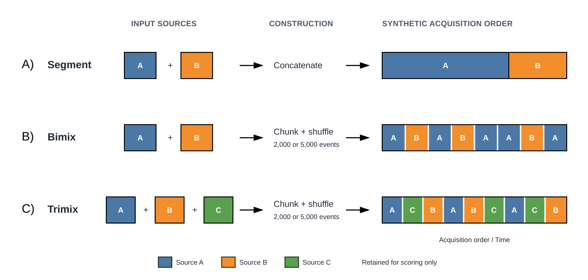

Figure S2: Representative flow cytometry CD3 / Time plots for Bimix 2000 bin, Trimix 5000 bin, and Trimix 2000 bin synthetic datasets, with original data inputs, and following cleaning by FlowMOP, FlowCut, and PeacoQC. Percentages below each figure represent the retained proportion of cells relative to the original representative synthetic sample.

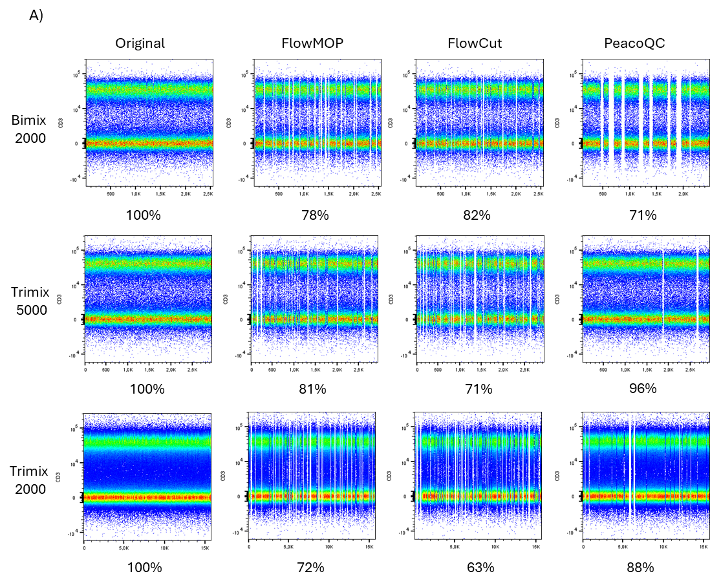

**Table S1A: Dataset Compositions**

| Dataset Name | Synthetic Time-Gating Dataset | Synthetic Debris-Gating Dataset | Synthetic Doublet-Gating Dataset | Human Liver |
| --- | --- | --- | --- | --- |
| Samples (given per benchmarker) | 6, 2 each at 0.5, 1, 3 cell concentrations, 3 datasets | 4, combined into 3 benchmarking samples | 4, combined into 3 benchmarking samples | 3 |
| Tissue Type | Peripheral blood mononuclear cells | Spleen | Spleen | Liver tissue |
| Organism | Human | Mouse | Mouse | Human |
| Collection Location | Canberra, ACT, Australia | Canberra, ACT, Australia | Canberra, ACT, Australia | Sydney, NSW, Australia |

| Mouse Dorsal Root Ganglion | Mouse Skin | Mouse Small Intestine | Mouse Colon | Mouse Brain |
| --- | --- | --- | --- | --- |
| 3 | 3 | 3 | 3 | 4 |
| Dorsal root ganglia | Skin | Distal small intestine | Colon | Brain |
| Mouse | Mouse | Mouse | Mouse | Mouse |
| Canberra, ACT, Australia | Canberra, ACT, Australia | Canberra, ACT, Australia | Canberra, ACT, Australia | Canberra, ACT, Australia |

| Mouse Central Nervous System | Mouse Spleen | Mouse Blood | Mouse Bone Marrow | Human Cultured T cells |
| --- | --- | --- | --- | --- |
| 3 | 7 | 5 | 3 | 5 |
| Spinal cord and brain | Spleen | Peripherally collected blood | Femur derived bone marrow | Peripherally collected, cultured, and restimulated T cells |
| Mouse | Mouse | Mouse | Mouse | Human |
| Canberra, ACT, Australia | Canberra, ACT, Australia | Canberra, ACT, Australia | Canberra, ACT, Australia | Canberra, ACT, Australia |

**Table S1B: Expert / Algorithm IDs**

| Expert / Algorithm | ID |
| --- | --- |
| Expert 1 | 1 |
| Expert 2 | 2 |
| Expert 3 | 3 |
| Expert 4 | 4 |
| FlowMOP | 5 |
| FlowCut | 6 |
| PeacoQC | 7 |

**Table S1C: Time gating rankings (1 = best)**

| Rankings | Mouse DRG | Mouse Skin | Human Cultured T Cells | Mouse Bone Marrow |
| --- | --- | --- | --- | --- |
| 1 | 3 | 3 | 3 | 3 |
| 2 | 1 | 1 | 2 | 5 |
| 3 | 4 | 4 | 1 | 4 |
| 4 | 2 | 2 | 4 | 1 |
| 5 | 5 | 6 | 7 | 2 |
| 6 | 6 | 5 | 5 | 6 |
| 7 | 7 | 7 | 6 | 7 |
| Mouse Spleen | Mouse Blood | Mouse Brain | Mouse Central Nervous System | Human Liver |
| 3 | 4 | 4 | 1 | 3 |
| 4 | 3 | 1 | 4 | 1 |
| 1 | 1 | 5 | 3 | 2 |
| 7 | 2 | 3 | 2 | 4 |
| 5 | 6 | 2 | 5 | 6 |
| 6 | 5 | 7 | 7 | 7 |
| 2 | 7 | 6 | 6 | 5 |

**Table S1D: Debris gating rankings (1 = best)**

| Rankings | Mouse DRG | Mouse Skin | Human Cultured T cells | Mouse Bone Marrow |
| --- | --- | --- | --- | --- |
| 1 | 3 | 2 | 4 | 3 |
| 2 | 2 | 3 | 2 | 2 |
| 3 | 1 | 5 | 3 | 1 |
| 4 | 4 | 4 | 1 | 4 |
| 5 | 5 | 1 | 5 | 5 |
| Mouse Spleen | Mouse Blood | Mouse Brain | Mouse Central Nervous System | Human Liver |
| 3 | 5 | 3 | 3 | 2 |
| 2 | 3 | 2 | 2 | 1 |
| 1 | 2 | 4 | 4 | 5 |
| 4 | 4 | 1 | 5 | 3 |
| 5 | 1 | 5 | 1 |  |

**Table S1E: Doublet gating rankings (1 = best)**

| Rankings | Mouse DRG | Mouse Skin | Human Cultured T cells | Mouse Bone Marrow |
| --- | --- | --- | --- | --- |
| 1 | 2 | 2 | 1 | 4 |
| 2 | 3 | 3 | 4 | 2 |
| 3 | 1 | 1 | 3 | 1 |
| 4 | 5 | 5 | 2 | 5 |
| 5 | 4 | 4 | 5 |  |
| Mouse Spleen | Mouse Blood | Mouse Brain | Mouse Central Nervous System | Human Liver |
| 3 | 3 | 3 | 4 | 3 |
| 4 | 2 | 1 | 3 | 5 |
| 1 | 1 | 4 | 1 | 2 |
| 5 | 5 | 5 | 2 | 4 |
| 2 | 4 | 2 | 5 | 1 |

**Table S2: Jeffreys’ Scale**

| Bayes Factor | Hypothesis descriptor |
| --- | --- |
| <1 | Null hypothesis supported |
| 1-3 | Anecdotal / Weak evidence |
| 3-10 | Moderate / Substantial evidence |
| 10-30 | Very strong evidence |
| >30 | Decisive evidence |

**Table S3A: Retention and permissiveness-adjusted Zombie-high exclusion following combined time, debris, and doublet filtering in human liver samples**

| Sample | Tissue | Manual retained (%) | FlowMOP retained (%) | Zombie-high in raw (%) | Zombie-high among FlowMOP-removed (%) | Zombie-low removed (%) | Zombie-high removed (%) | Manual selectivity ratio | FlowMOP selectivity ratio | FlowMOP/manual fold-change |
| --- | --- | ---: | ---: | ---: | ---: | ---: | ---: | ---: | ---: | ---: |
| LB180 | Non-tumour | 58.1 | 64.1 | 17.2 | 27.9 | 31.3 | 58.0 | 1.13 | 1.85 | 1.64 |
| LB192 | Non-tumour | 74.0 | 79.1 | 1.4 | 4.1 | 20.3 | 61.5 | 1.12 | 3.03 | 2.70 |
| LB200 | Non-tumour | 31.3 | 53.7 | 9.2 | 17.3 | 42.2 | 86.9 | 1.17 | 2.06 | 1.76 |
| LB202 | Tumour | 37.9 | 62.0 | 55.4 | 64.8 | 30.0 | 44.4 | 0.86 | 1.48 | 1.71 |
| LB236 | Tumour | 38.6 | 54.1 | 64.7 | 54.4 | 59.3 | 38.5 | 0.74 | 0.65 | 0.88 |
| LB262 | Tumour | 68.0 | 53.6 | 21.6 | 29.8 | 41.5 | 63.9 | 1.88 | 1.54 | 0.82 |
| Summary | Six samples | 51.3 ± 17.8 | 61.1 ± 10.0 |  |  |  |  | 1.13 median | 1.70 median | 1.68 median (0.82-2.70) |

Selectivity is the Zombie-high removal rate divided by the Zombie-low removal rate. The primary exact two-sided paired Wilcoxon signed-rank test was applied to log-transformed FlowMOP/manual selectivity ratios (p = 0.156). FlowMOP output is the intersection of the time, debris, and doublet masks and excludes the limit-of-detection mask. Zombie-low was defined operationally as Zombie UV-A <12,000 raw units. Manual populations were reconstructed from the FlowJo workspace.

**Table S3B: Constituent FlowMOP gate selectivity**

| Sample | Time | Debris | Doublet | Combined |
| --- | ---: | ---: | ---: | ---: |
| LB180 | 1.08 | 1.46 | 4.89 | 1.85 |
| LB192 | 1.04 | N/A | 5.64 | 3.03 |
| LB200 | 1.27 | 0.02 | 9.13 | 2.06 |
| LB202 | 0.95 | 0.10 | 60.85 | 1.48 |
| LB236 | 0.97 | 0.15 | 246.30 | 0.65 |
| LB262 | 1.04 | 1.34 | 4.77 | 1.54 |
| Median | 1.04 | 0.15 | 7.38 | 1.70 |

Values are Zombie-high/Zombie-low removal-rate ratios; values above 1 indicate preferential Zombie-high exclusion. The LB192 debris ratio is undefined because the debris mask removed no events. The extreme LB202 and LB236 doublet ratios reflect near-zero removal of Zombie-low events.

**Table S4: FlowMOP MAD-smoothing ablation on the 92 largecut synthetic time-gating files**

| Short, long smoothing factors | Runs | Retained-target purity, mean ± SD | Removed-non-target purity, mean ± SD |
| --- | ---: | ---: | ---: |
| `0,0` (no-smoothing control) | 92 | 0.8805 ± 0.1799 | **0.6400 ± 0.2035** |
| `0.01,0.02` | 92 | 0.8888 ± 0.1710 | 0.6286 ± 0.2087 |
| `0.01,0.05` (current default) | 92 | 0.9077 ± 0.1605 | 0.6168 ± 0.2137 |
| `0.02,0.05` | 92 | 0.9079 ± 0.1588 | 0.6179 ± 0.2152 |
| `0.02,0.09` | 92 | **0.9122 ± 0.1558** | 0.6058 ± 0.2156 |
| `0.02,0.10` | 92 | 0.9099 ± 0.1560 | 0.6027 ± 0.2153 |
| `0.05,0.20` | 92 | 0.9084 ± 0.1550 | 0.5892 ± 0.2229 |
| `0.10,0.90` (primary-comparison setting) | 92 | 0.8947 ± 0.1599 | 0.5712 ± 0.2188 |
| `0.20,0.90` | 92 | 0.8691 ± 0.1701 | 0.5548 ± 0.2156 |
| `0.40,0.90` | 92 | 0.8380 ± 0.1758 | 0.5688 ± 0.2196 |

Retained-target purity and removed-non-target purity follow the definitions used for Figure 2. Bold indicates the highest mean in each metric.

Figure S3:

Fluorescence variation as a function of cell concentration.

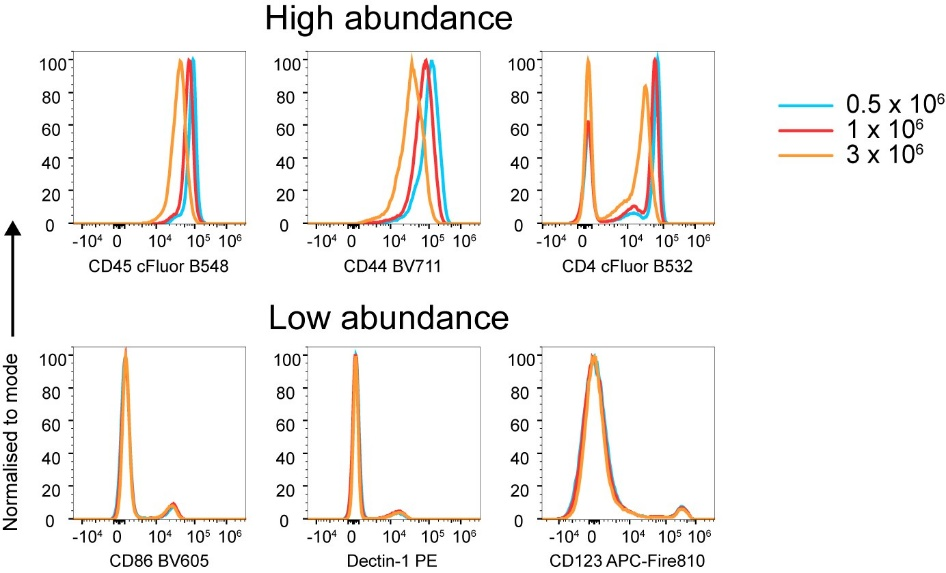

Figure S4:

Time-only acquisition-rate perturbations reveal FlowCut sensitivity to local Time density. Points show raw-matched changes in retained-target purity and removed-non-target purity, with large points and intervals showing the mean and 95% confidence interval. Negative values indicate reduced purity relative to the raw control. Columns show all inputs together and the Segment, Bimix, and Trimix subsets separately. FlowMOP remains unchanged under both source-linked and random Time warping. In contrast, FlowCut's retained-target and removed-non-target purity shift after Time-only perturbation, with the clearest removed-non-target purity loss in random Time-warped inputs and the strongest source-linked retained-target purity loss in Segment inputs, where acquisition-rate structure aligns with source composition.

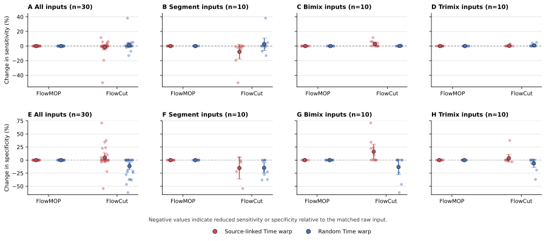

## References

[1]	Aysun Adan, Günel Alizada, Yağmur Kiraz, Yusuf Baran, and Ayten Nalbant. 2017. Flow cytometry: basic principles and applications. Critical Reviews in Biotechnology 37, 2 (February 2017), 163–176. https://doi.org/10.3109/07388551.2015.1128876

[2]	Thomas Myles Ashhurst, Felix Marsh-Wakefield, Givanna Haryono Putri, Alanna Gabrielle Spiteri, Diana Shinko, Mark Norman Read, Adrian Lloyd Smith, and Nicholas Jonathan Cole King. 2022. Integration, exploration, and analysis of high-dimensional single-cell cytometry data using Spectre. Cytometry Part A 101, 3 (2022), 237–253. https://doi.org/10.1002/cyto.a.24350

[3]	Noah Castelo, Maarten W. Bos, and Donald R. Lehmann. 2019. Task-Dependent Algorithm Aversion. Journal of Marketing Research 56, 5 (October 2019), 809–825. https://doi.org/10.1177/0022243719851788

[4]	Antonio Cosma. 2020. The Nightmare of a Single Cell: Being a Doublet. Cytometry A 97, 8 (August 2020), 768–771. https://doi.org/10.1002/cyto.a.23929

[5]	Annelies Emmaneel, Katrien Quintelier, Dorine Sichien, Paulina Rybakowska, Concepción Marañón, Marta E. Alarcón-Riquelme, Gert Van Isterdael, Sofie Van Gassen, and Yvan Saeys. 2022. PeacoQC: Peak-based selection of high quality cytometry data. Cytometry Part A 101, 4 (2022), 325–338. https://doi.org/10.1002/cyto.a.24501

[6]	Kipper Fletez-Brant, Josef Špidlen, Ryan R. Brinkman, Mario Roederer, and Pratip K. Chattopadhyay. 2016. flowClean: Automated identification and removal of fluorescence anomalies in flow cytometry data. Cytometry Part A 89, 5 (2016), 461–471. https://doi.org/10.1002/cyto.a.22837

[7]	Zicheng Hu, Alice Tang, Jaiveer Singh, Sanchita Bhattacharya, and Atul J. Butte. 2020. A robust and interpretable end-to-end deep learning model for cytometry data. Proceedings of the National Academy of Sciences 117, 35 (September 2020), 21373–21380. https://doi.org/10.1073/pnas.2003026117

[8]	Nanditha Mallesh. 2023. Automated analysis of flow cytometry using deep learning for the detection of B-cell neoplasms. Thesis. Universitäts- und Landesbibliothek Bonn. Retrieved August 7, 2023 from https://bonndoc.ulb.uni-bonn.de/xmlui/handle/20.500.11811/10949

[9]	Justin Meskas, Daniel Yokosawa, Sherrie Wang, Gabriela C. Segat, and Ryan Remy Brinkman. 2023. FlowCut: An R package for automated removal of outlier events and flagging of files based on time versus fluorescence analysis. Cytometry Part A 103, 1 (2023), 71–81. https://doi.org/10.1002/cyto.a.24670

[10]	Gianni Monaco, Hao Chen, Michael Poidinger, Jinmiao Chen, João Pedro de Magalhães, and Anis Larbi. 2016. flowAI: automatic and interactive anomaly discerning tools for flow cytometry data. Bioinformatics 32, 16 (August 2016), 2473–2480. https://doi.org/10.1093/bioinformatics/btw191

[11]	Christina Bligaard Pedersen, Søren Helweg Dam, Mike Bogetofte Barnkob, Michael D. Leipold, Noelia Purroy, Laura Z. Rassenti, Thomas J. Kipps, Jennifer Nguyen, James Arthur Lederer, Satyen Harish Gohil, Catherine J. Wu, and Lars Rønn Olsen. 2022. cyCombine allows for robust integration of single-cell cytometry datasets within and across technologies. Nat Commun 13, 1 (March 2022), 1698. https://doi.org/10.1038/s41467-022-29383-5

[12]	Lisa Weijler, Florian Kowarsch, Michael Reiter, Pedro Hermosilla, Margarita Maurer-Granofszky, and Michael Dworzak. 2024. FATE: Feature-Agnostic Transformer-Based Encoder for Learning Generalized Embedding Spaces in Flow Cytometry Data. 2024. 7956–7964. Retrieved May 3, 2024 from https://openaccess.thecvf.com/content/WACV2024/html/Weijler_FATE_Feature-Agnostic_Transformer-Based_Encoder_for_Learning_Generalized_Embedding_Spaces_in_WACV_2024_paper.html

[13]	Kenneth Lo, Ryan Remy Brinkman, and Raphael Gottardo. 2008. Automated gating of flow cytometry data via robust model-based clustering. Cytometry Part A 73A, 4 (April 2008), 321–332. https://doi.org/10.1002/cyto.a.20531

[14]	Lukas Fisch, Michael Heming, Andreas Schulte-Mecklenbeck, Catharina C. Gross, Stefan Zumdick, Carlotta Barkhau, Daniel Emden, Jan Ernsting, Ramona Leenings, Kelvin Sarink, Nils R. Winter, Udo Dannlowski, Heinz Wiendl, Gerd Meyer zu Hörste, and Tim Hahn. 2024. GateNet: A novel neural network architecture for automated flow cytometry gating. Computers in Biology and Medicine 179 (September 2024), 108820. https://doi.org/10.1016/j.compbiomed.2024.108820

[15]	Jiong Chen, Matei Ionita, Yanbo Feng, Yinfeng Lu, Patryk Orzechowski, Sumita Garai, Kenneth Hassinger, Jingxuan Bao, Junhao Wen, Duy Duong-Tran, Joost Wagenaar, Michelle L. McKeague, Mark M. Painter, Divij Mathew, Ajinkya Pattekar, Nuala J. Meyer, E. John Wherry, Allison R. Greenplate, and Li Shen. 2025. Automated cytometric gating with human-level performance using bivariate segmentation. Nature Communications 16, 1 (February 2025), 1576. https://doi.org/10.1038/s41467-025-56622-2

[16]	Chris P. Verschoor, Alina Lelic, Jonathan L. Bramson, and Dawn M. E. Bowdish. 2015. An introduction to automated flow cytometry gating tools and their implementation. Frontiers in Immunology 6 (July 2015), 380. https://doi.org/10.3389/fimmu.2015.00380
